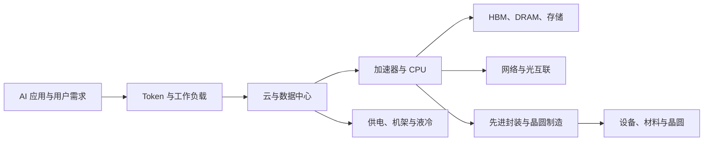
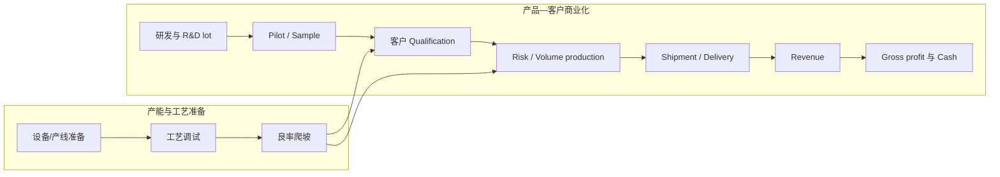
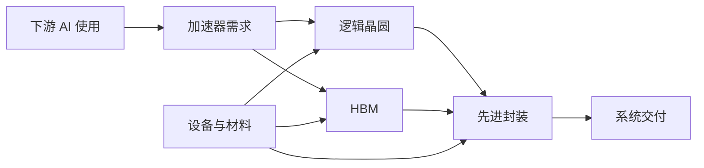
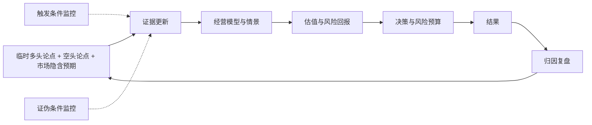

# 从零研究 AI 产业链股票：以美股为主，含海外关键可比公司

> 基于“瓶颈—寡头—利润弹性—扩产纪律”的完整实战教程
>
> 版本：3.1（机构审稿修订版：拆分动态案例、修正估值口径、重构学习路径与研究门控）
>
> 编写与资料核验日期：2026-07-13（北京时间）
>
> 方法论来源：用户提供的《琳姐投研方法论》（2026-06-25 半导体分享结构化整理）
>
> 适用对象：第一次系统研究上市公司、会使用浏览器和表格，但不熟悉半导体、财报与估值的投资者

---

## 开始之前：这份教程能做什么，不能做什么

这是一套**把产业叙事变成可验证投资假设**的研究方法，不是股票推荐、目标价或下单指令。文中出现的公司和 ticker 都只用于解释产业位置、披露口径与研究步骤，不代表买入、卖出或持有建议。

你最终研究的不是“AI 很厉害”这句话，而是下面这条完整链条：



然后逐层回答：

1. 需求是否真实，还是只有故事？
2. 真正卡住系统的环节是什么？
3. 供给为什么不能很快补上？
4. 客户是否缺少替代选择？
5. 缺口能否转成售价、毛利和现金流？
6. 管理层是否克制扩产？
7. 产品是否从“能做”走到了认证、交付和收入？
8. 好消息是否已经反映在估值里？
9. 什么证据出现时，说明你的判断错了？

### 两条必须终身保留的边界

第一，**方法可以长期复用，事实必须标日期**。原方法论里的“存储当前更强”“某项技术可能在某年放量”“某公司在产业链中的角色”等，都是特定时间的判断。公司会拆分，ticker 会变化，产品会延迟，出口规则会修改，供需也会反转。例如，[Western Digital 的闪存业务已在 2025 年分拆为独立的 Sandisk](https://www.sec.gov/Archives/edgar/data/106040/000010604025000038/wdc-20250627.htm)，[Kioxia 也已于 2024 年在东京证券交易所上市](https://www.kioxia-holdings.com/en-jp/news/2024/20241218-1.html)。旧材料仍能教方法，但不能直接充当今天的事实。

第二，**产业逻辑正确，不等于股票值得买**。从“AI 需求增长”到“股票产生超额回报”，至少要跨过四座桥：

| 桥 | 必须证明什么 | 常见断点 |
| --- | --- | --- |
| 需求桥 | AI 使用增长确实转化为该产品的订单 | 使用量增长，但单位成本下降更快；客户重复下单 |
| 竞争桥 | 公司能获得订单并守住份额 | 客户改用自研、第二供应商或替代技术 |
| 财务桥 | 订单转化为收入、毛利和自由现金流 | 良率低、成本上升、CapEx 吞掉现金 |
| 估值桥 | 当前股价没有提前透支过多未来 | 公司很好，但市场预期比实际结果更乐观 |

### 原方法论、教程扩展与“行业公开门道”的边界

本教程只把《琳姐投研方法论》中明确出现的原则归于原分享者。九层产业链、数据合同、质量标签、六向验证、三只时钟、研究门控、财务模型和仓位公式，是为了让方法可复现而增加的教学结构，不是原作者原话。

为了避免错误归因，还要明确原方法论没有完整展开的领域：

1. 统一的数据版本、来源许可和 point-in-time 规则。
2. 财务三表、营运资本、稀释和不同 CapEx 口径的系统模型。
3. 反向 DCF、概率加权与估值敏感性。
4. 组合相关性、主题集中度和风险预算。
5. 出口规则逐条核查、ECCN 与法规生效日。
6. 把假设状态写入可审计工作流的工程实现。

这些是本教程为了让经验可复现、可回测、可审计而增加的执行层，不应包装成作者的“内部秘诀”。

本文所说的“行业公开门道”，只指散落在公开申报、合同、技术标准和监管文件中的专业判断方法，不是内幕消息，也不包含重大非公开信息（MNPI）。无法公开复核的信息不能进入正式结论，更不能据此交易。

### 小白的默认路线

在完成至少一份完整 Deep Dive 之前，默认只做纸面观察名单或模拟组合。不要为了“逼自己跟踪”而先投入真钱，更不要用融资、期权或三倍杠杆 ETF 代替研究。美国 SEC 的投资者教育材料也把资产配置和分散化列为风险管理的基础；集中持有几只高度相关的 AI 半导体股，并不是真正的分散化。

在继续阅读前，先写下五条不可突破的护栏：

1. 应急资金不进入高波动行业投资。
2. 不借钱、不使用裸期权、不把日复位杠杆 ETF 当长期持仓。
3. 在一份完整 Deep Dive 和估值页完成前，只做纸面观察。
4. 单一公司、同一产业链和同一客户因子都要分别设风险上限。
5. 研究结果允许是“放弃、等待或信息不足”，不要求一定买入。

完整的个人 Investment Policy、仓位和退出规则见第 25 章与附录 E；第一次阅读先遵守上述默认护栏，后续再根据自己的期限、负债和风险能力修订。

### 三种使用方式

- **2 小时导览**：0–15 分钟读风险护栏与第 1.1–1.3 节；15–40 分钟读第 3.1–3.3 节；40–65 分钟读第 4.5 与 6.1 节；65–90 分钟浏览第 10 章、第 12 章地图，并在第 17 章任选一个商业模式；90–110 分钟读第 19 章与 20.6；最后 10 分钟填写附录 A，只输出“继续研究/信息不足”，不做投资决定。
- **两周入门**：先读第 1–12 章；再读第 15–21、25–26 章，学会数据治理、横向比较、财务、估值和风险；最后按需查第 13–14 章，并用第 23–24 章和独立案例册练习。
- **八周实战**：按第 27 章学习计划执行，完成产业链图、证据库、财务模型、估值和投资政策。

### 三层内容架构

主教程只承担永久方法和研究手册两种用途；会过期的公司数据已移入独立日期化案例册。阅读时按三层分工：

| 层级 | 内容 | 第一次阅读 |
| --- | --- | --- |
| 核心主线 | 第 1–12、15–23、25–26 章 | 按顺序读 |
| 产业参考 | 第 13–14 章、附录 F–G | 遇到目标行业再查 |
| 日期化数据 | 独立案例册及后续 vintage | 学完第 17–20 章后使用；每次先检查截止日和许可 |

第 15–16 章现在只保留数据治理和横向比较协议。2026-07-13 的财报、份额、行情、股本和十公司案例只在独立案例册维护，避免多个章节各自保存同一数字。

### 章节内的四种学习块

为了让小白不再在正文和附录之间来回跳，后文把补充材料放回它最有用的章节：

- **先懂这些词：**先解释读懂本章必须知道的术语。
- **历史坐标：**用真实事件说明行业为何形成今天的结构。
- **琳姐经验：**标出原方法论的经验判断及其失效边界。
- **行业公开门道：**说明专业人士如何用公开资料识别话术、口径和风险。

概念、历史坐标、作者经验和行业公开门道已经按主题分散到正文与附录；这些内容是查阅层，不是需要一次背完的考试清单。建议按三遍阅读：

1. **第一遍只看正文和先懂这些词**，先知道产业链在做什么。
2. **第二遍看历史坐标和琳姐经验**，理解方法为什么形成、在哪些条件下会失效。
3. **第三遍看行业公开门道、数据表和练习**，再开始研究具体公司。

## 目录

- 第一部分：先把投资问题想对
  - [第 1 章：你买的不是“AI”，而是一份未来现金流](#chapter-1)
  - [第 2 章：从叙事思维切换到产业链思维](#chapter-2)
- 第二部分：半导体世界怎样真正运转
  - [第 3 章：半导体的物理现实](#chapter-3)
  - [第 4 章：四条铁律](#chapter-4)
  - [第 5 章：结构趋势、行业周期与三只时钟](#chapter-5)
  - [第 6 章：从软话术到硬证据](#chapter-6)
- 第三部分：怎样读公开材料与财报
  - [第 7 章：美股官方材料地图](#chapter-7)
  - [第 8 章：建立可追溯的证据系统](#chapter-8)
  - [第 9 章：六向交叉验证](#chapter-9)
  - [第 10 章：三张财务报表入门](#chapter-10)
  - [第 11 章：财报电话会的两遍阅读法](#chapter-11)
- 第四部分：按层研究 AI 产业链
  - [第 12 章：AI 产业链九层地图](#chapter-12)
  - [第 13 章：九层产业链逐层研究](#chapter-13)
  - [第 14 章：按产业层级设计电话会问题](#chapter-14)
  - [第 15 章：维护动态数据快照](#chapter-15)
  - [第 16 章：横向比较协议](#chapter-16)
- 第五部分：从产业证据到财务模型与估值
  - [第 17 章：按商业模式拆收入](#chapter-17)
  - [第 18 章：CapEx 口径](#chapter-18)
  - [第 19 章：Bear / Base / Bull 三情景](#chapter-19)
  - [第 20 章：估值与 price-in](#chapter-20)
- 第六部分：把研究做成可重复流程
  - [第 21 章：从零完成 Deep Dive](#chapter-21)
  - [第 22 章：研究门控与置信度卡](#chapter-22)
  - [第 23 章：重建 Micron 研究流程](#chapter-23)
  - [第 24 章：CPO/光互联迷你案例](#chapter-24)
- 第七部分：风险、政策与生存
  - [第 25 章：小白风险管理](#chapter-25)
  - [第 26 章：政策、出口限制和地缘风险](#chapter-26)
- 第八部分：学习计划与可复制模板
  - [第 27 章：八周学习路线](#chapter-27)
- 附录：可复制模板与查表
  - [附录 A：公司一页纸模板](#appendix-a)
  - [附录 B：Deep Dive 模板](#appendix-b)
  - [附录 C：证据台账模板](#appendix-c)
  - [附录 D：季度更新模板](#appendix-d)
  - [附录 E：个人 Investment Policy 模板](#appendix-e)
  - [附录 F：核心术语速查](#appendix-f)
  - [附录 G：官方与第三方资料库及更新频率](#appendix-g)
  - [附录 H：研究卫生检查](#appendix-h)
  - [附录 I：决策日志与事后归因](#appendix-i)

---

# 第一部分：先把投资问题想对

<a id="chapter-1"></a>

## 第 1 章　你买的不是“AI”，而是一份未来现金流

股票代表企业所有权。长期而言，投资回报来自企业未来能够为股东创造并保留的现金流，以及市场愿意为这些现金流支付的价格。AI 只是可能改变收入、成本、竞争格局和资本需求的变量。

因此，下面四句话完全不同：

1. AI 会继续发展。
2. AI 基础设施支出会继续增长。
3. 某家公司会从支出增长中获得收入和利润。
4. 以今天的股价买入这家公司能获得满意回报。

前三句都对，第四句仍可能错。原因包括：

- 需求增长已经被高估值提前计入。
- 行业增长很快，但竞争让利润留不下来。
- 客户增长很快，但公司产能、良率或交付失败。
- 收入增长很快，但库存、应收账款和 CapEx 吃掉现金。
- 公司赚得很多，但扩股、股权激励或糟糕收购稀释股东。
- 产业处于周期高点，当前利润并非可持续利润。

### 先懂这些词：投资、研究与决策语言

| 概念或特定名词 | 给初学者的解释 | 在本文中的用途与常见误区 |
| --- | --- | --- |
| 投资论点 / thesis | 对“为什么这家公司未来现金流会超出或低于市场预期”的一组可证伪判断。 | 它不是“我喜欢 AI”，而要包含需求、供给、竞争、财务、估值和证伪条件。 |
| 叙事 / narrative | 市场用来解释公司前景的故事。 | 叙事可以指路，但不能替代订单、交付和现金流。 |
| 产业链思维 | 从终端需求向上追踪到云、芯片、存储、网络、制造、设备、材料、电力与散热。 | 防止只研究一家公司的宣传材料，忽略上下游约束。 |
| Layer 2 Thinking | 不只看最显眼的直接受益者，而是继续追问“谁让它成为可能、谁更稀缺”。 | 它寻找二阶受益者，不代表越偏门越好。 |
| Deep Dive | 围绕一家公司完成产业、产品、财务、估值、风险和证伪的深度研究。 | 搜集很多链接不等于 Deep Dive；必须形成可检验结论。 |
| variant perception / 预期差 | 你的判断与市场隐含预期之间存在的差异。 | “公司会增长”不是预期差；要证明市场低估或高估了增长的幅度、持续时间或利润率。 |
| price-in / 已计价 | 一项好消息已经被股价和估值预先反映。 | 产业判断正确仍可能因买得太贵而回报不佳。 |
| 催化剂 / catalyst | 可能让市场修正预期的事件，如认证、涨价、财报或产能投产。 | 催化剂不是投资论点本身，也可能延期或被提前交易。 |
| 证伪条件 / invalidation | 一旦出现就说明原判断失效或需要重写的证据。 | “股价跌了”通常不是产业论点的证伪；订单取消、良率失败、替代技术成熟才可能是。 |
| 事实、推断、情景 | 事实是已观察数据；推断是因果解释；情景是对未来的条件化假设。 | 三者必须分栏，不能把管理层目标或分析师预测写成已发生事实。 |
| 一阶、二阶、三阶证据 | 一阶是监管申报和正式财务表；二阶是公司电话会、客户或供应商验证；三阶是媒体、渠道和社交信息。 | 证据层级越低越需要交叉验证；“消息很多”不等于证据强。 |
| 交叉验证 | 用客户、供应商、竞争对手、设备商、财务和政策等独立方向验证同一判断。 | 多篇转载同一新闻仍只有一个源头。 |
| borrowed conviction / 借来的信念 | 没有独立研究，只靠名人、博主或基金经理观点建立的确信。 | 一旦价格波动，借来的信念通常无法告诉你该加仓、减仓还是承认错误。 |
| 核心仓、卫星仓、观察仓 | 按证据强度、波动与研究深度分层管理的组合结构。 | 名称不能代替仓位上限、退出规则和相关性控制。 |
| 风险预算 | 事先规定单一公司、单一主题或同一风险因子最多可以造成多大损失。 | 五只 AI 半导体股可能共享同一周期，不等于五份独立风险。 |
| 相关性 / correlation | 两项资产回报共同变化的程度。 | 历史相关性会在危机中上升；不能只用正常时期的数字判断分散化。 |
| benchmark / 基准 | 用于比较投资表现的市场或行业指数。 | 超过零收益不等于有超额收益；还要比较风险相近的基准。 |
| alpha / 超额回报 | 在承担的市场与风格风险之外获得的回报。 | 牛市中高杠杆上涨不自动等于研究产生了 alpha。 |
| TAM / 总可服务市场 | 理论上某类产品或服务可以覆盖的总市场。 | TAM 不是公司收入；还要乘可服务份额、赢单率、价格和兑现时间。 |
| 市值、企业价值、完全稀释价值 | 基本市值是观察日股价乘点时发行在外普通股数；完全稀释股权价值还要按合同条款处理价内期权、可转债、优先股等潜在权益；企业价值再调整债务、优先股、少数股东权益及非经营现金/投资。 | 期间稀释加权平均股数是 EPS 分母，不是点时基本市值股数；市值倍数也不能与企业价值口径利润直接混比。 |

### 1.1 研究、投资、交易是三件事

| 活动 | 核心问题 | 合格输出 |
| --- | --- | --- |
| 研究 | 世界和公司实际上发生了什么？ | 事实、证据、推理、反证 |
| 投资 | 预期回报是否补偿风险？ | 估值、情景、仓位、期限 |
| 交易 | 何时、用什么规则执行？ | 入场、退出、流动性、订单规则 |

本教程重点解决前两项。没有研究结论时，K 线不会替你创造产业认知；没有估值和风险预算时，深度研究也不会自动变成好投资。

### 1.2 用一句话描述公司

研究任何公司前，先完成这个句子：

> `[公司]` 向 `[客户]` 销售 `[产品/服务]`，解决 `[具体物理或商业约束]`，主要通过 `[销量、价格、订阅、使用量或服务]` 赚钱。

不合格的表述：

> “它是 AI 龙头，未来空间很大。”

合格的表述示例：

> “某量测设备公司向晶圆厂销售检测与工艺控制系统，帮助先进制程发现缺陷、改善良率，收入来自新系统交付及装机基础服务。”

如果一句话里只有 `AI`、`平台`、`生态`、`赋能`，却没有客户、产品、约束和收费单位，你还没有理解这家公司。

### 1.3 第一份作业

从你感兴趣的五家公司中各选一家公司，用上面的句式写一句话。然后删掉所有不能由 10-K、20-F、公司产品页或客户披露证明的词。

---

### 1.4 如何判断自己真的理解了一个术语

不要背英文缩写。真正掌握一个术语，至少能回答四件事：

1. 它描述的是**技术状态、商业状态、会计状态还是监管状态**？
2. 它的分母、时间、单位和边界是什么？
3. 它比相邻概念硬在哪里，例如 `pipeline → term sheet → firm order → backlog → revenue → cash`？
4. 哪个一手来源能验证它，什么证据会推翻你的解释？

---

<a id="chapter-2"></a>

## 第 2 章　从叙事思维切换到产业链思维

叙事思维通常从 ticker 开始：

```text
看到新闻 → 找相关股票 → 看涨幅和社交媒体 → 追问“还能不能买”
```

产业链思维从系统约束开始：

```text
最终需求 → 必需产品 → 物理瓶颈 → 合格供应商 → 产能与良率
→ 订单与价格 → 毛利与现金流 → 估值与反证
```

### 2.1 六种最常见的“看起来像研究”

以下行为可以提供线索，但单独都不构成研究：

- 读一篇媒体文章后列出“受益股”。
- 看某位 KOL 的持仓截图。
- 看股价涨得早，倒推公司一定最受益。
- 把 `total addressable market` 直接乘一个主观市占率。
- 把公司说的 `pipeline` 当成订单。
- 把产品发布、送样或理论产能当成收入。

### 2.2 正确的研究顺序

1. 先画链条，不先选股票。
2. 找到每层产品的输入、输出、客户和供应商。
3. 找当前最紧的约束，而不是最著名的产品。
4. 找能够稳定量产的合格供应商。
5. 判断供应商能否提高价格或改善组合。
6. 检查竞争对手和客户是否给出相同信号。
7. 用财务报表验证收入、毛利、库存和现金流。
8. 用估值决定“好公司是否是好股票”。
9. 先写证伪条件，再考虑仓位。

### 2.3 Layer 2 Thinking：新闻之后多推一层

当一家晶圆厂增加先进光刻设备时，第一层受益者是光刻设备供应商。但研究不能停在这里：

```text
更多光刻步骤
  → 更多关键尺寸与套刻检查
  → 更多量测和缺陷检测
  → 更多刻蚀、沉积、清洗与 CMP 步骤
  → 更多耗材、服务和工艺控制
```

这种推理不等于相关公司一定受益。每一条箭头都要验证：

- 工艺步骤是否真的增加？
- 是新增设备还是旧机升级？
- 公司是否在该客户的合格供应商名单中？
- 订单何时确认、是否可取消？
- 收入确认在何时？
- 增量业务的毛利率如何？

### 2.4 瓶颈会迁移

系统吞吐量由最紧约束决定。一旦某个瓶颈缓解，约束可能依次迁移：

```text
加速器不足
→ HBM 或先进封装不足
→ 网络带宽不足
→ 机架供电与散热不足
→ 变电、并网、土地或施工不足
→ 应用 ROI 不足
```

这解释了为什么“上一阶段最强的股票”不一定继续是下一阶段最好的研究对象。投资者要找正在变紧、且经济价值能够被供应商捕获的约束。

---

### 琳姐经验：研究对象是一条因果链

下表保留原十八条经验的序号，方便追溯方法论来源。

| 原序号 | 经验结论 | 形成原因 | 应该怎么验证 | 失效边界或常见误用 |
| --- | --- | --- | --- | --- |
| 1 | 先从 ticker 和故事切换到产业链物理现实 | 半导体收入最终受设备、材料、工艺、良率、认证和交付约束 | 画产品流、资金流和产能依赖图 | 产业链里出现过的公司不一定都有收入弹性 |
| 11 | 从直接受益者继续做二阶产业链推导 | 最显眼的龙头可能已被充分定价，约束环节可能更稀缺 | 从晶圆厂/云厂 CapEx 追到设备、封装、材料、网络和电力 | 无限延伸概念链，忽略收入纯度和因果强度 |

作者最核心的思维切换，是把“这家公司属于 AI 概念”改写成一条能逐段验证的链：终端为什么需要更多计算，计算为什么需要更多内存、网络、封装和电力，哪个环节短期补不上，目标公司为什么能取得合格供给，最后这些优势为什么会进入收入、毛利和现金流。任何一段缺证据，结论就应降级，而不是用更强烈的叙事补洞。

这也解释了为什么作者会从台积电的扩产继续看 ASML、KLA、Lam Research、Applied Materials、载板和材料。二阶推导不是为了寻找更冷门的 ticker，而是为了找到**约束最强、供给最慢、财务暴露最纯**的环节。

# 第二部分：半导体世界怎样真正运转

<a id="chapter-3"></a>

## 第 3 章　半导体的物理现实：从“能做”到“赚到钱”

半导体不是发布一个软件版本就能无限复制。商业化通常同时推进“产能与工艺准备”和“产品—客户验证”两条轨道；下面是教学图，不是所有产品都严格按同一顺序前进。设备安装、良率爬坡、认证和试产可能重叠、反复或因客户而换序。

### 先懂这些词：半导体制造、组织与产能阶段

| 概念或特定名词 | 给初学者的解释 | 在本文中的用途与常见误区 |
| --- | --- | --- |
| fabless | 主要设计芯片、把制造外包给晶圆代工厂的公司。 | 资产较轻不代表没有供应承诺、库存和封装依赖。 |
| foundry / 晶圆代工 | 按客户设计制造晶圆的商业模式。 | 代工收入份额不等于每个节点、客户或封装环节的份额。 |
| IDM | 同时从事芯片设计和制造的垂直整合器件公司。 | IDM 也会外包部分晶圆或封装，不能简单二分。 |
| OSAT | 独立提供封装与测试服务的厂商。 | “先进产品”或“计算”口径通常包含非 AI 业务。 |
| WFE | wafer fab equipment，晶圆制造设备市场。 | WFE 支出是行业设备投资，不等于某一家设备商收入。 |
| fab / 晶圆厂 | 在晶圆上完成前道制造的工厂。 | “建厂”到“量产”之间可能相隔多年。 |
| wafer、die、chip | wafer 是晶圆；切割后单颗裸片为 die；封装测试后通常称 chip。 | 晶圆数量、裸片数量和成品芯片数量不能混用。 |
| process node / 制程节点 | 一代制造技术的商业标签，如 3nm、5nm。 | 不同厂商同名节点的密度、性能和规则不可直接等同。 |
| tape-out / 流片 | 芯片设计完成并把版图交给制造环节。 | 流片不是量产，更不是商业收入；后续仍可能改版。 |
| PDK | 晶圆厂提供给设计者的工艺设计规则、模型和工具包。 | 有 PDK 支持只说明可开始设计，不等于产品已验证。 |
| R&D lot / 研发批次 | 用来验证技术可行性的早期小批晶圆。 | 产出少、条件可人工优化，不能外推量产成本和良率。 |
| pilot line / 中试线 | 在接近量产条件下验证流程、设备和一致性的生产线。 | 中试成功仍要跨过客户认证和稳定爬坡。 |
| risk production / 风险生产 | 在最终认证或完整良率成熟前，为抢时间进行的有限生产。 | “已投产”可能只是风险生产，库存和返工风险仍高。 |
| qualification / 客户认证 | 客户对性能、可靠性、工艺和供应稳定性的正式验证。 | 同一产品对 A 客户获认证，不自动代表 B 客户也可出货。 |
| volume production / 批量生产 | 在商业条件下持续生产可交付产品。 | 还要问规模、良率、客户和收入贡献，不能只看“量产”两个字。 |
| mass production / 大规模量产 | 规模、节拍、质量和成本都达到成熟商业运行。 | 公司有时宽泛使用该词，最好用出货量、收入和良率交叉验证。 |
| capable vs. delivery | capable 是技术上能做；delivery 是能按量、按质、按期交付。 | 本文最重要的制造边界之一：展示样品不等于供应能力。 |
| nameplate、installed、qualified capacity | 名义设计产能、已安装设备产能、经验证可稳定交付的合格产能。 | 新闻里的“新增产能”必须先问是哪一级。 |
| yield / 良率 | 合格成品占投入或理论产出的比例。 | 良率决定有效供给、单位成本和毛利，是制造业核心经济变量。 |
| defect density / 缺陷密度 | 单位面积上可能导致失效的缺陷数量。 | 大芯片对缺陷更敏感，所以 chiplet 和先进封装具有经济意义。 |
| learning curve / 学习曲线 | 随着累计生产与经验增加，良率、速度和成本改善。 | 不能假设所有新厂都按成熟厂速度爬坡。 |
| greenfield、brownfield、retrofit | 新建厂、利用既有厂扩建、对现有设备或产线改造。 | 三者资本强度、工期、审批、良率风险完全不同。 |
| wafer-start / 晶圆投入 | 进入生产流程的晶圆数量。 | bit 供给可通过制程迁移增长，即使 wafer-start 不变。 |
| product mix / 产品组合 | 不同产品、规格、客户和价格的销售构成。 | 高毛利产品占比提高会让收入和利润快于物理出货量增长。 |



每个产品、每个客户都应单独记录阶段，不能把“客户 A 已量产”外推为“所有客户已量产”。

### 3.1 每个阶段到底证明了什么

| 阶段 | 已经证明 | 还没有证明 |
| --- | --- | --- |
| R&D lot | 概念或工艺可能跑通 | 稳定性、规模、成本、客户接受 |
| Pilot lot | 小规模工艺更接近生产 | 大规模良率和持续交付 |
| Qualification | 客户样品达到部分要求 | 订单数量、量产节奏、最终份额 |
| Risk production | 接近商业生产 | 稳定大规模出货 |
| Volume production | 可以按商业规模制造 | 客户是否拉货、利润和现金 |
| Delivery | 客户实际收到产品 | 收入质量、收款和可持续利润 |
| Revenue | 会计上确认销售 | 毛利、自由现金流和股东回报 |

### 3.2 Capable 不等于 Delivery

管理层说“我们有能力每月生产 X”时，要立刻问：

- X 是 nameplate capacity 还是当前可运行产能？
- 设备是否全部安装并验收？
- 是理论 wafer starts，还是良率调整后的合格产出？
- 是否已经完成客户认证？
- 是多班制满负荷假设，还是当前实际利用率？
- 关键材料、封装和测试是否配套？
- 有订单吗？订单可取消吗？
- 已经出货并确认收入了吗？

建议在研究表里分开记录：

| 产能口径 | 含义 |
| --- | --- |
| 宣布产能 | 新闻稿或规划中的目标 |
| 建设产能 | 厂房或设备正在建设 |
| 安装产能 | 设备已到位但未必验收 |
| 合格产能 | 工艺和客户认证通过 |
| 良率调整产能 | 合格产能 × 实际良率 |
| 可售产能 | 可分配给客户的产出 |
| 已售产能 | 有约束订单覆盖 |
| 已交付产能 | 已经实际出货 |

### 3.3 良率为何决定生死

简化地说：

```text
合格产出 = 投入晶圆 × 每片理论裸片数 × 良率
```

良率改善会同时带来：

- 更多可售产品。
- 更低的单位固定成本。
- 更少报废和返工。
- 更稳定的客户交付。
- 可能更高的毛利率。

但良率并非公司之间可直接比较的单一数字。产品尺寸、缺陷密度、封装复杂度和测试标准都不同。管理层不披露具体良率时，可以追踪替代信号：

- 是否从送样进入量产。
- 产出是否逐月增加。
- 毛利率是否改善。
- 客户是否扩大订单。
- 返工、保修和库存是否异常。
- 量测、检测和 process control 投入是否增加。

### 3.4 章末练习

找一家光模块、存储或芯片公司最近两个季度的官方材料，把每一句产品进展分别标记为：

```text
能力声明 / 送样 / 认证 / 试产 / 量产 / 交付 / 收入 / 现金
```

如果大多数句子停留在前三项，就不能用“已经商业化”描述它。

---

### 琳姐经验：制造事实优先于发布会语言

下表保留原十八条经验的序号，方便追溯方法论来源。

| 原序号 | 经验结论 | 形成原因 | 应该怎么验证 | 失效边界或常见误用 |
| --- | --- | --- | --- | --- |
| 2 | 小批量成功不等于大规模量产成功 | 实验条件可人工优化，量产要求稳定、重复、低成本 | 分开记录 R&D lot、pilot、qualification、risk production、HVM | 把送样、demo 或一次测试写成量产 |
| 3 | 良率是半导体制造的生命线 | 良率同时决定可售产出、单位成本、交期和客户信任 | 连续跟踪良率方向、单位成本、报废、返工和出货 | 相信没有批次、产品、时间和分母的良率传闻 |
| 4 | `capable` 不等于 `delivery` | 设计产能或实验室性能不代表按量、按质、按期交付 | 继续查客户认证、出货规模、收入确认和回款 | 把“具备能力”直接乘市场份额算收入 |

原方法论多次区分研发批次、中试、认证、风险生产和量产。对于制造业，“能做出一颗”与“每月稳定交付大量产品且赚钱”之间，隔着设备稳定性、材料一致性、缺陷控制、良率、测试覆盖、人员和客户质量体系。因此听电话会时，动词比形容词重要：`sampling`、`qualified`、`shipping`、`recognized as revenue` 代表不同证据等级。

作者用 `capable ≠ delivery` 压缩了这条经验。更完整的研究顺序应是：

```text
技术声明
  -> 可重复样品
  -> 客户送样
  -> 客户认证
  -> 确定订单/合同约束
  -> 稳定量产
  -> 实际交付
  -> 收入确认
  -> 毛利与现金回收
```

越靠后，商业证据越硬；但即使出现收入，也仍要问毛利、资本开支和回款是否支持股东价值。

### 行业公开门道：制造、量产和良率

| 内行关注点 | 为什么重要 | 怎样用公开资料验证 | 新手常见误区 |
| --- | --- | --- | --- |
| 产品阶段动词 | `sample`、`pilot`、`qualified`、`risk production`、`HVM` 对收入确定性差异很大 | 保存原句、日期、客户范围和下一里程碑 | 只看“领先”“突破”“量产准备”等形容词 |
| 良率必须有产品、批次和时间 | 平均良率会掩盖不同代际、堆叠和客户的差异 | 连续比较成本、报废、交付和管理层措辞 | 把一次实验室数据当稳定量产良率 |
| 大裸片和多层堆叠会放大损失 | 任一裸片、键合或测试失败都可能损失整套封装价值 | 查 die size、stack height、known-good-die 和测试路线 | 只按每 bit 晶圆成本计算 HBM 经济性 |
| 制程步骤越多，过程控制越重要 | 更多沉积、刻蚀、键合和曝光意味着更多失效机会 | 交叉设备公司订单、客户节点和 process-control intensity | 认为先进制程只增加光刻设备需求 |
| 新厂、设备到厂和 HVM 是三件事 | 厂房完工后仍需 tool move-in、调试、工艺和认证 | 跟踪 shell、tool install、qualification、HVM 日期 | 把剪彩或设备搬入当可售产能上线 |
| Brownfield 与 greenfield 风险不同 | 现有厂扩建可复用厂务，通常更快；新厂容量更大但风险更高 | 拆项目类型、许可、设备和首次晶圆时间 | 只看投资总额，不看项目阶段 |
| 利用率直接影响单位成本 | 折旧、人工和厂务固定成本需由合格产出吸收 | 查 underutilization charge、库存和毛利桥 | 认为减产只减少收入，不会伤毛利 |
| 晶圆尺寸转换不会自动降本 | 大晶圆需要新设备、工艺、良率和客户重新验证 | 查合格产能、单位成本和实际出货 | 按面积比例直接推算利润提升 |
| 客户认证可能比制造更慢 | 技术达标后还要通过平台、可靠性和供应质量体系 | 查 qualification、design win、shipment 和 revenue timing | 把规格表达标等同已赢得客户 |
| 封装、基板和测试也会卡住芯片 | 前道有合格 die，也可能无法组成可交付系统 | 交叉 foundry、OSAT、基板和客户披露 | 只数晶圆产能或 GPU die |

---

<a id="chapter-4"></a>

## 第 4 章　四条铁律：筛选真正“硬”的机会

原方法论的核心，是寻找四个条件同时成立的环节：

1. **瓶颈**：需求大于供给，而且短期补不上。
2. **寡头或事实垄断**：能稳定交付的玩家少，替换困难。
3. **利润弹性**：小供需缺口能带来售价和利润的非线性变化。
4. **扩产纪律**：过去的过度扩产和亏损让管理层不敢迅速增加供给。

四条必须同时看。只有瓶颈、没有定价权，供应商可能只是辛苦加班；只有寡头、没有需求，设备会闲置；只有高利润、没有扩产纪律，竞争者很快会把利润打掉。

### 先懂这些词：供需、订单与合同（第 4–6 章共用）

| 概念或特定名词 | 给初学者的解释 | 在本文中的用途与常见误区 |
| --- | --- | --- |
| 瓶颈 / bottleneck | 系统中最限制最终产出的那个合格供给环节。 | “重要”不等于“瓶颈”；瓶颈会随扩产、技术和需求迁移。 |
| 垄断、寡头 | 一个或少数供应商控制大部分合格供给。 | 集中度高只有在客户难替换、认证慢且扩产受限时才可能形成定价权。 |
| 定价权 | 公司提高价格或维持高价而不明显丢失有效需求的能力。 | 涨价可能来自短期现货紧缺，未必是持久护城河。 |
| 供给弹性 | 价格或需求变化后，行业能多快增加有效供给。 | 半导体名义产能上得快，合格产能仍可能因良率和认证滞后。 |
| 利润弹性 | 收入或价格的小变化引发利润更大比例变化。 | 固定成本高的行业上行很猛，下行时反向也很猛。 |
| lead time / 交期 | 从下单到交付所需时间。 | 交期拉长可显示紧张，也可能因低效、产品切换或客户重复下单。 |
| ASP / 平均售价 | 销售收入除以相应销量或 bit 出货得到的平均价格。 | ASP 上升可能只是高价产品占比提高，需要与 mix 分开。 |
| volume、price、mix | 销量、单价与产品组合，是拆解收入变化的三要素。 | 只说收入增长会掩盖“量没涨、全靠价格”的周期风险。 |
| utilization / 产能利用率 | 实际生产量相对可用产能的比例。 | 高利用率常抬高毛利，低利用率产生未吸收固定成本。 |
| safety stock / 安全库存 | 为应对交付波动而持有的缓冲库存。 | 全链条同时加安全库存会放大牛鞭效应，后来也可能去库存。 |
| pipeline / 项目管线 | 正在接洽、试用或评估的潜在业务集合。 | 没有签约、金额、概率与周期时，它是最软的需求语言之一。 |
| term sheet / 条款清单 | 交易主要商业条款的初步约定。 | 是否有约束力取决于文本；不能自动当作正式订单。 |
| firm order / 确定订单 | 在约定条件下具有较强履约义务的订单。 | 仍要看取消权、验收、付款和客户信用。 |
| backlog / 订单积压 | 已获订单但尚未确认收入的余额。 | 不同公司纳入标准不同，可能含可取消订单，不能跨公司直接比较。 |
| book-to-bill | 新接订单额除以同期确认收入或出货额。 | 大于 1 常意味着积压增加，但季度波动和取消会误导。 |
| LTA / 长期协议 | 覆盖多个期间的供货、采购或价格安排。 | 必须看数量承诺、价格公式、违约、重谈和最低采购条款。 |
| take-or-pay | 客户即使不提货也需支付约定最低金额的条款。 | 它比普通意向硬，但最终可执行性、信用和补救条款仍重要。 |
| prepayment / 预付款 | 客户在交付前支付资金。 | 可帮助供应商扩产和锁定产能，但要核对退款权和会计归类。 |
| deposit / 定金 | 为保留订单或产能支付的款项。 | 金额很小或可退时，信号强度远弱于不可退的大额预付款。 |
| pull-in、push-out | 客户把交期提前或推迟。 | pull-in 可能透支下季需求；push-out 可能是库存或项目延期的早期警报。 |
| cancellation / 取消 | 客户终止订单或合同。 | 要区分无罚取消、付费取消与改期，backlog 质量取决于此。 |
| channel inventory / 渠道库存 | 分销商、ODM、客户等链条中尚未被最终消耗的库存。 | 公司出货增长若只是把货压入渠道，不代表终端需求增长。 |
| bullwhip effect / 牛鞭效应 | 终端需求小变化在上游被订单与库存行为放大。 | 短缺期重复下单和安全库存会造成假繁荣，随后快速砍单。 |

### 4.1 铁律一：瓶颈

#### 定义

瓶颈不是“很重要”，而是：

> 没有它，整个系统无法按计划运行；在投资所关心的时间窗口内，合格供给又不能明显增加。

#### 七类信号

- Lead time 拉长。
- 客户提前拉货或争抢产能。
- 有约束力的长期协议。
- 预付款、押金或客户共同出资。
- 合格产能已售出。
- 上游设备、材料或厂房扩产。
- 目标公司、客户、供应商和竞争对手给出一致信号。

原方法论曾用 18–36 个月说明部分半导体扩产可能很慢。教程不把它当固定常数：retrofit、技术迁移、brownfield、greenfield、材料、设备、封装和客户认证的周期都不同，必须采用目标公司与上下游在当前项目上的具体时间表。

#### 研究时要问的 15 个问题

1. 缺的是“名义产能”还是“合格产能”？
2. 缺口是全行业还是个别客户排产问题？
3. 是短期物流问题，还是物理产能问题？
4. Lead time 是公司披露、客户披露还是渠道传闻？
5. 客户是否重复下单，造成 double ordering？
6. 订单能否取消或延期？
7. 长约有没有最低购买量？
8. 预付款是否可退？
9. 客户是否能改用较低规格产品？
10. 客户是否在导入第二供应商？
11. 新产能从建设到 qualification 需要哪些步骤？
12. 技术迁移能否在不增加晶圆的情况下提高 bit 或产出？
13. 政策、出口限制或补贴是否扭曲了需求？
14. 瓶颈缓解后会迁移到哪里？
15. 当前股价是否已经按多年缺货定价？

#### 三个假瓶颈

**假瓶颈一：客户重复预订。** 同一客户可能向多家供应商预订同一需求。供应链紧张缓解后，订单会同时取消。

**假瓶颈二：公司自身执行差。** 只有一家公司交付慢，不代表行业缺货；可能是该公司良率、人员或供应链失败。

**假瓶颈三：短期库存错位。** 渠道某一周缺货，终端需求却在下降。补库存结束后，价格迅速反转。

### 4.2 铁律二：寡头或事实垄断

#### 玩家少只是起点

真正的定价权来自“客户很难换”，而不只是公司数量少。应同时验证：

- 工艺和专利积累。
- 客户认证时间。
- 切换会不会影响良率、软件或可靠性。
- 服务网络和装机基础。
- 替代技术的性能与成本。
- 客户自研或垂直整合能力。
- 客户是否坚持双供应商策略。

#### 把“市场份额”拆成四种

| 份额 | 含义 | 为什么会误导 |
| --- | --- | --- |
| 总市场份额 | 全规格、全地区合计 | 低端份额不能代表高端壁垒 |
| 合格供应商份额 | 已通过目标客户认证 | 认证并不保证实际订单 |
| 可用产能份额 | 当前能稳定量产的产能 | 可能被长约锁定，无法服务新客户 |
| 利润池份额 | 行业利润中由公司获得的比例 | 需要定价、成本和资本效率共同决定 |

#### 护城河证据

强证据：

- 多年稳定毛利和资本回报。
- 客户明确披露替换困难。
- 竞争对手投入多年仍无法量产。
- 产品失效会让客户承担巨大停线或良率风险。
- 服务、软件、耗材和数据形成持续黏性。

弱证据：

- 公司自称“全球领先”。
- 单一专利数量。
- 产品参数更高，但客户并不在意。
- 某一年份额很高。
- 一次性独家订单。

### 4.3 铁律三：利润弹性

利润弹性描述的是：收入小幅变化时，利润可能更大幅变化。它不是统一会计指标，可以用下面的教学公式观察：

```text
收入 = 销量 × ASP

毛利 = 收入 - 变动成本 - 制造固定成本分摊

营业利润 = 毛利 - 研发 - 销售管理费用

经营杠杆近似值 = 营业利润变动百分比 / 收入变动百分比
```

#### 为什么利润会跳

- 缺货让 ASP 上升。
- 高规格产品占比提高。
- 工厂折旧和人员成本相对固定。
- 利用率上升，固定成本分摊到更多合格产品。
- 良率改善，报废减少。
- 售后服务和软件提高组合毛利。

#### 为什么收入涨了，利润可能不涨

- 新产品初期良率低。
- 加急运输、原材料和代工价格上涨。
- 低毛利客户或产品占比提高。
- 折旧、研发和扩产成本先发生。
- 客户获得价格保护或返利。
- 库存减值、保修和质量成本增加。
- 股权激励和稀释抵消每股收益。

#### 对周期公司的反向提醒

经营杠杆在上行时放大利润，在下行时也会放大亏损。高峰期毛利率不能直接当作永续毛利率。估值时必须同时建立：

- 高景气情景。
- 正常化情景。
- 下行周期情景。

### 4.4 铁律四：扩产纪律

原方法论用“扩产 PTSD”描述行业在过去过度投资、价格崩跌和巨额亏损后形成的谨慎。它是形象说法，不是标准医学或财务术语。

#### 三类扩产

| 类型 | 含义 | 通常特点 |
| --- | --- | --- |
| Retrofit | 改造已有设备或产线 | 资本较少、速度较快、增量有限 |
| Brownfield | 在现有厂区扩建 | 可复用基础设施，风险相对较低 |
| Greenfield | 新建完整厂区 | 投资大、周期长、最终供给增量大 |

#### 偏纪律的语言

- `remain disciplined`
- `align supply with demand`
- `technology transition rather than wafer capacity`
- `brownfield`
- `retrofit`
- `customer-funded capacity`

#### 供给转折警报

- 多家公司同时宣布 greenfield。
- 上游设备订单大幅扩散到所有竞争者。
- 客户预付款减少，供应商仍扩产。
- 低成本新进入者通过认证。
- 利用率开始下降，库存仍增加。
- 管理层从“按订单扩产”转向“抢份额扩产”。

#### 扩产纪律的悖论

好周期会逐渐破坏自己的好条件：

```text
缺货 → 涨价 → 高利润 → 扩产诱惑 → 新供给 → 缺口收窄 → 降价
```

所以，研究不是证明“缺货永远存在”，而是估计：

1. 缺口还能维持多久？
2. 新供给什么时候变成合格供给？
3. 在供给到来前，公司能赚多少现金？
4. 市场已经按多长的景气期定价？

### 4.5 四条铁律的逻辑乘法

可以把机会理解为：

```text
投资硬度
≈ 需求真实性
× 供给刚性
× 替代难度
× 价值捕获能力
× 扩产纪律
× 执行可信度
```

这里用乘法而不是加法，是为了提醒你：任何一个关键环节接近零，整体逻辑都可能失效。这个表达是教学工具，不是可回测的预测模型。

---


### 琳姐经验：供给反应决定利润能持续多久

下表保留原十八条经验的序号，方便追溯方法论来源。

| 原序号 | 经验结论 | 形成原因 | 应该怎么验证 | 失效边界或常见误用 |
| --- | --- | --- | --- | --- |
| 5 | 第一优先级是找真正的瓶颈 | 最难扩的合格供给决定整个系统短期吞吐 | 问“缺少哪个环节会让整套系统停下来” | 把任何涨价、缺货或排队都当结构性瓶颈 |
| 6 | 瓶颈要与寡头、认证和切换成本一起看 | 稀缺但容易复制或替换的产品守不住利润 | 查供应商数量、客户第二来源、认证周期和替换损失 | 把高市占率自动翻译成永久定价权 |
| 7 | 重点寻找库存与利润弹性 | 固定成本高时，ASP、利用率和 mix 的小变化会放大利润 | 拆 `volume × price × mix`，再看库存减记和低利用率费用 | 把峰值毛利率和峰值 EPS 当永续利润 |
| 8 | 经历过严重亏损的行业通常更克制扩产 | 过度扩产留下的亏损、减值和债务会改变管理层行为 | 对比 CapEx、wafer starts、设备订单和管理层措辞 | 把资金不足、技术落后也美化为“资本纪律” |
| 9 | 半导体扩产通常是年级别工程 | 建厂、设备、调试、工艺、良率和客户认证顺序无法压缩为软件发布 | 为每个阶段写预计时间、依赖和下一证据 | 把“18—36 个月”当所有产品和项目的固定常数 |

需求增长并不自动形成超额利润。作者把瓶颈、寡头、利润弹性和扩产 PTSD 放在一起，是为了判断“高利润能维持多久”。若竞争者可以快速复制、客户可以轻松切换、管理层集体激进扩产，短缺会比市场叙事更快结束；反之，若认证慢、设备稀缺、良率难爬、客户又愿意预付，供给恢复就可能长期落后于需求。

这条经验同时有反面：不扩产可能不是纪律，而是缺钱；寡头可能因客户自研而被绕开；长交期可能来自运营低效；高预付款也可能附带退款权。作者给的是提问框架，不是自动选股公式。

---

<a id="chapter-5"></a>

## 第 5 章　结构趋势、行业周期与三只时钟

AI 可以是长期结构趋势，半导体仍然有库存、价格和资本开支周期。

“三只时钟”是本教程为操作化原文“结构趋势与行业周期”而增加的教学模型，并非原作者命名的原始框架。

### 5.1 三只时钟

| 时钟 | 时间尺度 | 典型变量 |
| --- | --- | --- |
| 需求时钟 | 月到多年 | 用户、token、模型、云部署、企业 ROI |
| 供给时钟 | 季度到多年 | 设备、建厂、良率、认证、产能 |
| 市场时钟 | 秒到多年 | 预期、估值、利率、仓位、情绪 |

好公司可能在需求时钟上加速，却因市场时钟已经更乐观而下跌；行业可能在供给时钟上仍紧张，但设备订单已经预示两年后供给增加。

### 5.2 先行、同步和滞后指标

| 类型 | 可能指标 | 局限 |
| --- | --- | --- |
| 先行 | 客户 CapEx 指引、设备订单、预付款、在建 MW | 可能取消或延迟 |
| 同步 | 出货、ASP、利用率、月度收入 | 可能已被市场预期 |
| 滞后 | 毛利、折旧、现金回收、正式年报 | 确认度高但反应慢 |

### 5.3 设备订单的正确用法

设备订单常领先产能和产品收入：

```text
订单 → 设备制造 → 出货 → 安装 → 验收 → 工艺调试
→ 良率爬坡 → 客户认证 → 量产 → 产品收入
```

但设备订单也可能误导：

- 客户只是替换旧机。
- 订单可取消。
- 设备交付受出口限制。
- 安装后良率失败。
- 全行业同时买设备，最终造成过剩。

### 5.4 库存周期

库存要同时看三处：

1. 目标公司的成品、在制品和原材料。
2. 渠道和客户库存。
3. 上游供应商的订单与交期。

常见阶段：

```text
终端需求上升
→ 客户补库存
→ 交期拉长与重复下单
→ 供应商扩产
→ 终端需求放缓
→ 客户去库存
→ 订单骤降
```

“客户补库存”产生的收入不等于最终消费。研究者要区分 sell-in 与 sell-through。

### 历史坐标：2022–2023 存储下行与 HBM 复苏

**事件性质：完整产业周期中的一次剧烈下行与反转。**这是“利润弹性”和“扩产 PTSD”最具体的现实背景。

#### 背景

存储制造固定成本高，厂房和设备一旦投入，短期关闭也无法消除折旧。疫情期间设备需求、供应扰动和客户备货共同推高部分需求；随后 PC、手机和消费需求转弱，客户开始消化库存。由于 DRAM/NAND 产品相对标准化，供给稍微超过需求就可能引发 ASP 快速下降。

#### 经过

1. **2022 年下半年起：客户削减采购并去库存。**订单下降不只是终端需求变化，还叠加渠道与客户库存回落。
2. **Micron FY2023：财务冲击集中体现。**公司 FY2023 收入从上年的 307.58 亿美元降至 155.40 亿美元；毛利率从 45% 变为负 9%；营业亏损 57.45 亿美元。公司还记录了显著库存相关损失并削减供给和资本开支。
3. **行业供给纪律：**主要厂商降低 wafer starts、减缓设备投资，并把资源转向更高价值产品。供给调整有滞后，因此价格不会在宣布减产当天立即恢复。
4. **2024–2026：库存正常化与 AI/HBM 需求改善。**HBM、高容量服务器 DRAM 和企业 SSD 提升组合，价格与利用率反弹，利润恢复速度远快于 bit 出货。这一轮上行同样不代表周期已经消失。

#### 影响

- **利润双向弹性：**高固定成本让 ASP 和利用率下降时出现巨亏，上升时也会产生非常陡峭的利润恢复。
- **资本纪律来源：**经历亏损和减值后，管理层更常强调 brownfield、技术迁移、客户预付款和 disciplined CapEx；但语言必须继续用设备订单和实际产能验证。
- **估值陷阱：**上行阶段峰值 EPS 很高，P/E 看似很低；若价格正常化，低倍数可能迅速消失。
- **研究动作：**每季拆 `bit shipment × ASP/bit × mix`，再检查库存、利用率、CapEx 和 2027–2028 新供给，而不是只看总收入。

一手来源：[Micron FY2023 10-K](https://investors.micron.com/static-files/7dd0a07c-a8ab-4cf0-b49f-c57f2221f5fa)、[Micron FY2026 Q3 10-Q](https://www.sec.gov/Archives/edgar/data/723125/000072312526000015/mu-20260528.htm)。

### 5.5 估值周期

市场通常提前交易变化率：

- 最差但不再恶化时，股价可能先涨。
- 利润最好但增速见顶时，股价可能先跌。
- 设备商可能早于晶圆产能和芯片收入反应。

因此，不要问“财报这么好为什么跌”，要问：

> 结果相对市场此前隐含的预期，是更好、相同还是更差？

---


### 琳姐经验：设备订单领先，但不保证需求兑现

下表保留原十八条经验的序号，方便追溯方法论来源。

| 原序号 | 经验结论 | 形成原因 | 应该怎么验证 | 失效边界或常见误用 |
| --- | --- | --- | --- | --- |
| 10 | 设备订单常领先产能和产品收入 | 没有设备安装与制程准备，就没有新增合格产出 | 从客户 CapEx 反查设备商 backlog、出货与验收 | 设备订单存在不保证下游需求最终兑现 |

---

<a id="chapter-6"></a>

## 第 6 章　从软话术到硬证据

管理层必须讲未来，投资者必须判断“未来”处于哪一级证据。

### 6.1 三轴证据矩阵：不要把所有状态排成一条线

技术成熟度、合同约束与财务兑现并不存在全行业通用的固定先后。例如客户可能在认证完成前为预留产能支付押金；design win 在不同产品里也可能只是入围，而不是不可取消订单；公司自由现金流更不能代表某个单一产品已经成熟。

因此，对每个“产品 × 客户”分别记录三条轴：

| 证据轴 | 从弱到强的常见状态 | 这一轴回答什么 | 不能自动推出什么 |
| --- | --- | --- | --- |
| 技术轴 | 概念/roadmap → R&D lot → sample → pilot/risk production → qualification → volume production | 产品能否稳定达到客户规格并规模制造 | 有订单、有利润或客户一定采用 |
| 商业轴 | 兴趣/pipeline → MoU/term sheet → design win → firm order → LTA/capacity reservation → 不可退预付款或 take-or-pay | 客户承担了多强的采购义务和经济代价 | 已交付、已确认收入或合同不可重谈 |
| 财务轴 | delivery → revenue → gross profit → cash collection → repeat order → product-level return on capital | 经济价值是否进入报表、现金并形成复购 | 当前估值便宜或周期利润可持续 |

推荐记录格式：

| 产品/客户 | 技术状态 | 商业状态 | 财务状态 | 一手来源 | 下一状态 | 截止日期 |
| --- | --- | --- | --- | --- | --- | --- |
| 示例产品 / 客户 A | qualification | design win | 尚无收入拆分 | 客户与公司披露 | volume production | YYYY-MM-DD |

三条轴不能相加成一个“成熟度总分”。真正的强证据通常是三轴相互闭合：技术通过认证、合同具有约束、交付进入收入和现金；其中任何一轴缺失，都应明确写成待验证项。

### 6.2 关键词翻译

| 管理层用词 | 不要自动翻译成 | 正确追问 |
| --- | --- | --- |
| `strong demand` | 已有订单 | 哪个产品、客户、数量、期限？ |
| `pipeline` | 未来收入 | 转化率、周期、历史兑现率？ |
| `design win` | 已经出货 | 何时量产、份额多少、能否取消？ |
| `capacity sold out` | 现金已收到 | 合同是否约束、客户是否预付？ |
| `capable of X` | 实际产量 X | 当前良率、利用率和交付是多少？ |
| `strategic agreement` | 必买长约 | 是否有最低购买量和违约代价？ |
| `customer-funded` | 完全无风险扩产 | 资金可退吗？公司还承担多少 CapEx？ |
| `high utilization` | 永久高利润 | 是行业高峰还是长期结构变化？ |
| `remain disciplined` | 永不扩产 | CapEx 和 wafer capacity 实际怎么变？ |

### 6.3 合同的五个问题

任何长约、预付款或 strategic agreement，都要查：

1. 是否有最低购买量或 `take-or-pay`？
2. 价格是固定、指数化还是可重谈？
3. 客户能否取消、延期或转换产品？
4. 预付款是否可退，如何在会计上确认？
5. 供应商若延迟交付，有什么赔偿或退款义务？

如果公司提交了合同附件，可在 8-K、10-Q、10-K 的 exhibits 中查找。部分条款可能依法遮蔽；“未披露”不能自动解释成有利。

原方法论把某类“客户以更强约束、押金或预付款锁定供给”的销售安排称为 `NBM（New Business Model）`。这不是全行业统一的标准术语，不能看到 `NBM` 三个字母就自动给高分；仍然要回到最低购买量、价格、退款、违约和交付条款。

### 6.4 事实、推断和假设分栏

研究笔记必须分成三栏：

| 类型 | 示例 |
| --- | --- |
| 事实 | 公司在 10-Q 中披露某产品已进入 volume shipment |
| 推断 | 量产意味着相关封装需求可能提高 |
| 假设 | 公司能在未来两年保持当前份额和售价 |

不要把“事实 A + 事实 B”之间的箭头伪装成事实。箭头是你的推理，必须允许被反证。

---

### 琳姐经验：用经济约束判断需求硬度

下表保留原十八条经验的序号，方便追溯方法论来源。

| 原序号 | 经验结论 | 形成原因 | 应该怎么验证 | 失效边界或常见误用 |
| --- | --- | --- | --- | --- |
| 12 | 长约、预付款和押金比口头需求更硬 | 客户承担经济代价后，需求信号通常更可信 | 阅读最低采购、取消、退款、价格重谈和违约条款 | 把所有 LTA、deposit 或 dedicated line 当不可取消订单 |

### 行业公开门道：订单、合同和客户行为

| 内行关注点 | 为什么重要 | 怎样用公开资料验证 | 新手常见误区 |
| --- | --- | --- | --- |
| Backlog 不一定不可取消 | 公司对 backlog 的纳入和取消规则不同 | 读 10-K 定义、合同附件和历史兑现率 | 把全部 backlog 直接当未来收入 |
| Pipeline 只是销售机会 | 它可能还没有价格、预算和采购义务 | 查是否转为 firm order、RPO、交付或收入 | 用 pipeline 金额直接计算估值 |
| LTA 的硬度取决于赔偿机制 | 合同长期不代表客户必须按原价采购 | 查最低量、take-or-pay、重谈和终止条款 | 看到“多年协议”就视为锁单 |
| 预付款可能可退或抵货款 | 它的约束力取决于退款权和履约条件 | 查资产负债表分类、现金流和合同脚注 | 把预付款当利润或额外收入 |
| Dedicated line 是运营安排 | 专线可能由供应商承担投资，客户未必承担最低采购 | 查 CapEx 责任、产能保留费和采购义务 | 把“为客户建线”写成确定收入 |
| Term sheet 多数只是谈判框架 | 它可能明确写着 non-binding | 查 binding 条款和 definitive agreement 状态 | 把签署条款清单当交易完成 |
| Pull-in 会透支后续季度 | 客户可能为短缺、价格或政策提前采购 | 比较库存、交期、取消和下一季指引 | 把单季激增外推为永久 run-rate |
| 安全库存不是终端消耗 | 整条链同时备货会形成牛鞭效应 | 比较客户库存天数、实际部署和终端使用 | 把重复下单当真实需求倍增 |
| 第二供应商认证会改变议价权 | 客户会主动降低单一来源风险 | 查客户与竞争者 qualification、share 和 pricing | 假设寡头份额永久固定 |
| 未点名客户不能被“破案”成事实 | 保密协议会让供应商只披露平台或客户类型 | 双方披露能匹配时也标记为推断和置信度 | 用供应链线索宣布未公开客户关系 |

---

# 第三部分：怎样读公开材料与财报

<a id="chapter-7"></a>

## 第 7 章　美股官方材料地图

先用 [SEC EDGAR](https://www.sec.gov/search-filings) 找申报，再去公司 IR 页面补充新闻稿、演示稿和电话会。公司 IR 更方便，SEC 申报是更稳定的监管底稿。

### 先懂这些词：财报、会计与监管文件

| 概念或特定名词 | 给初学者的解释 | 在本文中的用途与常见误区 |
| --- | --- | --- |
| 10-K | 美国本土发行人的年度报告，含审计财务、风险、业务和管理层讨论。 | 它比新闻稿完整，但披露的是历史，不是自动有效的未来预测。 |
| 10-Q | 美国本土发行人的季度报告，财务通常未经年度审计。 | 应与新闻稿和电话会配套阅读，注意季度与财年口径。 |
| 8-K | 重大事件或结果的即时报告。 | 财报新闻稿常作为 8-K 附件出现；附件与正文的法律口径可能不同。 |
| 20-F、6-K | 外国私人发行人在美国使用的年度报告和临时报告。 | TSMC、ASML、ASE 等不一定提交 10-K/10-Q，不能因表格名称不同就漏查。 |
| 13F | 达到门槛的机构管理人季度披露的部分美股多头持仓。 | 有时间滞后，不含完整空头、衍生品和买入理由，不能机械抄仓。 |
| GAAP、non-GAAP | GAAP 是会计准则口径；non-GAAP 是公司调整后的补充口径。 | non-GAAP 可帮助看经营，但必须检查剔除了什么，尤其是股权激励和重组费。 |
| 收入 / revenue | 已满足会计确认条件的销售金额。 | 订单、出货、开票、收款与收入可能发生在不同时间。 |
| 毛利、毛利率 | 收入减销售成本；毛利率是毛利除以收入。 | 产品组合、利用率、良率、价格和库存减值都能改变毛利率。 |
| 营业利润、营业利润率 | 扣除研发和销售管理等经营费用后的利润及其收入占比。 | 高毛利不等于高营业利润，研发密集型公司尤其如此。 |
| 净利润、每股收益 / EPS | 扣除利息、税项和非经营项目后的归属利润；EPS 再除以股份数。 | 回购、增发、可转债和一次性税项会改变 EPS，不能只看增长率。 |
| 经营现金流 / CFO | 核心经营活动带来的现金流。 | 利润增长但应收和库存大量占用现金时，CFO 可能恶化。 |
| 自由现金流 / FCF | 常见定义为经营现金流减资本支出。 | 公司定义可能不同；云厂商的融资租赁和政府补贴使简单公式失真。 |
| PP&E | 物业、厂房及设备，是资本密集型公司的生产资产。 | 账面 PP&E 是存量；当期购买、折旧、处置和在建工程是不同流量。 |
| CapEx / 资本支出 | 用于厂房、设备、服务器和基础设施的长期投资。 | `现金购买 PP&E`、`新增融资租赁`和公司自定义净 CapEx 不能随意相加。 |
| 折旧与摊销 | 把资产成本按使用期分摊到各期费用。 | CapEx 先形成现金流出，折旧滞后进入利润表；扩产会让未来折旧上升。 |
| 营运资本 | 应收、库存、应付和其他经营性流动项目的净占用。 | 高增长服务器业务可能收入很好、毛利不高且大量吃现金。 |
| 库存 / inventory | 原材料、在制品和产成品。 | 库存上升既可能是备货，也可能是滞销；要看结构、周转、减值和上下游库存。 |
| 应收、应付 | 应收是客户尚未付款；应付是公司尚未付给供应商。 | 应收增速长期快于收入可能意味着回款质量变差。 |
| 递延收入、合同负债 | 已收钱或已取得付款权，但尚未满足收入确认义务。 | 它通常比口头意向硬，却仍不等于当期收入。 |
| RPO / remaining performance obligations | 已签合同中尚未确认为收入的履约义务对应交易价格。 | 合同期限、取消权和收入确认节奏不同，RPO 不能直接当下一年收入。 |
| 股权激励 / SBC | 用股票或期权支付员工的报酬。 | 它是经济成本并会稀释股东；不能只因非现金就完全忽略。 |
| 稀释 / dilution | 新股、期权或可转债使原股东占比下降。 | 净利润增长若被股份数增长抵消，每股价值未必同步增长。 |
| 分部披露 / segment | 公司按管理方式披露的业务组。 | “数据中心”“计算”“电子材料”等分部边界不同，不能跨公司直接相加。 |
| guidance / 指引 | 管理层对未来季度或年度的目标区间。 | 它是前瞻判断，不是 actual；应记录发布日期、假设和后来兑现度。 |
| actual / 历史实际值 | 已结束期间且由正式材料披露的经营结果。 | 实际值也会因重述、会计变更或并购口径发生变化。 |

### 7.1 常见文件

| 文件 | 谁提交 | 主要用途 | 重要局限 |
| --- | --- | --- | --- |
| 10-K | 美国公司，年度 | 业务、风险、审计财报、MD&A、重大合同 | 频率低，部分经营指标不披露 |
| 10-Q | 美国公司，前三财季 | 季度财报、变化、风险更新 | 未审计，细节少于 10-K |
| 8-K | 美国公司，重大事件 | 财报、并购、融资、管理层变化、合同 | 不是每条新闻都必须提交 |
| 20-F | 外国私人发行人，年度 | 类似年度报告 | IFRS/本国口径、时间表不同 |
| 6-K | 外国私人发行人，阶段披露 | 财报、新闻和重大更新 | 内容与频率不完全等同 10-Q |
| DEF 14A | 代理声明 | 高管薪酬、董事、股东投票、关联交易 | 通常晚于 10-K |
| Form 4 | 内部人交易 | 董事和高管持股变化 | 不能单独推断动机 |
| 13F | 符合门槛的机构管理人 | 季末部分证券持仓 | 最迟季末后 45 天、非完整组合 |
| Prospectus | 基金或证券发行 | 目标、费用、风险、指数与结构 | 摘要页面不能替代正式文件 |

### 7.2 10-K 的高效阅读顺序

第一次不要从第一页逐字读到最后。按问题阅读：

1. **Item 1 — Business**：公司卖什么、客户是谁、商业模式是什么。
2. **Item 1A — Risk Factors**：公司自己承认哪些失败方式。
3. **Item 7 — MD&A**：收入、毛利、现金和资本资源为什么变化。
4. **Item 8 — Financial Statements**：三表和附注。
5. **收入确认附注**：什么时候算收入、退款和履约义务如何处理。
6. **分部与客户集中附注**：增长来自哪里、依赖谁。
7. **库存、PP&E、债务和承诺附注**：周期和资产负债表风险。
8. **Item 9A — Controls**：内部控制是否有效。
9. **Exhibits**：重大合同、债务、客户协议。
10. **DEF 14A**：薪酬是否鼓励真正股东价值。

Investor.gov 的[官方 10-K/10-Q 指南](https://www.investor.gov/introduction-investing/general-resources/news-alerts/alerts-bulletins/investor-bulletins/how-read)特别提醒：公司编写申报，SEC 规定披露要求并进行合规审阅，但 SEC 并不为公司的陈述或投资价值背书。

### 7.3 10-Q 的正确读法：只找“变化”

每季重点比较：

- 收入增长由销量、价格、组合还是并购驱动？
- 毛利变化由售价、利用率、良率、成本还是会计调整驱动？
- 指引相对上一季如何变化？
- 库存和应收是否跑赢收入？
- CapEx、折旧和采购承诺是否上升？
- 风险因素新增或删除了什么？
- 管理层措辞从 `pilot` 变成 `qualification`，还是从 `sold out` 变成 `balanced`？
- 上季承诺是否兑现？

建议建立“上一季承诺追踪表”：

| 上季原话 | 预计时间 | 本季实际 | 状态 | 解释 |
| --- | --- | --- | --- | --- |
|  |  |  | 达成/延迟/取消/口径变化 |  |

### 7.4 8-K 和合同附件

8-K 常见研究用途：

- Earnings release 作为 Exhibit 99.1。
- 重大客户或供应协议。
- 债务、融资和股权发行。
- 收购、出售和业务重组。
- CEO/CFO 变动。
- 资产减值、重述或审计变化。

不要只看新闻标题。打开 filing index，检查所有 exhibits；有时真正有用的最低购买量、期限、抵押和终止条件在附件。

### 7.5 13F 不能用来抄作业

13F 的主要局限：

- 申报可晚至季度结束后 45 天。
- 反映的是报告日持仓，不是今天持仓。
- 不是完整资产负债表；现金、许多空头和其他工具可能看不到。
- 不知道成本、对冲、投资期限和卖出纪律。
- 某持仓可能只是套利、指数或风险对冲的一部分。

因此，13F 只能用来发现“值得研究的问题”，不能提供 borrowed conviction。

### 7.6 SEC API：让数据可复现

[EDGAR APIs](https://www.sec.gov/search-filings/edgar-application-programming-interfaces)无需 API key，可以获取：

- 公司提交历史。
- 10-K、10-Q、8-K 等文件元数据。
- XBRL company facts。
- 跨公司 frames。

使用时注意：

- 按 SEC 的自动访问政策设置描述性 User-Agent。
- 公司自定义 XBRL taxonomy 可能降低可比性。
- 财年结束日不同，不能盲目按自然季度比较。
- 同一 fact 可能因重述或不同 context 出现多条。
- API 取数后仍要回到原 filing 核对定义。

---

### 行业公开门道：数据、披露、政策和模型

| 内行关注点 | 为什么重要 | 怎样用公开资料验证 | 新手常见误区 |
| --- | --- | --- | --- |
| 财报发布日期不等于期间截止日 | 市场在发布日才知道描述更早期间的数据 | 同时记录 period end、filed date、published date | 把后来财报放进历史回测 |
| Guidance 与 actual 必须分层 | 指引会改变且可能没有分部细节 | 给数据打 `official_guidance` 或 `official_actual` 标签 | 用业绩预告替代完整财报 |
| 市占率必须保存分母 | 收入、bit、出货、代际和地域份额不是一个问题 | 记录期间、产品、地域、厂商范围和来源 | 把不同机构百分比拼进一张表 |
| 13F 看不到完整实时意图 | 数据滞后，通常没有空头、全部衍生品和成本 | 只把它当历史多头线索 | 跟随“机构新买入”立即交易 |
| Form 4 的交易原因不同 | 税务处置、归属和主动买卖含义不同 | 看 transaction code、10b5-1 和脚注 | 看到内部人卖出就直接判定看空 |
| 风险因素的变化比模板更重要 | 新增、删除和措辞变化可能暴露新约束 | 做季度文本 diff，并回到具体事件 | 只统计出现多少次“风险” |
| 法规生效日可能不是刊登日 | Public Inspection 与规则正文可能规定即时生效 | 保存规则 PDF、版本、effective date 和过渡期 | 只依据新闻发布日期 |
| 国家分组变化不等于全面放开 | 许可仍取决于物项、实体和最终用途 | 按 ECCN、end user、end use、exception 逐项判断 | 用国家级标题替代交易级合规分析 |
| 同源报道不构成独立验证 | 多家媒体可能都引用同一个匿名来源 | 追溯至公司、监管文件或独立上下游 | 用报道数量代替证据质量 |
| 缺失值必须保持未知 | 猜值会在模型中伪装成事实并污染后续推理 | 标记 `unknown`、待验证项和下一数据源 | 用行业平均悄悄填公司专属数据 |

---

<a id="chapter-8"></a>

## 第 8 章　建立可追溯的证据系统

好研究不仅要“有链接”，还要知道链接支持哪一句话、观察的是什么时间、质量如何。

### 先懂这些词：数据质量、来源与市场份额

| 概念或特定名词 | 给初学者的解释 | 在本文中的用途与常见误区 |
| --- | --- | --- |
| 观察期 / observation period | 数字实际描述的时间区间或时点。 | 发布日是 5 月不代表数字描述 5 月；它可能是截至 3 月的季度。 |
| 发布日、获取日 | 发布日是源头首次公开时间；获取日是研究者读取或抓取时间。 | 动态网页会更新，保留两者才能复现“当时可见什么”。 |
| 数据版本 / vintage | 某次发布时的数据快照。 | 宏观、行业和份额数据可能回修；不能把当前修订值伪装成当时已知值。 |
| 一手来源 / primary source | 监管机构、公司正式申报、标准组织或政府原始文件。 | 一手来源仍可能带有管理层立场，但事实链更短。 |
| 二手来源 / secondary source | 研究机构、媒体或分析师对一手材料的整理与估计。 | 市场份额常来自估计，必须标机构、日期、分母和是否公开完整方法。 |
| `official_actual` | 正式监管或公司财务表中的历史实际值标签。 | 不应把公司目标、市场预测或第三方估计塞进此类。 |
| `official_guidance` | 公司正式给出的未来指引标签。 | 需要与实际值分开，后续跟踪兑现率。 |
| `estimated` / 外部估计 | 研究机构或研究者基于样本和模型得到的数值。 | 应保留误差意识，不使用过多小数制造虚假精确。 |
| `derived-from-official` | 由正式输入进行简单、可复现计算得到。 | 必须写出公式；派生结果不是公司直接披露。 |
| fresh、stale | fresh 表示在既定更新频率内仍新鲜；stale 表示超过更新窗口。 | stale 不等于错误，但不能冒充当前实时状态。 |
| fallback | 必需源失败时保留的上一次完整快照或替代源状态。 | 公开展示时必须显式标记，离线种子数据不能冒充正式数据。 |
| licence scope / 许可范围 | 对源数据可访问、摘要、再分发或商用的权利边界。 | 能在网页上看到不代表可以批量复制或重新发布。 |
| 分母 / denominator | 市场份额所占的那个“总市场”的精确定义。 | 晶圆代工收入份额、先进节点产能份额和 AI 芯片份额是三个不同问题。 |
| 同比、环比 | 同比与上年同期比，环比与前一连续期间比。 | 季节性、并购和财年错位会让比较失真。 |
| 单位与币种 | 美元、欧元、新台币、韩元，以及百万、十亿、万亿等量纲。 | 换算前先统一期间、汇率时点和单位；中文“亿/万亿”最容易抄错。 |

### 8.1 每个数字的最小数据合同

| 字段 | 说明 |
| --- | --- |
| 指标与单位 | 例如 Revenue，USD million |
| 数值 | 原始披露值，不擅自改单位 |
| 观察期 | 数值描述哪个季度、年度或时点 |
| 截至时间 | 财务期末或产品状态日期 |
| 发布时间 | 来源何时公开 |
| 获取时间 | 你何时下载或核验 |
| 来源 | SEC、公司 IR、政府或标准组织 URL |
| 来源类型 | audited filing、unaudited release、guidance、product page |
| 质量状态 | fresh、stale、fallback、estimated、error |
| 许可范围 | 能否保存原文、只保留链接、是否允许再分发 |
| Fallback | 主来源失败时用了什么，或 `none` |
| 分母与范围 | 市场份额必须写地区、产品、收入/出货/bit/端口等分母 |
| 计算公式 | 自行计算的占比、利润率和单季差额必须保存公式与输入 |
| 备注 | 口径、修订、币种、非 GAAP 调整 |

### 8.2 五种质量标签

- **fresh / 正常**：在预期更新周期内，来源完整。
- **stale / 过期**：来源曾有效，但已经超过更新窗口。
- **fallback / 备用源**：主来源失败，使用明确标记的替代源。
- **estimated / 估算**：由公开输入和公式计算，不是公司披露。
- **error / 异常**：抓取、解析或质量检查失败，不能发布为事实。

原则：缺失就留空。不要把上季度、媒体估计或演示数字填进“当前官方值”。

市场份额即使来自知名研究机构，也应标为 `estimated`，而不是 `fresh official`。研究机构之间只要期间、地区、产品边界或收入确认模型不同，就不能拼成一条连续趋势线。

### 8.3 当前值与历史版本

宏观数据和公司指导都可能修订。研究时要保留“当时知道什么”，避免事后偏差。

例如：

- 财报最初新闻稿是一个版本。
- 随后的 10-Q 可能提供更多细节。
- 后续 10-K 可能重分类或修订。
- 管理层指导是前瞻判断，不是实际结果。

保存时至少记录：

```text
vintage = 来源在当时发布的版本
current = 目前最新可用版本
```

回测判断时使用当时可见的 vintage，不要用后来修订的数字假装当时已经知道。

### 8.4 来源优先级

#### A 级：监管和可审计来源

- SEC 10-K、10-Q、8-K、20-F、6-K、合同附件。
- 经审计财务报表。
- 政府法规和数据。
- 标准组织的正式规范。

#### B 级：公司一手经营材料

- Earnings release。
- IR slides。
- 官方 earnings call。
- 产品和技术文档。
- 客户或供应商官方披露。

#### C 级：行业组织与学术资料

- 行业协会、会议和标准组织。
- 同行评审论文。
- 政府实验室和大学研究。

#### D 级：二手线索

- 主流媒体。
- 券商和咨询报告。
- 付费数据库。
- 社交媒体、论坛和 KOL。

D 级可以帮助发现问题，但关键投资结论应回到 A/B 级。付费数据还要确认许可，不要复制受保护报告或把不可再分发数据发布出去。

### 8.5 官方入口

- [SEC EDGAR Search](https://www.sec.gov/search-filings)：搜索公司申报。
- [SEC EDGAR APIs](https://www.sec.gov/search-filings/edgar-application-programming-interfaces)：无 API key 的 submissions 和 XBRL companyfacts。
- [Investor.gov 10-K/10-Q 阅读指南](https://www.investor.gov/introduction-investing/general-resources/news-alerts/alerts-bulletins/investor-bulletins/how-read)：官方入门顺序。
- [NIST CHIPS Awards](https://www.nist.gov/chips/chips-america-awards)：区分拟议奖励和最终奖励。
- [BIS EAR](https://www.bis.gov/regulations/ear/table-of-contents)：出口管理条例动态入口。
- [EIA Electricity Data](https://www.eia.gov/electricity/data.php)：电力数据。
- [MLPerf](https://mlcommons.org/benchmarks/)：标准化训练和推理测试。

### 8.6 一条证据记录示例

```yaml
claim: 某产品已经进入量产出货
source_url: https://example-official-source.invalid
source_type: company_earnings_release
observation_period: FY20XX-QX
published_at: 20XX-XX-XX
fetched_at: 20XX-XX-XXTXX:XX:XX+08:00
quality: fresh
license_scope: public_link_and_original_summary
fallback: none
directness: direct_company_statement
confidence: medium
contrary_evidence: 尚未看到多个客户收入拆分
```

示例 URL 故意无效，避免把演示记录误认为真实数据。

---

<a id="chapter-9"></a>

## 第 9 章　六向交叉验证

目标公司是利益相关方。它的话很重要，但不能单独定案。

### 琳姐经验：必须用上下游和竞争者交叉验证

| 原序号 | 经验结论 | 形成原因 | 应该怎么验证 | 失效边界或常见误用 |
| --- | --- | --- | --- | --- |
| 16 | 必须用上下游和竞争者交叉验证 | 单家公司最懂自己，也最有动力选择有利叙事 | 至少查客户、供应商、竞争者、价格、产能和财务六个方向 | 把六篇同源转载误当六个独立证据 |

原方法论要求交叉验证；下面固定为六个方向的矩阵，是本教程为了便于执行增加的教学结构。

### 9.1 六个方向

| 方向 | 要找什么 | 例子 |
| --- | --- | --- |
| 上游 | 材料、设备、产能订单 | 设备订单是否先增加 |
| 下游 | 成本、拉货、部署、ROI | 客户是否承认成本上升或产能不足 |
| 同业 | 同一供需和价格信号 | 竞争者是否也涨价、扩产或减产 |
| 替代技术 | 客户是否有另一条路 | 自研 ASIC、铜互连、第二材料 |
| 财务 | 话术是否进入报表 | ASP、毛利、库存、现金是否同步 |
| 政策与宏观 | 需求是否受外部条件改变 | 出口规则、电力并网、利率 |

### 9.2 交叉验证矩阵

研究一个“HBM 紧缺”假设时，可以建表：

| 证据问题 | 目标公司 | 竞争对手 | GPU/ASIC 客户 | 封装/代工 | 设备商 | 当前结论 |
| --- | --- | --- | --- | --- | --- | --- |
| 需求增长 |  |  |  |  |  |  |
| 交期拉长 |  |  |  |  |  |  |
| 价格上涨 |  |  |  |  |  |  |
| 产能锁定 |  |  |  |  |  |  |
| 新产能时间 |  |  |  |  |  |  |
| 执行风险 |  |  |  |  |  |  |

只有目标公司一栏有内容，说明你收集的是公司叙事，不是产业证据。

### 9.3 关系边也要有证据

“A 是 B 的供应商”不能仅凭网上名单。至少记录：

- 来源 URL。
- 披露日期。
- 关系类型：客户、供应商、合作、技术依赖、推测。
- 是否由双方确认。
- 置信度。
- 最近复核日期。

公司可能故意不披露客户名称。此时可以写“管理层称某领先客户”，但不能擅自把客户映射为具体公司。

### 9.4 股价不是产业证据

股价联动可作为线索，但不能证明供应关系或订单。相关股票同时上涨可能来自：

- ETF 被动资金。
- 利率变化。
- 板块情绪。
- 空头回补。
- 同一宏观新闻。

正确做法是：先记录价格异动，再寻找正式披露，而不是用涨幅替代披露。

---

<a id="chapter-10"></a>

## 第 10 章　三张财务报表入门

### 10.1 利润表：这一期赚了多少

基本结构：

```text
Revenue
- Cost of revenue / COGS
= Gross profit
- R&D
- Sales & marketing
- G&A
= Operating income
- Interest and taxes
= Net income
```

#### 重点指标

```text
Gross margin = Gross profit / Revenue

Operating margin = Operating income / Revenue

Net margin = Net income / Revenue
```

对于半导体，毛利率变化通常比单看收入更能验证：

- ASP。
- 产品组合。
- 良率。
- 利用率。
- 折旧分摊。
- 原材料与代工成本。

### 10.2 资产负债表：钱和风险压在哪里

重点项目：

- **Cash**：能否穿越下行。
- **Accounts receivable**：收入是否变成可收回款项。
- **Inventory**：需求判断、在制品和减值风险。
- **PP&E**：厂房设备与未来折旧。
- **Debt**：利息、到期和契约。
- **Contract liabilities/deferred revenue**：客户是否先付款。
- **Purchase commitments**：即使需求下降，是否仍必须采购。

#### 两个简单预警

```text
应收增速长期显著高于收入增速
→ 可能是回款变慢、客户条件放宽或收入质量变化

库存增速长期显著高于收入增速
→ 可能是备货、新品爬坡，也可能是需求低于预期
```

不能看到预警就直接下结论，必须读附注和管理层解释。

### 10.3 现金流量表：利润有没有变成现金

```text
Operating cash flow
- Capital expenditures
= 简化自由现金流
```

为了避免同一张表混用多种口径，本文以后统一并列两种 FCF：

```text
Simple FCF
= GAAP operating cash flow - gross cash purchases of PP&E

Company-adjusted FCF
= 公司披露口径，并逐项列出政府补贴、JV 前端投资、融资租赁、
  资本化开发支出、资产出售和其他调整
```

跨公司比较默认先看 `Simple FCF`。公司调整口径可以补充解释，但不能静默替代；如果拿不到 gross cash PP&E，就写 `unknown`，不能用净 CapEx 或管理层口径悄悄补值。

注意：

- 公司定义的 adjusted FCF 可能排除某些支出。
- 融资租赁取得的设备可能不在当期现金 CapEx 中。
- 客户预付款会暂时提高现金流，但未来需要交货。
- 政府补贴和资产出售不等于持续经营现金。
- 高增长期营运资本可能占用大量现金。

### 10.4 净利润到自由现金流的桥

每季至少解释：

```text
Net income
+ Depreciation and amortization
+ Stock-based compensation
- Increase in working capital
- Cash CapEx
- Other recurring cash needs
= Owner-oriented cash estimate
```

股权激励不是当期现金支出，但会稀释股东。不要因为加回 SBC，就把它当作没有经济成本。

对资本密集型公司，还要区分“这一期产生了多少现金”和“这些现金是否创造了股东价值”。后一问题要到第 18 章继续检查新增投入资本回报，而不能只凭 FCF 正负判断扩产好坏。

---


### 行业公开门道：财务、会计和资本结构

| 内行关注点 | 为什么重要 | 怎样用公开资料验证 | 新手常见误区 |
| --- | --- | --- | --- |
| ASP、volume 和 mix 必须拆开 | 收入增长可能主要由涨价或高端占比提升 | 使用公司量价桥和分部数据 | 把收入增长都解释为份额提升 |
| 库存减记会跨季度影响毛利 | 下行期减记、回升期销售低账面成本库存都会改变利润 | 查 NRV 政策、减记金额和毛利桥 | 把毛利跳升都归因技术领先 |
| CapEx 口径可能相差巨大 | 现金购买、融资租赁、补贴和净额口径处理不同 | 统一现金流量表、PP&E 附注与管理层口径 | 未调整就横向相加云厂 CapEx |
| EBITDA 对晶圆厂远远不够 | 折旧和持续资本开支是商业模式核心 | 同看经营现金流、CapEx、资产寿命和债务 | 因 EBITDA 为正就认为可以自我造血 |
| 低 P/E 可能是周期峰值陷阱 | 高 ASP 与高利用率把当前利润放大 | 用正常化价格、利用率和毛利估值 | 机械挑选最低 P/E 存储股 |
| SBC 是真实股东成本 | 不流出现金也会增加股份或回购需求 | 看 diluted shares、SBC 和回购三者 | 因 non-GAAP 剔除就忽略 |
| 重组先看旧股处理和债权顺位 | 公司继续经营不等于原股东保值 | 读 RSA、重组计划、交换比例和 8-K | 把“退出破产”理解为旧股恢复 |
| 政府补贴通常附带条件 | 投资、就业、里程碑和 clawback 会影响确认 | 查 award 条款、现金到账和会计分类 | 把宣布金额一次性加入利润 |
| 分拆会破坏历史可比性 | 分部、债务、股数和共享成本需重列 | 使用 Form 10、pro forma、8-K 和新公司首份年报 | 把旧集团利润直接归给新公司 |
| 高 CapEx 公司必须做偿债压力测试 | 周期转弱时负现金流与到期债务会相互放大 | 建债务到期、利息、最低现金和 covenant 表 | 只看单一净债务/EBITDA 比率 |

---

<a id="chapter-11"></a>

## 第 11 章　财报电话会的两遍阅读法

### 11.1 财报包

每个季度尽量收齐：

1. Earnings release。
2. 10-Q/10-K 或 6-K/20-F。
3. IR slides。
4. Prepared remarks。
5. Q&A 或官方 webcast。
6. 上一季度同一套材料。
7. 关键客户、供应商和竞争对手同期材料。

第三方 transcript 方便搜索，但可能有识别错误，也受许可限制。关键数字和原话要回到公司官方录音、演示或 SEC 文件。

### 11.2 第一遍：15 分钟找结果

只回答：

- 收入、毛利率、营业利润和 FCF。
- 分部变化。
- 指引的收入、毛利、费用和 CapEx。
- 产品是否从送样进入量产。
- 管理层最强调的三件事。
- 与上一季预期相比，哪里超出或落后？

### 11.3 第二遍：找因果和反证

搜索以下词族，而不是孤立关键词：

#### 需求

```text
demand, order, backlog, book-to-bill, pipeline, pull-in,
push-out, cancel, inventory, utilization, customer
```

#### 供给

```text
capacity, constraint, lead time, equipment, yield,
qualification, ramp, volume production, shipment
```

#### 价格与利润

```text
pricing, ASP, mix, gross margin, incremental margin,
cost reduction, underutilization, depreciation
```

#### 扩产

```text
CapEx, wafer capacity, greenfield, brownfield, retrofit,
disciplined, prepayment, customer-funded
```

#### 风险

```text
export control, license, concentration, sole source,
commitment, impairment, excess inventory, delay
```

### 11.4 Q&A 比 prepared remarks 更重要的地方

Prepared remarks 是管理层精心组织的叙事。Q&A 要观察：

- 分析师追问后是否给出数字。
- 管理层是否回避时间、客户或利润问题。
- CEO 和 CFO 的口径是否一致。
- 回答是否从 `order` 退回 `pipeline`。
- 对扩产和价格问题是否加入新的限定词。
- 同一问题在两个季度的语气如何变化。

不要用“语气坚定”替代事实。语气只是一条低等级线索。

### 11.5 一份合格的季度更新

季度笔记只需回答八项：

1. **事实变化**：哪些新数字或事件已经发生？
2. **假设变化**：原 thesis 哪一项被加强或削弱？
3. **三轴状态变化**：技术、商业和财务证据分别升级、停滞还是降级？
4. **财务变化**：ASP、毛利、库存、现金和 CapEx 如何？
5. **市场预期桥**：实际与新指引相对发布前一致预期/隐含预期如何？
6. **估值变化**：盈利预测和估值倍数分别变化多少？
7. **反证状态**：证伪条件是否触发？
8. **动作**：观察、继续研究、降低信心或退出；原因是什么？

---

# 第四部分：按层研究 AI 产业链

---

<a id="chapter-12"></a>

## 第 12 章　AI 产业链九层地图

为了避免只研究 GPU，本教程把 AI 产业链拆成九层。层与层之间并不是简单线性关系，而是相互约束的网络。

| 层级 | 解决的问题 | 典型研究对象 | 核心经营指标 | 主要风险 |
| --- | --- | --- | --- | --- |
| 材料与晶圆 | 为制造提供超高纯基底和耗材 | 硅片、光刻胶、特气、湿化学品、靶材 | 纯度、认证、利用率、长约、扩产周期 | 客户集中、商品化、库存周期 |
| 前道设备 | 在晶圆上沉积、曝光、刻蚀、注入与清洗 | 光刻、沉积、刻蚀、离子注入、清洗 | 订单、系统销量、隐含 ASP、装机服务 | 出口限制、订单取消、客户 CapEx |
| 晶圆制造 | 把芯片设计变成合格晶圆 | 先进制程、成熟制程、特色工艺、量测 | 晶圆收入、节点组合、良率、利用率、CapEx | 良率、地缘、产能过剩 |
| 先进封装与测试 | 把逻辑、HBM 和芯粒连接并验证 | CoWoS、2.5D/3D、SoIC、OSAT、测试 | 合格产能、利用率、封装复杂度、良率 | 工艺延迟、载板/设备缺口 |
| 计算芯片 | 执行训练和推理 | GPU、AI ASIC、CPU、FPGA、Chiplet | 数据中心收入、产品代际、毛利、软件黏性 | 自研芯片、出口管制、客户集中 |
| 内存与存储 | 给计算持续提供高带宽内存和持久化数据 | HBM、DRAM、NAND、eSSD | bit shipment、ASP、组合、库存、CapEx | 强周期、价格反转、过度扩产 |
| 网络与光通信 | 让加速器和数据中心交换数据 | 以太网/InfiniBand、光模块、CPO、SerDes、交换 ASIC | 端口速率、内容量、订单、客户认证 | 技术路线切换、`capable` 无交付 |
| 服务器与数据中心 | 把芯片变成可运行的机架和机房 | 服务器、机架、液冷、UPS、DPU/NIC | backlog、MW、机柜利用率、PUE、现金周转 | 低毛利、建设延迟、并网不足 |
| 云、模型与应用 | 把算力转成可售服务和用户价值 | 云、模型实验室、企业 AI、数据中心运营商 | 云收入、RPO、CapEx、token 成本、AI ARR | ROI 不足、价格战、监管与版权 |

板级供电、机架电源、UPS、变电与并网属于同一条跨层电力链，但它们的客户、单位经济和建设周期不同。本文把板级电源放在计算系统研究中，把设施供电、液冷和并网放在服务器与数据中心层，不再与 HBM/NAND 合并成同一层。

### 12.1 一条适合小白的主干与并行输入

第一次研究时，不必同时掌握 45 个细分节点。但不能把逻辑晶圆、HBM 和封装误画成单向串联关系：逻辑晶圆与 HBM 是先进封装的并行输入，设备与材料又是制造和封装的共同上游。



每个节点只回答四个问题：

1. 上一层为什么需要它？
2. 没有它，系统会怎样？
3. 谁能稳定量产？
4. 需求变化如何进入收入和利润？

掌握后，再向两边扩展：

- 向上游：设备、材料、衬底、量测、刻蚀、沉积。
- 向系统侧：网络、光模块、供电、液冷、数据中心。
- 向下游：云利用率、模型价格、企业付费、应用 ROI。

### 12.2 研究公司时必须识别“纯度”

一家公司的业务可能横跨多层。不能看到某个 AI 产品，就把全部市值都归到该叙事。

至少拆分：

- AI 相关收入占比是否披露？
- 是产品收入、服务收入，还是管理层估计？
- 高增长业务是否被低增长业务抵消？
- AI 产品毛利是否高于公司平均？
- 订单来自一个大客户还是多个客户？
- 收入增长是否伴随应收账款和库存异常增长？

对没有披露 AI 收入的公司，写“未披露”，不要自己制造一个精确比例。

---

<a id="chapter-13"></a>

## 第 13 章　九层产业链逐层研究

本章的公司仅为“去哪里找披露”的示例，不是推荐名单。美国公司通常提交 10-K/10-Q；外国私人发行人可能提交 20-F/6-K；ADR 还涉及汇率、国家、托管和地缘风险。

本章按制造流从上游写到下游，方便查表；第一次学习却应按需求反推阅读：

```text
13.9 云、模型与应用
→ 13.8 服务器与数据中心
→ 13.5 计算芯片
→ 13.6 内存与存储 + 13.7 网络与光通信
→ 13.4 先进封装
→ 13.3 晶圆制造
→ 13.2 前道设备
→ 13.1 材料与晶圆
```

第二遍再从 13.1 顺序读到 13.9，检查上游供给如何限制下游交付。

### 13.1 材料与晶圆

#### 它们做什么

- **硅片**：芯片制造的基底。
- **光刻胶与多层材料**：接受曝光并把图形转移到晶圆。
- **电子特气**：用于沉积、刻蚀、掺杂和清洗。
- **湿电子化学品**：清洗、去胶和表面处理。
- **靶材与高纯材料**：用于形成金属和其他薄膜。

#### 为什么可能形成瓶颈

- 纯度和缺陷标准极高。
- 新材料需要客户认证。
- 客户换料可能影响良率。
- 特定材料的上游原料或产能集中。
- 新厂不只要建筑，还要通过客户和工艺验证。

#### 必查指标

- 半导体业务占公司收入多少。
- Top 客户和地区集中度。
- 合同是固定价、指数价还是可调整价。
- 产能利用率、扩产预算与投产日期。
- 原料价格能否向客户传导。
- 新规格送样、认证、量产各到哪一步。

#### 反证

- 多家供应商同时大规模扩产。
- 客户成功导入第二供应商。
- 材料成本上涨但售价无法传导。
- 公司“半导体”业务实际上主要服务成熟、低增长终端。

官方入门页可从 [SUMCO 硅片产品](https://www.sumcosi.com/english/products/lineup.html)、[JSR 电子材料](https://www.jsr.co.jp/jsr_e/products/em/biz/)、[Entegris 半导体材料](https://www.entegris.com/en/home/our-science/by-industry/microelectronics/semiconductor.html) 开始。

### 13.2 前道设备

#### 先懂这些词：前道工艺、设备与材料

| 概念或特定名词 | 给初学者的解释 | 在本文中的用途与常见误区 |
| --- | --- | --- |
| lithography / 光刻 | 用光把电路图形转移到晶圆上的工艺。 | 分辨率、套刻、光源、掩模和光刻胶共同决定结果。 |
| DUV、EUV | 深紫外与极紫外光刻技术。 | ASML 是当前可商用 EUV 系统的唯一供应商，但一座先进厂仍需要大量 DUV。 |
| deposition / 沉积 | 在晶圆上形成薄膜的工艺族，包括 CVD、PVD、ALD 等。 | 新材料、3D 结构和更多层数会提高沉积步骤强度。 |
| etch / 刻蚀 | 选择性移除材料以形成图形与结构。 | 深宽比和选择性越难，对设备与工艺控制要求越高。 |
| clean / 清洗 | 去除颗粒、残留物和金属污染。 | 污染控制会限制设备跨材料复用，是扩产速度的隐性约束。 |
| CMP | 化学机械平坦化，使晶圆表面重新变平。 | 3D 结构和多层互连会增加平坦化复杂度。 |
| ion implantation / 离子注入 | 把掺杂元素注入晶圆以改变电学性质。 | 它是许多器件形成步骤之一，不应只用“光刻决定一切”理解晶圆制造。 |
| anneal / 退火 | 通过热处理修复晶格、激活掺杂或改变薄膜性质。 | 温度均匀性和热预算影响良率。 |
| metrology / 量测 | 测量尺寸、厚度、套刻等工艺参数。 | 它回答“做得是否符合规格”，不完全等同于找缺陷。 |
| inspection / 检测 | 找出图形、颗粒或结构异常。 | 工艺步骤增加与容错降低会提高检测强度。 |
| process control / 制程控制 | 用量测、检测、统计和反馈保持工艺稳定。 | 它不是单台设备，而是一套数据和控制闭环。 |
| CD / 关键尺寸 | 决定器件图形宽度等关键几何参数。 | 平均值达标仍不够，还要看均匀性和分布尾部。 |
| overlay / 套刻 | 多层图形之间的对准精度。 | 层数越多、尺寸越小，微小偏差越可能导致失效。 |
| photoresist / 光刻胶 | 对光敏感、用于形成图形掩膜的化学材料。 | 材料通过验证到稳定供应同样需要认证与一致性。 |
| silicon wafer / 硅晶圆 | 芯片制造的基础衬底。 | 尺寸、晶向、缺陷和客户规格不同，不能把所有晶圆产能视为可互换。 |
| epitaxy / 外延、MOCVD | 在衬底上生长晶体薄层；MOCVD 常用于化合物半导体。 | InP 激光器等光器件不仅受封装约束，也可能受外延和晶圆良率约束。 |

#### 工艺循环

先进逻辑和高层数存储会反复执行：

```text
deposition → lithography → etch → clean → CMP → metrology/inspection → repeat
```

设备公司不是同一种商业模式：

- 新系统收入受晶圆厂 CapEx 周期影响。
- 服务和备件收入受装机基础、利用率和维护强度影响。
- 某些设备是关键步骤近似单一来源，某些设备竞争更激烈。

#### 必查指标

- 系统收入与服务收入。
- 订单、积压订单及取消条款。
- 系统出货量与隐含平均售价。
- 客户和地区收入集中度。
- 中国收入及出口限制影响。
- 研发费用占收入比例。
- 装机基础、升级与服务 attach rate。
- 管理层所说的 WFE 增长是否由外部数据和客户 CapEx 支持。

#### Layer 2 问法

不要问“存储涨，设备会不会涨”，要问：

1. 存储公司是提高利用率，还是新增晶圆产能？
2. 是技术迁移，还是 greenfield？
3. 技术迁移增加哪些工艺步骤？
4. 哪一类设备的工艺强度最大？
5. 设备订单何时下、何时出货、何时验收确认收入？

官方技术入口包括 [ASML 光刻原理](https://www.asml.com/en/technology/lithography-principles)、[Lam Research 沉积](https://www.lamresearch.com/products/our-processes/deposition/)、[Lam Research 刻蚀](https://www.lamresearch.com/products/our-processes/etch/) 和 [KLA](https://www.kla.com/)。

#### 历史坐标：EUV 如何从研发走向高量制造

**事件性质：长期技术商业化进程，不是某一天突然形成的垄断。**

##### 背景

先进芯片需要在更小尺度上反复形成图形。传统 DUV 可通过多重曝光继续推进，但步骤、套刻和成本上升。EUV 使用更短波长，系统同时依赖光源、反射光学、真空、掩模、光刻胶、量测和客户工艺整合，研发与供应链门槛极高。

##### 经过

1. **2010 年前后：预生产系统。**ASML 向客户交付早期 EUV 系统，用于共同开发工艺，而非立即形成成熟大规模收入。
2. **2013 年前后：生产型系统。**设备逐渐从研发环境进入更接近量产的客户线。
3. **2016–2020：生产级平台与高量制造。**客户订单、光源可用性、产能和工艺成熟度持续改善，EUV 才真正进入领先节点的大规模生产。
4. **2023 起：High-NA 新阶段。**首批 High-NA 系统推进下一代分辨率能力，但“系统交付”仍早于客户全面量产。

##### 影响

- ASML 成为当前可商用 EUV 光刻系统的唯一供应商，这是多年技术、供应链和客户共同开发累积的结果。
- **不要误读为 ASML 占全部光刻市场 100%。**先进厂仍大量使用 DUV，成熟节点也使用 DUV/i-line。
- EUV 的单一供给说明“供应商少”背后必须有不可快速复制的技术、认证、服务和装机基础；它不是仅凭市场份额标签得出的结论。
- 新系统从出货到安装、验收、客户工艺成熟和芯片量产仍有时间差，正好印证 `capable ≠ delivery`。

一手来源：[ASML 官方历史时间线](https://www.asml.com/en/company/about-asml/history)、[ASML 2025 年报](https://www.asml.com/en/investors/annual-report/2025)。

### 13.3 晶圆制造

#### 三种常见公司

- **Pure-play foundry**：主要替客户制造，不与客户销售同类自有芯片。
- **IDM**：同时设计和制造自有产品，也可能做代工。
- **Fabless**：设计芯片，把制造交给代工厂。

#### 不能只看“几纳米”

节点名称不是跨公司的统一物理尺子。研究时还要看：

- 性能、功耗、面积和成本。
- 工艺设计套件与生态。
- 良率和爬坡速度。
- 客户产品是否按时 tape-out。
- 产能利用率与晶圆价格。
- 封装、测试和基板是否配套。

#### 必查指标

- 收入按平台、节点、终端和地区拆分。
- 前五大或单一客户集中度。
- 毛利率和海外厂稀释。
- CapEx、折旧、在建工程。
- 先进封装收入与产能进度。
- 技术认证、risk production、volume production。
- 月度收入能否与季度指引一致。

[TSMC 2025 年报入口](https://investor.tsmc.com/english/annual-reports)可用于理解纯晶圆代工、节点、先进封装、客户集中和海外扩产；[TSMC 2026 月度收入](https://investor.tsmc.com/english/monthly-revenue/2026)是少见的月度一手经营数据。月度收入是结果信号，不等于利润、终端需求或未来订单。

### 13.4 先进封装与测试

#### 先懂这些词：先进封装与测试

| 概念或特定名词 | 给初学者的解释 | 在本文中的用途与常见误区 |
| --- | --- | --- |
| advanced packaging / 先进封装 | 通过高密度互连把多个裸片、存储和基板整合成系统。 | 它既是性能技术，也是良率、供应链和资本开支问题。 |
| chiplet | 把一个大芯片拆成多个功能裸片再互连。 | 可提高设计复用和成品率，但增加封装、互连和测试复杂度。 |
| 2.5D、3D | 2.5D 常在中介层上并排连接裸片；3D 则垂直堆叠。 | 名称是拓扑概括，具体成本和良率取决于工艺实现。 |
| CoWoS | TSMC 的一组先进封装服务，把逻辑与 HBM 等通过中介层整合。 | “CoWoS 产能”可能按晶圆、封装面积或等效单位描述，分母必须核对。 |
| SoIC | TSMC 的三维芯片堆叠与键合技术族。 | 技术进入生产不等于每个客户产品都已量产。 |
| interposer / 中介层 | 位于逻辑裸片、HBM 与封装基板之间的高密度互连层。 | 大尺寸中介层会影响曝光、良率和封装面积。 |
| TSV | 穿透硅片的垂直导电通道。 | HBM 堆叠和某些 3D 封装依赖 TSV，其工艺与测试影响良率。 |
| hybrid bonding / 混合键合 | 以更细间距直接连接铜与介质的键合方式。 | “具备技术”与稳定高良率量产仍有很长距离。 |
| ABF substrate / ABF 载板 | 高性能芯片封装常用的积层基板。 | 载板层数、尺寸和规格不同，可替代性有限。 |
| PCB | 承载并连接封装器件的印刷电路板。 | AI 服务器和高速交换机提高层数、材料与信号完整性要求。 |
| bumping、flip chip、WLP、SiP | 凸块、倒装、晶圆级封装和系统级封装等工艺族。 | OSAT 披露常把多类业务合并，不能全部视为 AI 先进封装。 |
| ATE / 自动测试设备 | 对芯片电气功能和性能进行自动化测试的设备。 | 测试时间、覆盖率和并行度影响成本与产能。 |
| burn-in / 老化测试 | 在温度、电压或负载条件下提前暴露早期失效。 | 高可靠场景会增加测试时间和成本，但降低现场故障风险。 |

AI 加速器不是一块孤立芯片。逻辑裸片、HBM、互连和基板必须在有限面积与功耗下高密度连接。

#### 关键概念

- **2.5D**：通常利用中介结构横向集成多颗裸片。
- **3D/SoIC**：通过垂直堆叠缩短连接。
- **CoWoS**：TSMC 的先进封装家族，不能把不同子方案当成同一规格。
- **OSAT**：独立封装与测试服务。
- **ATE/Burn-in**：验证性能并筛出早期失效。

#### 必查指标

- 宣布产能、安装产能、认证产能、良率调整后产能分别是多少。
- 哪类产品占用更多封装面积和工序。
- 客户是否签约、预付款或锁定产能。
- 基板、测试、设备和洁净室是否同步到位。
- 产能何时开始贡献收入，不只是什么时候“完成建设”。

#### 最大误区

“封装产能翻倍”不等于“可交付产品翻倍”。新增产线仍要经过设备安装、工艺调试、良率爬坡、客户认证和量产。

官方技术入口：[TSMC 3DFabric](https://3dfabric.tsmc.com/english/dedicatedFoundry/technology/3DFabric.htm)、[CoWoS](https://3dfabric.tsmc.com/english/dedicatedFoundry/technology/cowos.htm)、[Amkor 技术](https://amkor.com/technology/)。

#### 历史坐标：CoWoS 与 HBM 如何成为共同约束

**事件性质：产业瓶颈迁移。**它是 2010 年代以来多个技术与商业节点叠加的结果，不是“某年突然缺货”。

##### 背景

大规模 AI 训练需要加速器快速取得模型参数和中间数据。单颗逻辑芯片的算力提升后，若内存带宽和封装互连跟不上，算力会等待数据。HBM 通过堆叠 DRAM 与宽接口提高带宽；CoWoS 等 2.5D 封装把逻辑裸片与多堆 HBM 放在高密度中介层上。两者必须和逻辑芯片共同设计、验证、封装、测试。

##### 经过

1. **2012 前后：CoWoS 完成 test vehicle 流片并进入中试。**TSMC 当时披露的是 `pilot production` 阶段，证明技术由研发走向中试，并不等于成熟商业量产。
2. **HBM 代际推进：**HBM 从早期标准和产品逐步发展到 HBM2E、HBM3、HBM3E，再到 HBM4。每一代提高带宽、堆叠和系统要求，也提高制造与认证难度。
3. **2022 年末以后：生成式 AI 加速需求。**高端 GPU/ASIC 的需求把 HBM、先进封装、测试和基板共同推到系统约束位置。TSMC 年报明确把 2023 年 CoWoS 强劲需求与多家客户 AI 芯片联系起来。
4. **2025–2026：HBM4 从送样走向部分客户出货。**截至本教程数据截止日，Samsung 与 Micron 已披露部分 HBM4 商业进展，但不同客户仍可能处在认证、爬坡或量产的不同阶段。

##### 影响

- 研究 AI 加速器不能只数 GPU；还要做 `逻辑 die × HBM 堆数 × 封装面积 × 合格率 × 测试` 的系统模型。
- HBM 会占用 DRAM 晶圆、制造步骤、封装和测试资源，因此其机会成本和有效供给不能只按标称 bit 计算。
- CoWoS “产能翻倍”可能按晶圆、封装面积或等效单位定义；封装尺寸持续变大时，单位数并不会同比翻倍。
- 当前瓶颈不保证永久存在。HBM 供应商扩产、客户引入第二供应商、封装路线变化或下游 ROI 下降都可能让瓶颈再次迁移。

一手来源：[TSMC 2012 CoWoS 里程碑](https://pr.tsmc.com/english/news/1746)、[TSMC 2023 年报](https://investor.tsmc.com/static/annualReports/2023/english/index.html)、[SK hynix HBM3 量产回顾](https://news.skhynix.com/meet-the-engineers-leading-the-worlds-first-mass-production-of-hbm3/)、[Samsung 1Q26](https://news.samsung.com/global/samsung-electronics-announces-first-quarter-2026-results)、[Micron FY2026 Q3 10-Q](https://www.sec.gov/Archives/edgar/data/723125/000072312526000015/mu-20260528.htm)。

### 13.5 计算芯片

#### 先懂这些词：计算、存储与内存

| 概念或特定名词 | 给初学者的解释 | 在本文中的用途与常见误区 |
| --- | --- | --- |
| CPU | 通用中央处理器，擅长控制、串行和广泛工作负载。 | AI 系统仍需要 CPU；不能把整台服务器价值都归给 GPU。 |
| GPU | 高并行处理器，已成为训练和大量推理工作负载的核心加速器。 | GPU 收入增长还依赖 HBM、封装、网络、电力和软件。 |
| ASIC / 定制加速器 | 为特定任务设计的专用芯片。 | 性能和效率可能更高，但软件生态、灵活性和开发规模是门槛。 |
| FPGA | 可在部署后重新配置逻辑的芯片。 | 灵活但通常单位性能、成本或功耗权衡不同于 ASIC/GPU。 |
| DPU、NIC | DPU 卸载网络、存储和安全任务；NIC 是网络接口控制器。 | 网络收入不能只看交换机，端点连接与卸载也占价值。 |
| HBM | 通过多层堆叠和宽接口提供高带宽的 DRAM。 | 它的单位容量价值、封装复杂度和 die 消耗都高于普通 DRAM。 |
| DRAM | 运行中保存数据的易失性内存。 | HBM 属于 DRAM 技术族，但普通服务器 DRAM 与 HBM 价格和供应不同。 |
| NAND flash | 非易失性存储介质，断电后仍保留数据。 | NAND 层数、bit 供给、库存和价格周期决定盈利。 |
| SSD、eSSD | 使用 NAND 的固态硬盘；eSSD 指企业级 SSD。 | 企业级认证、控制器、固件和耐久性使它不能与消费 SSD 简单等同。 |
| HDD | 以磁性盘片存储数据的机械硬盘。 | 在大容量、低单位成本场景仍有价值，不能用“SSD 更快”直接判定消失。 |
| PMIC | 电源管理芯片，为处理器、内存和板卡调节电压与电流。 | 系统功耗上升会提升电源管理复杂度，但份额和内容量需单独验证。 |
| bit shipment / bit 出货 | 按存储比特量衡量的出货，而非按芯片颗数。 | 制程迁移可让每片晶圆产出更多 bit，因此颗数、晶圆数和 bit 增长不同。 |
| bit growth | 行业或公司的存储比特供给/需求增长率。 | 供需平衡看 bit，而财务还要结合每 bit 价格与产品组合。 |
| content per system | 每台服务器、加速器或设备所含的芯片/内存/光模块价值量。 | 系统数量不变时，单机含量增长也能推动需求。 |
| bandwidth / 带宽 | 单位时间可传输的数据量。 | 高带宽不自动意味着低延迟，也不等于应用整体更快。 |
| latency / 延迟 | 一次请求或数据传输完成所需的时间。 | 平均延迟可能掩盖尾延迟，训练同步和在线推理关注点不同。 |
| precision / 精度格式 | 计算使用的数据位宽与数值表示，如 FP、INT 等。 | 更低位宽可提高吞吐，但模型质量、可比性和软件支持必须一致。 |
| training、inference | 训练用于学习模型参数；推理用已训练模型生成结果。 | 两者算力、内存、网络和利用率结构不同，不能用同一单位经济模型。 |
| token | 模型处理文本或多模态数据时使用的离散单位。 | token 数不是用户数；不同模型分词和缓存策略也会影响成本。 |
| KV cache | 推理时保存注意力键值以避免重复计算的缓存。 | 长上下文和并发会提高内存需求，量化与缓存管理又会降低单位占用。 |
| TCO | total cost of ownership，购置、能源、运维、空间和折旧等全生命周期成本。 | 芯片单价高不一定 TCO 高；性能/瓦、利用率和部署时间可能更重要。 |
| MLPerf | MLCommons 组织的训练、推理等标准化基准。 | 需核对硬件数量、软件版本、精度、功耗和可用性，榜单不是商业份额。 |

计算层包括通用 GPU、定制 AI ASIC、CPU、FPGA 和各种 Chiplet。研究时不能只比较“峰值算力”。

#### 系统级比较

- 支持的精度与实际模型。
- HBM 容量和带宽。
- 芯片间 scale-up 互连。
- 集群 scale-out 网络。
- 编译器、框架和软件生态。
- 供应、交付、故障率和服务。
- 每项任务的吞吐、延迟、能耗和总拥有成本。

#### 必查指标

- 数据中心计算与网络收入是否分开披露。
- 新旧产品切换是否造成供应和毛利波动。
- 大客户和直接客户集中度。
- 代工、封装、HBM 等采购承诺。
- 库存和不可取消采购义务。
- 出口限制、许可证与替代产品。
- 软件和服务能否创造独立经常性收入。

[NVIDIA FY2026 10-K](https://investor.nvidia.com/financial-info/sec-filings/sec-filings-details/default.aspx?FilingId=19184805)可作为研究加速器公司供应依赖、客户集中、库存承诺和出口风险的范本。[MLPerf](https://mlcommons.org/benchmarks/)提供统一规则下的训练和推理基准，但仍要核对硬件数量、软件版本、精度、功耗口径和是否可商用。

### 13.6 内存与存储

#### 先把产品分开

- **HBM**：高带宽、靠近加速器的堆叠 DRAM。
- **DDR/DRAM**：服务器和终端主存。
- **NAND**：非易失闪存介质。
- **企业级 SSD**：NAND、控制器、固件和系统验证的组合。
- **HDD**：冷数据、归档和大容量存储仍可能使用。
- **PMIC**：把输入电源转换为器件所需电压。

#### 存储公司的基本收入公式

```text
收入 ≈ bit shipment × 每 bit 平均售价
```

但利润还受这些因素影响：

- 产品组合：HBM、服务器 DRAM、消费 NAND 的价值不同。
- 良率和工艺迁移。
- 产能利用率。
- 库存减值与恢复。
- 折旧。
- 长约、预付款和价格重谈。
- 新产能和行业供给纪律。

#### 必查指标

- DRAM、NAND、HBM 的收入或增长拆分。
- bit shipment 和 ASP 分别变化多少。
- 数据中心业务收入和毛利率。
- 库存金额、库存天数和减值。
- CapEx/收入及新增 wafer capacity。
- 技术迁移带来的 bit growth 是否等于新增晶圆。
- 客户协议是否有最低购买量、押金和取消条款。

[Micron 2025 10-K](https://investors.micron.com/static-files/7a1f8c6f-1ce9-4efe-bc6e-722b6b9c4550)适合学习 DRAM、HBM、NAND、SSD 及其周期风险；[Micron 产品页](https://www.micron.com/products/memory/hbm)适合了解 HBM 技术，但产品页不能替代订单和财务披露。

#### 琳姐经验：HBM 不能脱离普通存储供给模型

下表保留原十八条经验的序号，方便追溯方法论来源。

| 原序号 | 经验结论 | 形成原因 | 应该怎么验证 | 失效边界或常见误用 |
| --- | --- | --- | --- | --- |
| 13 | 存储研究必须把 HBM 与普通 DRAM/NAND 放在同一供给模型里 | HBM 会占用晶圆、堆叠、封装、测试和工程资源 | 看 bit shipment、ASP、mix、wafer allocation、CapEx 和封装容量 | 只看 HBM TAM，不看传统产品机会成本与周期 |

#### 历史坐标：WDC 与 Sandisk 的合并和再分拆

**事件性质：公司结构与 ticker 变更。**这是全文最直接的“旧资料会失效”例子。

##### 背景

Western Digital 原本以 HDD 为核心，SanDisk 则拥有 NAND flash、SSD、存储卡等闪存业务及与制造伙伴的合资关系。Western Digital 在 2015 年宣布收购 SanDisk，交易目标是把机械硬盘与闪存能力放进同一存储集团；交易在 2016 年 5 月完成。两类业务后来仍表现出明显不同的产品周期、资本需求和估值逻辑。

##### 经过

1. **2015–2016：合并。**Western Digital 宣布并于 2016-05-12 完成 SanDisk 收购。历史材料因此长期把闪存业务、HDD 和 Western Digital 放在同一上市公司口径下。
2. **2023：决定拆分。**Western Digital 在完成战略评估后宣布，计划把 HDD 与 Flash 两项业务分成两家独立上市公司。
3. **2025-02-21：法律分拆完成。**公司按比例向 WDC 股东分配约 80.1% 的 Sandisk 股份；Western Digital 保留约 19.9%。
4. **2025-02-24：`SNDK` 常规交易开始。**Sandisk 成为以闪存为核心的独立上市主体；WDC 留下 HDD 业务。分拆后 WDC 不再合并 Sandisk，相关历史结果按终止经营等口径重列。

##### 影响

- **产业研究影响：**旧报告里“WDC 的 NAND 份额”不能直接移植到今天；现在应研究 `SNDK` 的 Flash 业务和 `WDC` 的 HDD 业务。
- **财务影响：**分拆前后收入、利润、债务、股份数和现金流口径发生断点，历史走势图必须使用重列数据。
- **估值影响：**闪存周期公司与 HDD 公司面临不同供给、客户和资本开支问题，不能沿用合并集团的单一倍数。
- **研究教训：**看到熟悉的公司名或 ticker，先查最近一份 10-K/8-K 的组织结构，而不是从旧研报继续算。

一手来源：[Western Digital 2016 年完成收购公告](https://www.prnewswire.com/news-releases/western-digital-completes-acquisition-of-sandisk-creating-a-global-leader-in-storage-technology-300267606.html)、[2025 分拆 8-K](https://www.sec.gov/Archives/edgar/data/106040/000119312525033383/d847507d8k.htm)、[Sandisk 分拆完成公告](https://www.sec.gov/Archives/edgar/data/2023554/000119312525033433/d849281dex991.htm)、[WDC 2025 10-K](https://www.sec.gov/Archives/edgar/data/106040/000010604025000038/wdc-20250627.htm)。

#### 历史坐标：东芝存储如何变成上市的 Kioxia

**事件性质：业务剥离、控制权改变、品牌与上市地位改变。**

##### 背景

东芝体系拥有 NAND flash 的长期研发和制造历史，但“东芝存储业务”“Toshiba Memory”“Kioxia Corporation”和上市公司 Kioxia Holdings 并不是在任何年份都可互换的名称。公司边界变化会直接影响 NAND 份额、股东结构、财报入口和可投资标的。

##### 经过

1. **2017-04-01：业务独立运营。**东芝存储业务被装入 Toshiba Memory Corporation，开始作为独立公司运行。
2. **2017-09 至 2018-06：出售。**东芝与 Bain Capital 牵头的财团相关主体签署股份购买安排，并在取得监管批准后于 2018-06-01完成出售。
3. **2019：控股结构与品牌改变。**控股公司于 2019 年建立；Toshiba Memory Corporation 自 2019-10-01 起更名为 Kioxia Corporation。
4. **2020：IPO 延期。**公司原有上市计划因市场不确定性被推迟。这说明“拟上市”不能当作已经获得公开市场估值。
5. **2024-12-18：东京证券交易所 Prime 市场上市。**Kioxia Holdings 以证券代码 `285A` 成为独立上市主体。

##### 影响

- **旧材料更新：**把 Kioxia 继续写成“东芝内部闪存部门”或“未上市私企”都已不准确。
- **份额解释：**市场份额表中的 Kioxia 是一个跨工厂、合资和公司层级的经营主体，不能只按旧东芝品牌统计。
- **财务可得性：**上市带来更系统的财务、治理与风险披露，但东京上市口径与美股 10-K 体系不同。
- **投资边界：**在美国研究 NAND 同业时，Kioxia 是重要竞争验证源，却不是普通美股 ticker；交易市场、汇率和信息制度都不同。

一手来源：[Kioxia Holdings 公司历史](https://www.kioxia-holdings.com/en-jp/about/company.html)、[2018 出售进展公告](https://www.kioxia-holdings.com/content/dam/kioxia/en-jp/about/news/2018/asset/20180517_1.pdf)、[2019 更名公告](https://apac.kioxia.com/en-apac/about/news/2019/20190718-1.html)、[2020 IPO 延期公告](https://www.kioxia-holdings.com/en-jp/news/2020/20200928-1.html)、[2024 上市公告](https://www.kioxia-holdings.com/en-jp/news/2024/20241218-1.html)。

#### 历史坐标：Intel NAND 业务如何变成 Solidigm

**事件性质：并购导致市场份额统计边界改变。**正文 1Q26 NAND 表中的“SK hynix Group（含 Solidigm）”需要这段历史才能读懂。

##### 背景

Intel 曾经营 NAND、SSD 以及中国大连 NAND 制造资产。SK hynix 已有自己的存储业务。若行业追踪机构后来把 Solidigm 并入 SK hynix Group，而研究者仍把 Intel、Solidigm 与 SK hynix 当作完全独立口径，就会在跨期比较中制造假的份额增减。

##### 经过

1. **2020-10：交易宣布。**Intel 与 SK hynix 宣布总价约 90 亿美元、分阶段完成的 NAND 和存储业务交易。
2. **2021-12-29：第一阶段完成。**SK hynix 获得 Intel SSD 业务及大连 NAND 制造设施等资产；新公司 **Solidigm** 开始运营。
3. **2025-03-27：第二阶段完成。**Intel 披露，SK hynix 取得剩余 NAND memory technology and manufacturing business；Intel 收到经调整后约 19 亿美元，第一阶段签订的 NAND 晶圆制造与销售协议同时终止。至此不能再把交易写成“仍待后续交割”。

##### 影响

- 行业表里的 `SK hynix Group` 可能包含 SK hynix 品牌产品与 Solidigm 企业 SSD/NAND 业务。
- 并购当年前后的收入、bit、品牌和客户范围不可机械串联；最好使用同一家研究机构的重述序列。
- “份额增长”可能来自收购边界，而不是有机赢单、良率或新增产能。

一手来源：[Intel 关于第一阶段交易完成及 Solidigm 成立的正式披露](https://www.intc.com/filings-reports/all-sec-filings/content/0001193125-21-369552/d282616dex991.htm)、[Intel 2025-03-27 第二阶段完成 8-K](https://www.intc.com/filings-reports/all-sec-filings/content/0000050863-25-000060/intc-20250327.htm)。

### 13.7 网络与光通信

#### 先懂这些词：网络、光互联与标准

| 概念或特定名词 | 给初学者的解释 | 在本文中的用途与常见误区 |
| --- | --- | --- |
| scale-up | 在较紧耦合域内连接加速器，使其像更大的计算单元协作。 | 对延迟、带宽和软件一致性要求高。 |
| scale-out | 连接更多服务器或集群节点以扩大整体规模。 | 交换机、网卡、光模块和拥塞控制共同决定效率。 |
| Ethernet | 广泛使用的开放网络技术族。 | “以太网份额”需说明数据中心、园区、端口速率或收入分母。 |
| InfiniBand | 面向高性能计算与 AI 的低延迟网络技术。 | 与以太网的选择不仅取决于硬件速度，还取决于软件和运维生态。 |
| switch ASIC | 交换机内部执行高速转发、缓冲和调度的核心芯片。 | 芯片份额、整机交换机份额和端口份额不是一回事。 |
| SerDes | 在串行与并行数据之间转换的高速接口电路。 | 速率提高后，信号完整性、功耗和封装难度急升。 |
| optical transceiver / 光模块 | 把电信号与光信号互相转换的可插拔或集成模块。 | 400G、800G、1.6T 是模块总速率，不等于单通道速率。 |
| EML、DFB | 常见半导体激光器结构；EML 集成调制功能，DFB 依靠分布反馈选定波长。 | 器件选择取决于距离、速率、功耗与成本，不能只按代际贴标签。 |
| InP / 磷化铟 | 适合高速激光器和光通信器件的化合物半导体材料。 | InP 产能要看外延、晶圆、器件良率和封装，不只是厂房面积。 |
| silicon photonics / 硅光 | 用硅工艺平台集成部分光学功能。 | 硅光仍可能需要外部激光器，不能等同于“全部用硅”。 |
| CPO | co-packaged optics，把光学引擎更靠近或集成到交换芯片封装。 | 目标是降低高速电连接功耗和距离；发布产品不等于客户批量部署。 |
| NPO | near-packaged optics，把光学放在封装附近但不一定同封装。 | 它与可插拔、CPO 是连续的系统权衡，不是非黑即白。 |
| 400G、800G、1.6T | 光模块或端口的聚合传输速率代际。 | 单位是 bit/s；“出货翻倍”要问端口、模块、收入还是光器件数量。 |
| OIF | 光互联论坛，制定或推动光通信互操作规范。 | 标准完成是生态条件，不代表所有厂商产品已认证量产。 |
| UCIe | 面向 chiplet 间互连的开放规范。 | 规范兼容、物理实现和商业互换性是不同层次。 |
| qualification sample / 认证样品 | 交给客户验证的工程或预生产样品。 | 送样是早期证据；订单、量产和收入必须另行证明。 |

AI 集群的芯片需要交换数据。网络研究必须区分：

- 单机或单机架内的 scale-up。
- 跨服务器、跨机架的 scale-out。
- 交换 ASIC、NIC/DPU、铜连接、光模块、激光器、DSP/SerDes。
- 可插拔光模块与 CPO 等不同技术路线。

#### 光链条

```text
集群规模扩大
→ 交换端口与速率提升
→ 光模块需求
→ 激光器、调制器、DSP/SerDes
→ 外延、MOCVD、InP 等上游
```

#### 必查指标

- 端口速率迁移与每台交换机端口数。
- 每个集群的网络内容量，而不只看 GPU 数量。
- 产品送样、qualification、volume shipment 和 revenue。
- 前两大客户占比。
- 代工、激光器、DSP 等关键部件的供应风险。
- 价格下降能否由更高速度和内容量抵消。
- CPO 的维护、热管理、良率和标准化风险。

对于小公司，`design win`、`pipeline`、`capable` 和“专线”都只是中低等级证据。必须继续追到交付、收入、毛利和现金。

官方技术入口：[OIF 技术协议](https://www.oiforum.com/technical-work/implementation-agreements-ias/)、[InfiniBand Trade Association](https://www.infinibandta.org/ibta-specification/)、[Broadcom 交换芯片](https://www.broadcom.com/products/ethernet-connectivity/switching/strataxgs/bcm78910-series)。

#### 历史坐标：NVIDIA 收购 Mellanox 后的网络栈扩张

**事件性质：并购与随后市场结构里程碑。**

##### 背景

单卡算力提升后，大模型训练越来越依赖成千上万颗加速器协同。如果网络出现拥塞、丢包或同步等待，昂贵 GPU 会空闲。网络因此从“配套设备”变成影响集群有效算力和 TCO 的核心层。

##### 经过

1. **2019：收购宣布。**NVIDIA 宣布收购高速网络厂商 Mellanox。
2. **2020-04：约 70 亿美元交易完成。**Mellanox 的 InfiniBand、Ethernet 和高速互连能力与 NVIDIA 的计算、软件结合。
3. **后续产品整合：**NVIDIA 逐步扩展到网卡/DPU、交换芯片、交换机与 Spectrum-X 等以太网方案，计算与网络能够共同优化。
4. **1Q26 市场里程碑：**IDC 估计 NVIDIA 首次成为数据中心以太网交换机收入份额第一，估计份额 21.5%，略高于 Arista 的 20.7%；同期 800G 已占数据中心交换机收入 35.8%。这是第三方市场估计，并非 NVIDIA 审计财务份额。

##### 影响

- AI 集群研究从 `GPU 数量` 变成 `GPU + NIC/DPU + switch + optics + software` 的系统问题。
- NVIDIA 网络份额上升既可能来自产品竞争力，也受 AI 高端交换机 ASP 和市场分母快速扩张影响，不能与端口数量份额混淆。
- 对 Arista、Broadcom 和光模块公司的判断必须区分 scale-up 与 scale-out、交换芯片与整机、端口与收入。

一手及定义来源：[NVIDIA 完成 Mellanox 收购公告](https://nvidianews.nvidia.com/news/nvidia-completes-acquisition-of-mellanox-creating-major-force-driving-next-gen-data-centers)、[IDC 1Q26 数据中心以太网追踪](https://www.idc.com/resource-center/blog/nvidia-becomes-1-in-datacenter-ethernet-switching-as-1q26-market-surges-39-8-to-15-4-billion/)。

### 13.8 服务器与数据中心

#### 先懂这些词：云、AI 基础设施、供电与散热

| 概念或特定名词 | 给初学者的解释 | 在本文中的用途与常见误区 |
| --- | --- | --- |
| hyperscaler / 超大规模云厂商 | 运营全球大规模云和数据中心基础设施的公司。 | 四家巨头 CapEx 口径不同，不能未经调整直接求和。 |
| neocloud | 以 GPU/AI 计算为核心的新型云服务商统称。 | 商业模式、融资、利用率和客户质量差异很大，不是统一会计类别。 |
| IaaS、PaaS、SaaS | 基础设施、平台和软件即服务。 | 云市场份额的分母是否包含托管私有云、SaaS，会大幅改变结果。 |
| hosted private cloud | 由供应商托管、面向单一客户或受限环境的私有云。 | 某些研究机构把它计入云基础设施，另一些不计。 |
| ARR | annual recurring revenue，可重复订阅合同的年化经常性收入。 | 与 annual revenue run rate 不同；后者可能只是把最近期间收入乘年化系数。 |
| annual revenue run rate | 按当前收入速度外推的一年化运行速率。 | 它不保证续约，也不等于已签合同或未来实际收入。 |
| rack / 机架 | 安装服务器、网络和电源设备的标准化框架。 | AI 机架功率密度提高会改变配电、母线、散热和楼宇设计。 |
| MW / 兆瓦 | 功率单位，常用于数据中心容量。 | announced、planned、under construction、energized 和 IT load 是不同阶段与分母。 |
| IT load | 实际供给服务器和网络设备的电功率。 | 园区总容量还包括冷却和转换损耗，不能直接等同。 |
| PUE | 数据中心总能耗除以 IT 设备能耗。 | 受气候、负载率、测量边界和季节影响，不能脱离条件比较。 |
| WUE | 衡量数据中心相对 IT 工作量或能耗的用水效率指标。 | 不同定义和水源边界会改变结果。 |
| UPS | 不间断电源，在电网异常时短时维持供电并改善电能质量。 | UPS 容量、拓扑、冗余和电池策略影响成本与效率。 |
| CDU | coolant distribution unit，液冷系统中的冷却液分配单元。 | CDU 只是液冷链的一环，还包括冷板、管路、换热和设施侧系统。 |
| liquid cooling / 液冷 | 用液体更高效地把热量从芯片或机架带走。 | direct-to-chip、浸没式等方案不同，服务器支持与设施改造决定落地速度。 |
| air cooling / 风冷 | 以空气搬运热量的传统散热方式。 | 并非一定被完全取代；功率密度、环境和改造成本决定混合方案。 |
| data center utilization / 利用率 | 已部署算力或空间被有效使用的比例。 | 已购买 GPU 不等于满负载；低利用率会削弱客户投资回报和后续订单。 |
| ROI / 投资回报率 | 客户从 AI 基础设施获得的收益相对投入。 | 下游若无法变现，最终会传导为上游订单放缓，即使技术仍进步。 |

这一层把芯片变成能运行的系统：

- 服务器与机架集成。
- UPS、配电、母线和备用电源。
- 风冷、冷板、CDU 和浸没式液冷。
- NIC、DPU 和存储。
- 土地、建筑、变电、并网和运营。

#### 必查指标

- 订单与 backlog 是否可取消。
- AI 服务器收入增长是否伴随毛利改善。
- 库存、应收和应付账款是否吞噬现金。
- 已通电 MW、在建 MW 与规划 MW。
- 机柜利用率、收入/MW、建设 CapEx/MW。
- 电力合同、并网排队与建设许可。
- PUE、WUE 及冷却方式。
- 设备销售、维护服务和项目收入的组合。

PUE 的基本定义是：

```text
PUE = 数据中心总能耗 / IT 设备能耗
```

PUE 越接近 1，设施层额外能耗越低，但不同气候、负载率和测量边界会影响可比性。不要只凭一个 PUE 数字判断数据中心经济性。

[DOE/LBNL《United States Data Center Energy Usage Report: 2025 Update》](https://eta-publications.lbl.gov/publications/united-states-data-center-energy-2025)是截至本教程核验日的最新版本，提供美国用电历史、模型和延伸至 2030 年的情景预测；预测不是已发生事实。[EIA 电力数据](https://www.eia.gov/electricity/data.php)可查询州级和部门电价；[Open Compute Cooling Environments](https://www.opencompute.org/community/cooling-environments)与 [Rack & Power](https://www.opencompute.org/wiki/Open_Rack)适合理解机架、供电和液冷接口。

#### 历史坐标：GPU 加速服务器收入跨过半数

**事件性质：第三方估计的市场结构转折。**

IDC 在 1Q26 估计全球服务器厂商收入为 1,226 亿美元，其中 GPU 加速服务器收入 689 亿美元，占 56.2%。这个数字说明高价值 AI 系统已经成为服务器收入的主要组成，但它**不等于服务器出货台数过半，也不等于产业利润过半**。

其背景是 GPU、HBM、网络、机架与液冷把单套系统 ASP 大幅抬高；经过是 hyperscaler、neocloud 和企业持续部署加速服务器；影响则包括：

- ODM/OEM 收入可能高速增长，但系统集成毛利率和营运资本未必同步改善；
- 服务器收入被高价系统放大，用收入份额推断物理台数会严重失真；
- GPU 加速服务器仍需 CPU、普通 DRAM、SSD、网络和电力，不能把 689 亿美元全部归属某一家 GPU 供应商；
- 这是外部模型估计，应保留 IDC 的期间、地区和产品定义，不能当公司审计数字。

来源：[IDC 1Q26 全球服务器追踪](https://www.idc.com/resource-center/press-releases/1q26-server-tracker/)。

### 13.9 云、模型与应用

这是整条链的“付钱端”。如果下游长期不能形成经济回报，上游资本开支最终可能减速。

#### 云的研究指标

- 云收入和营业利润。
- AI 相关收入是否单独披露。
- RPO、合同义务和 backlog。
- 现金 PPE 支出、融资租赁和折旧。
- GPU/ASIC 利用率。
- 自研芯片和外购芯片的组合。
- 资产使用寿命变更对利润的影响。

#### 模型的单位经济

至少区分：

```text
输入 token 价格
输出 token 价格
缓存读取/写入
长上下文溢价
Batch 或预留折扣
每秒 token
首 token 延迟
每个有效任务的总成本
```

模型价格下降有两种完全不同的结果：

1. 价格下降快于使用量增长，收入和上游预算承压。
2. 价格下降激发更大需求，总 token、推理和基础设施需求反而增长。

不能靠观点决定是哪一种，要持续观察价格、用量、云收入、资本开支、利用率和应用毛利。

#### 应用的研究指标

- AI ARR、RPO 或剩余履约义务。
- 付费席位、工作单元或调用量。
- 每单位收入。
- 每单位推理成本。
- 毛利率与增量毛利。
- 留存、扩张率和实际生产部署。
- AI 功能是涨价、加购还是免费捆绑。

模型价格可从 [OpenAI](https://developers.openai.com/api/docs/pricing)、[Anthropic](https://platform.claude.com/docs/en/about-claude/pricing)和 [Gemini](https://ai.google.dev/gemini-api/docs/pricing)官方页核对。它们属于高时效数据，每次使用都应重新抓取并保留时间戳。

---

<a id="chapter-14"></a>

## 第 14 章　按产业层级设计电话会问题

本章是**问题库，不是每次电话会都要逐项机械填写的主线作业**。第一次阅读只保留五个最高信息增益问题：量价组合、交付状态、毛利桥、现金桥、下一项可观察证伪；研究到具体产业层时，再从对应清单选择不超过三个问题。

### 14.1 所有公司都要问

1. 收入增长由 volume、price、mix 各贡献多少？
2. 最大客户占比是否变化？
3. 订单可取消吗？
4. Backlog 何时转收入，历史转化率如何？
5. 毛利变化的桥接是什么？
6. 库存为什么变化？
7. 应收账款为何比收入快或慢？
8. CapEx 是维护、技术迁移还是新增产能？
9. 折旧和资产寿命如何变化？
10. 自由现金流与净利润为什么不同？
11. 股权激励和稀释多少？
12. 最大单一供应风险是什么？
13. 出口规则对收入、库存和产品设计有什么影响？
14. 哪个公开指标最能证明管理层兑现承诺？
15. 什么情况会让当前指导失效？

### 14.2 设备公司

1. 系统与服务收入各是多少？
2. 订单增长来自替换、升级还是新增 fab？
3. Memory 与 logic/foundry 暴露如何？
4. 中国收入中多少可能受限制？
5. 订单取消、push-out 和验收周期如何？
6. 单台系统 ASP 变化来自配置还是涨价？
7. 装机基础利用率是否提高服务收入？
8. 客户 greenfield 的建设进度是否真实匹配设备交付？
9. 新技术每片晶圆增加多少 process intensity？
10. 竞争对手能否替代关键步骤？

### 14.3 晶圆厂与封装

1. 各节点和平台收入占比。
2. 利用率、良率和晶圆价格。
3. 新节点的风险生产、量产和客户 tape-out。
4. 海外厂对毛利的稀释。
5. 先进封装的宣布、安装、合格和已售产能。
6. 基板、HBM、测试和设备是否同步。
7. 单一客户和地缘风险。
8. CapEx 与折旧的多年路径。
9. 长约和预付款的约束程度。
10. 新产能何时真正贡献合格产出。

### 14.4 存储

1. DRAM 与 NAND 的 bit shipment 和 ASP。
2. HBM 代际、容量、客户认证和量产。
3. 数据中心收入和毛利。
4. 库存天数与减值。
5. Wafer capacity 与技术迁移 bit growth 的区别。
6. HBM 对普通 DRAM 供给的机会成本。
7. 长约、预付款和最低购买量。
8. 行业竞争者的 CapEx。
9. 峰值毛利和正常化毛利。
10. 新厂投产、良率和折旧节奏。

### 14.5 网络与光通信

1. 速度代际和产品组合。
2. Design win 到收入的时间。
3. Capable、qualified 和 shipped 的数量差异。
4. 客户集中和第二供应商。
5. 激光器、DSP、晶圆与封装的供给。
6. CPO 与可插拔方案的客户选择。
7. ASP 下降是否被内容量和速率抵消。
8. 大客户产品周期对季度收入影响。
9. 新产品良率和保修。
10. Backlog 取消条款。

### 14.6 电力、液冷和数据中心

1. 已通电、在建、规划 MW 各是多少？
2. 并网、变电和设备交期。
3. 项目是否有已签客户和押金？
4. 建设 CapEx/MW 与维护 CapEx。
5. 机柜利用率和收入/MW。
6. PUE/WUE 的测量边界。
7. 液冷收入是设备、项目还是服务。
8. 原材料和劳动力成本传导。
9. Backlog 是否包含未获许可项目？
10. 电价、可靠性和现场发电风险。

### 14.7 云、模型与应用

1. AI 收入是独立收入还是嵌入现有产品？
2. CapEx 中多少是芯片、服务器、机房、土地和网络？
3. 现金 PPE 与融资租赁如何拆分？
4. 折旧寿命变化对利润影响。
5. AI 资源利用率和供给约束。
6. 模型价格下降与使用量增长谁更快？
7. 每个工作单元的推理成本和毛利。
8. AI ARR/RPO 的定义。
9. 免费试用、捆绑和付费部署如何区分？
10. 客户是否从试点进入生产并扩大使用？

---

<a id="chapter-15"></a>

## 第 15 章　维护动态数据快照：让事实可更新、可追溯

产业结论、财报数字、行情、股本和政策都会变化。它们不能与永久方法混成一份没有版本的数据表。本章只规定如何维护动态事实，不保存某一天的公司排名。

### 15.1 永久方法与动态事实分开

| 层 | 保存什么 | 更新方式 |
| --- | --- | --- |
| 永久方法 | 证据等级、财务公式、估值纪律、证伪和风险规则 | 只有方法发生变化时修改教程 |
| 日期快照 | 财报、份额、价格、股数、认证、政策状态 | 每次更新新建 vintage，不覆盖旧版本 |
| 原始证据 | SEC、公司 IR、交易所或获许可行情的原始记录 | 保留链接、文件哈希或本地快照 |
| 研究结论 | 由事实推导出的支持、反对和待验证判断 | 与对应 vintage 绑定 |

这样做可以避免三类错误：用今天的信息改写过去、只更新一处导致章节冲突，以及把已过期数字继续当成当前事实。

### 15.2 每个数值都要有数据合同

最小字段如下：

```text
metric_id
security_id / legal_entity
value / unit / currency
period_start / period_end
observation_time / published_time / fetched_time
source_url / source_type
quality_state
licence_scope
adjustment_state
fallback_state
calculation_formula
snapshot_id
```

其中：

- `observation_time` 回答数字对应哪个时点或期间。
- `fetched_time` 回答研究者何时取得数据。
- `adjustment_state` 说明行情是否复权、财务是否重述、股数是否做期后调整。
- `licence_scope` 决定数据能否保存、摘要、再分发或商用。
- `snapshot_id` 把同一轮研究所用的数据锁在一起。

### 15.3 一个数字只能有一个真相源

教程、案例、报告和网页可以展示同一数字，但不能各自手工维护。推荐顺序：

```text
原始来源
→ 结构化快照或带日期案例册
→ 教程引用 / 研究报告 / 网页展示
```

如果公司发布重述、拆股、增发或债转股，应建立新 snapshot，并保留旧版本；不要静默覆盖历史记录。

### 15.4 更新检查表

每次财报或重大事件后依次检查：

1. 法律主体、ticker、交易所、币种和证券类型是否变化。
2. 财报期间、发布日期和会计口径是否变化。
3. 收入、毛利、现金流、CapEx、债务和股数是否更新。
4. 产品状态是否从开发进入送样、认证、量产、交付或收入。
5. 市场份额的期间、产品和分母是否仍一致。
6. 期后融资、转股、权证、回购和注销是否改变股本。
7. 旧 thesis 的支持证据、反证和置信度是否改变。
8. 数据许可是否允许当前保存和发布方式。

### 15.5 发布门槛

动态数据只有满足以下条件才可进入公开材料：

- 来源允许公开链接、必要元数据和原创摘要。
- 精确行情具备再分发权；仅限本地研究的数据不得进入公开版本。
- 所有数值带观察期和获取时间。
- 估计值、公司指引、派生计算和审计实际值明确区分。
- 缺失值保持 `unknown`，不使用行业平均悄悄填补。

### 15.6 当前案例册

截至 2026-07-13 的产业数据底图和来源已经移至独立的[带日期案例册](./lin-ai-supply-chain-casebook-2026-07-13-zh-cn.md)。案例册是动态研究材料，不属于永久教材；后续更新应新增日期版本。

---

<a id="chapter-16"></a>

## 第 16 章　横向比较协议：先统一口径，再比较公司

横向比较不是把十家公司放进一张估值排行榜，而是用同一套问题检查不同商业模式。真正执行案例前，先完成第 17-20 章的收入、CapEx、情景和估值学习。

### 16.1 最小完整数据包

| 数据组 | 必须回答的问题 |
| --- | --- |
| 证券身份 | 法律主体、主上市地、ticker、币种、普通股/优先股/ADS 是否混用 |
| 产业位置 | 公司卖材料、设备、芯片、模块、内存还是服务；收入跨越哪些层级 |
| 历史财务 | 至少八个季度和三个年度的收入、利润、现金流、CapEx 与股数 |
| 当前实际 | 最新完整报告期的实际值；指引不得冒充已实现结果 |
| AI 暴露 | 能直接报告的 AI/数据中心收入；不能拆出的部分标 `unknown` |
| 产品状态 | 开发、送样、认证、量产、交付、收入、现金分别处于哪一步 |
| 股本与估值 | 点时股数、期后融资、基本市值、完全稀释价值和一致口径 EV |
| 研究动作 | 催化、反证、共同风险、下一验证源和更新时间 |

### 16.2 比较顺序

```text
证券身份
→ 产品和产业层
→ 收入分母与会计期间
→ 交付状态
→ 现金质量和资本强度
→ 股本与证券结构
→ 正常化估值
→ 催化、反证和组合共同风险
```

任何一步口径不一致，都应停止排名并标记待补数据。

### 16.3 三套估值必须同时出现

| 口径 | 用途 | 不能怎样使用 |
| --- | --- | --- |
| 最新季度年化 | 发现当前经营速度和极端周期位置 | 不能直接当未来一年，也不能跨公司排名 |
| TTM | 降低单季噪声，连接当前股价与最近十二个月实际值 | 仍可能处在周期极端 |
| 正常化情景 | 使用中周期价格、利用率、利润率、CapEx 和稀释 | 不能用主观平均数伪造精确性 |

横向表若没有 TTM 和正常化情景，单季年化倍数只能标为“诊断值”，不得形成推荐顺序。

### 16.4 评分不替代判断

最终输出应写成证据矩阵，而不是单一总分：

| 结论 | 证据等级 | 数据新鲜度 | 置信度 | 反证 | 下一来源 |
| --- | --- | --- | --- | --- | --- |
| 支持 / 反对 / 未知 | A-D | fresh / stale | 低 / 中 / 高，或分数区间 | 可观察事实 | 具体文件或对手方 |

### 16.5 当前十公司练习

SNDK、MU、Samsung、SK hynix、LITE、COHR、AAOI、AXTI、SIVE 和 SOI 的完整横向练习已经移至[2026-07-13 案例册](./lin-ai-supply-chain-casebook-2026-07-13-zh-cn.md)。完成第 17-20 章后再打开，并至少重算一个 TTM 指标、一个正常化情景和一个完全稀释股本桥。

---

# 第五部分：从产业证据到财务模型与估值

<a id="chapter-17"></a>

## 第 17 章　按商业模式拆收入

### 17.1 设备公司

```text
系统收入 ≈ 出货台数 × 系统 ASP × 验收率

服务收入 ≈ 装机基础 × 服务 attach rate × 单机服务收入
```

重点：订单不等于出货，出货不一定立即验收，验收才可能确认系统收入。

### 17.2 晶圆代工

```text
收入 ≈ 晶圆出货量 × 每片晶圆收入

每片晶圆收入受节点、产品和客户组合影响
```

重点：先进节点占比上升可能提高每片收入，也可能因初期良率、海外厂和折旧压低毛利。

### 17.3 Fabless 芯片

```text
收入 ≈ 芯片/系统出货量 × ASP
```

还要拆：

- 芯片、板卡、整机或系统收入。
- 网络和软件。
- 库存与采购承诺。
- 代工、封装与 HBM 成本。

### 17.4 存储

```text
Revenue_t = Bits shipped_t × ASP per bit_t × Mix factor_t

Revenue_t / Revenue_(t-1)
= (1 + bit growth) × (1 + ASP growth) × (1 + mix effect)

Revenue growth = 上述乘积 - 1
```

只有当三个变化都很小时，才可用 `收入增速 ≈ bit 增速 + ASP 增速 + mix 影响` 做一阶近似。大幅涨价时交叉项不可忽略：例如 ASP 上升 60%、bit 出货上升 4%，两项共同带来的收入增幅是约 66.4%，不是 64%。

如果收入增长主要来自 ASP，利润弹性可能很高，但价格反转风险也更大。若主要来自 bit shipment，要判断是最终需求、补库存还是抢份额。`Mix factor` 不是随意加入的“好产品加分”，必须由 HBM、服务器 DRAM、企业 SSD 等高价值产品占比及其价格差异支持。

### 17.5 光模块与网络

```text
收入 ≈ 出货量 × ASP

出货量受端口数量、速度迁移、客户份额和认证影响
```

更高速产品 ASP 较高，但单位带宽价格通常可能下降。研究“每个 GPU 的网络内容量”比只看模块单价更有意义。

### 17.6 服务器与集成商

```text
收入 ≈ 系统出货 × 每套系统价值

毛利受 GPU 等高价值通用部件占比、集成价值和供应紧张影响
```

收入爆发不保证高毛利。还要看营运资本、供应商付款、客户回款和保修。

### 17.7 数据中心运营商

```text
收入 ≈ 可用 MW/机柜 × 利用率 × 单位租金
+ 互联与服务收入
```

必须区分：

- 已通电、可出租容量。
- 正在建设容量。
- 有土地和电力权利但尚未开工的规划容量。

### 17.8 云

云收入由计算、存储、网络、数据库和平台服务共同组成。AI 只是一部分。重点追踪：

- 消费型收入与长期合同。
- GPU/ASIC 供应和利用率。
- AI CapEx 与折旧。
- 云营业利润。
- 客户优化支出与新增工作负载。

### 17.9 模型租云单位成本

```text
每有效输出 token 成本
= (实例小时 × 云价 + 存储 + 网络 + 其他服务)
  / 有效输出 token 数
```

### 17.10 模型自建单位成本

```text
每有效输出 token 成本
= (硬件折旧 + 电费 × PUE + 网络/存储 + 运维 + 场地)
  / 有效输出 token 数
```

“有效输出”要排除失败请求、低质量结果、空闲和无法收费的调用。缓存、量化、batch、模型路由和利用率都会显著改变成本。

### 17.11 AI 应用

订阅型：

```text
收入 ≈ 付费客户 × 付费席位 × 每席位价格
```

使用型：

```text
收入 ≈ 工作单元/调用量 × 单位价格

增量毛利 ≈ AI 收入 - 推理成本 - 直接服务成本
```

最关键的问题不是“有 AI 功能”，而是：

- 客户是否额外付费。
- 使用是否持续。
- 推理成本是否可控。
- AI 是否提高留存、扩张或新客。

---

<a id="chapter-18"></a>

## 第 18 章　CapEx：最容易横向比错的指标

不同公司对 CapEx 的定义不一致：

- 有的只披露现金购买 PP&E。
- 有的把融资租赁本金或新增租赁纳入。
- 有的扣除资产出售或政府激励。
- 有的把土地、机房、服务器和芯片混在一起。

### 18.1 统一比较三栏

| 统一口径 | 内容 |
| --- | --- |
| 现金 PPE | 现金流量表中的购买 PP&E |
| 融资租赁 | 新增融资租赁和/或本金支付，注明公司口径 |
| 抵减项 | 资产出售、补贴、客户出资等 |

不要直接把媒体报道的“CapEx”数字放在一列比较。

### 18.2 CapEx 的四种用途

- **Maintenance**：维持现有产能和可靠性。
- **Technology migration**：升级工艺，提高性能或每片产出。
- **Capacity expansion**：增加可用产能。
- **Strategic/greenfield**：为多年后新市场建设。

同样的 CapEx，投资含义完全不同。

### 18.3 折旧错配

资产先投入现金，之后多年折旧。高速芯片可能比厂房更快过时。研究云和数据中心时要检查：

- 服务器、网络、芯片与建筑的资产寿命。
- 公司是否延长或缩短使用寿命。
- 使用寿命改变对当期利润的影响。
- 旧芯片能否转售或用于较低等级负载。

### 18.4 CapEx 是需求证据，但不是纯 AI 订单

Hyperscaler CapEx 可能包括：

- 土地。
- 建筑。
- 数据中心电力与冷却。
- 服务器和网络。
- AI 加速器。
- 非 AI 云业务。
- 办公与其他资产。

只有公司明确披露时，才能写出 AI 占比；否则应保留为“总基础设施 CapEx”。

官方季度入口示例：[Microsoft Investor Relations](https://www.microsoft.com/en-us/Investor/)、[Amazon Investor Relations](https://ir.aboutamazon.com/)、[Alphabet SEC filings](https://abc.xyz/investor/)、[Meta Investor Relations](https://investor.atmeta.com/)。

### 18.5 资本效率：CapEx 大小本身不是结论

高 CapEx 可能是在高回报市场扩大瓶颈产能，也可能是在周期顶部追赶竞争者；低 CapEx 可能代表轻资产优势，也可能代表产品失去需求。因此要把投入与投入后新增经营利润连接起来。

```text
NOPAT ≈ Operating income × (1 - normalized cash tax rate)

Invested capital
≈ operating assets - non-interest-bearing operating liabilities

ROIC = NOPAT / average invested capital

Incremental ROIC
= change in normalized NOPAT / change in invested capital

Reinvestment rate
= net reinvestment / NOPAT
```

机构模型至少并列两套口径：

- **当前 ROIC**：使用已披露利润与期初、期末平均投入资本，诊断当下经营效率。
- **正常化 ROIC**：把周期高峰/低谷的 ASP、利用率、税率和一次性项目拉回中周期，判断长期经济性。

比较公司时，必须统一处理在建工程、租赁、商誉、政府补贴、客户出资和闲置现金。晶圆厂、数据中心或新产线投产前，投入资本已经上升而 NOPAT 尚未形成，单期 ROIC 会自然下降；这不是自动的坏信号，但管理层必须给出投产、爬坡、认证和回报时间表。

最终判断不是“CapEx 高/低”，而是：新增一元投入资本能否在合理时间内产生高于资本成本的正常化 NOPAT，以及这种回报能否在竞争和扩产后持续。

---

<a id="chapter-19"></a>

## 第 19 章　建立 Bear / Base / Bull 三情景模型

预测不是为了猜中一个数字，而是知道结论依赖哪些变量。

### 19.1 第一步：只选 3–5 个关键驱动

例如存储公司：

- bit shipment。
- ASP。
- 毛利率。
- CapEx。
- 正常化税率和股本。

设备公司：

- WFE 或客户 CapEx。
- 公司份额。
- 系统 ASP。
- 服务收入。
- 毛利率。

数据中心公司：

- 已通电 MW。
- 利用率。
- 单位租金。
- 建设 CapEx/MW。
- 融资成本。

### 19.2 第二步：写清每个情景的因果

| 情景 | 需求 | 供给 | 价格/组合 | 毛利 | 估值 |
| --- | --- | --- | --- | --- | --- |
| Bear | 需求低于预期 | 新供给提前 | ASP 下跌 | 去杠杆 | 估值压缩 |
| Base | 需求按计划 | 供给逐步释放 | 价格正常化 | 中周期毛利 | 历史合理区间 |
| Bull | 需求超预期 | 认证/扩产延迟 | ASP/组合更强 | 经营杠杆 | 估值维持或扩张 |

### 19.3 第三步：计算，而不是写形容词

简化示例：

```text
Revenue_t = Revenue_(t-1) × (1 + volume_growth) × (1 + price_mix)

Gross_profit_t = Revenue_t × gross_margin

Operating_income_t = Gross_profit_t - operating_expenses

FCF_t = operating_cash_flow_t - cash_capex_t
```

### 19.4 第四步：反向压力测试

不要只问“需要多高增长”，还要问：

- ASP 下降 20% 会怎样？
- 新厂折旧开始、利用率只有一半会怎样？
- 最大客户订单下降会怎样？
- 毛利回到历史中位区间会怎样？
- 出口受限库存需要减值会怎样？
- 股本每年稀释会怎样？

示例百分比只是压力测试输入，不是行业预测。

### 19.5 第五步：概率不是装饰

```text
概率加权价值
= P(Bear) × Bear value
+ P(Base) × Base value
+ P(Bull) × Bull value
```

概率必须合计 100%，并写明为什么。不要为了让结果好看，给 Bull 高概率。

---

<a id="chapter-20"></a>

## 第 20 章　估值：好公司和好股票之间的最后一座桥

### 先懂这些词：估值、周期与风险

| 概念或特定名词 | 给初学者的解释 | 在本文中的用途与常见误区 |
| --- | --- | --- |
| P/E | 股价或市值除以每股收益或净利润。 | 周期顶点利润很高时 P/E 反而显得低，可能是“峰值 P/E 陷阱”。 |
| P/S | 市值除以收入。 | 适合尚未稳定盈利公司作辅助，但忽略毛利、资本强度和稀释。 |
| EV/EBITDA | 企业价值除以息税折旧摊销前利润。 | 对资本密集公司会淡化真实折旧和持续 CapEx，不能单独使用。 |
| FCF yield / 自由现金流收益率 | 自由现金流除以市值或企业价值。 | 分母、FCF 定义和周期正常化必须一致。 |
| DCF | 把未来自由现金流按风险折现到今天。 | 输出高度依赖长期增长、利润率、CapEx 和折现率，不是精确答案机器。 |
| reverse DCF | 从当前股价反推市场隐含的增长和利润假设。 | 它特别适合检查“好消息已计价多少”。 |
| terminal value / 终值 | DCF 中预测期结束后所有现金流的现值。 | 终值占比太高说明结论极度依赖遥远假设。 |
| normalization / 正常化 | 用中周期价格、利用率和利润率代替极端高低点。 | 正常化不是随意取平均，要解释周期、结构变化与新增竞争。 |
| operating leverage / 经营杠杆 | 固定成本使收入变化被放大为利润变化。 | 它在上行和下行都存在。 |
| margin torque / 利润率扭矩 | 价格、利用率、良率或组合变化对利润率产生的非线性推动。 | 不是标准会计科目，应把具体机制写清。 |
| Bear、Base、Bull | 悲观、基准、乐观三种条件化情景。 | 不应只改增长率，还要同步修改价格、供给、利润、CapEx 与估值。 |
| 概率加权 | 为各情景赋概率后计算期望结果。 | 小概率巨亏不能因平均值为正而忽略。 |
| sensitivity / 敏感性分析 | 观察关键变量变化如何影响估值或利润。 | 一次只改变一项有助理解，但现实变量常相关联。 |
| permanent loss / 永久性损失 | 本金因业务、资本结构或过高估值而难以恢复。 | 短期波动不必然是永久损失，杠杆强平却会把波动变成永久损失。 |
| liquidity risk / 流动性风险 | 需要交易时无法以合理价格成交的风险。 | 小盘股、期权和压力市场中尤其明显。 |
| concentration risk / 集中风险 | 单一公司、客户、技术、地区或主题占比过高。 | AI 产业链不同 ticker 也可能共享相同客户和 CapEx 风险。 |
| customer concentration / 客户集中 | 少数客户贡献大部分收入或应收。 | 分销商可能遮蔽最终客户集中度，需要结合供应链关系判断。 |
| ETF | 持有一篮子资产、在交易所买卖的基金。 | 行业 ETF 能分散单股风险，却仍暴露于同一周期。 |
| leveraged ETF / 杠杆 ETF | 通常以衍生品追求某指数**单日**回报的倍数。 | 它不是长期回报倍数承诺。 |
| daily reset / 每日重置 | 杠杆 ETF 每天重新调整敞口以实现单日目标。 | 多日结果依赖路径，不能把指数累计涨幅简单乘 3。 |
| path dependence / 路径依赖 | 最终结果不仅由起点终点决定，还由途中涨跌顺序决定。 | 高波动横盘时，杠杆产品可能即使指数回到原点也损失。 |
| volatility drag / 波动损耗 | 复利和每日重置使波动降低长期几何收益。 | 越高杠杆、越高波动、持有越久，影响通常越大。 |

### 20.1 市值与企业价值

```text
基本市值
= 观察日股价 × 观察时点发行在外普通股数

完全稀释股权价值
= 基本股权价值
+ 按合同结算条款计入价内期权、权证、可转债、优先股等奖励或证券的增量价值

Enterprise value
≈ 完全稀释股权价值
  + Debt + Preferred stock + Noncontrolling interests
  - Non-operating cash and investments
```

期间 `diluted weighted-average shares` 主要用于计算该期间的稀释 EPS，不是点时基本市值的股数。基本市值和完全稀释股权价值必须分开标注；期权、RSU、PSU、权证和可转债也不能先作为潜在股份计入股权价值，又以债务形式完整重复加入 EV。对现金受限、投资资产并非多余、租赁负债重要或证券结算方式复杂的公司，EV 应给出清晰桥接、区间或 `unknown`，不能假装一个公式适用于全部公司。

### 20.2 常见倍数

| 指标 | 适用场景 | 最大陷阱 |
| --- | --- | --- |
| P/E | 盈利稳定或可正常化 | 周期高峰时 E 很高，P/E 看似很低 |
| EV/EBITDA | 资本密集、比较资本结构 | 忽略 CapEx 和营运资本 |
| P/S | 暂无利润但商业模式可估 | 不同毛利与资本强度不可直接比 |
| FCF yield | 现金流成熟 | 高峰现金流不可持续 |
| DCF | 显式建长期现金流 | 对增长、毛利和折现率极敏感 |

### 20.3 周期股为什么不能只看低 P/E

周期高峰：

```text
ASP 高 → 毛利高 → EPS 高 → P/E 看起来低
```

周期底部：

```text
ASP 低 → 毛利低或亏损 → P/E 很高或无意义
```

所以应估计“正常化利润”：

- 使用完整周期的价格和毛利。
- 区分结构性改变与暂时高景气。
- 扣除维持竞争力所需 CapEx。
- 用 Bear/Base/Bull 而不是单点 EPS。

### 20.4 反向 DCF：市场在期待什么

与其争论“合理 P/E 是多少”，不如从当前企业价值反推：

- 收入需要增长多久？
- 稳态毛利和营业利润要多高？
- 需要多少 CapEx？
- 终值增长率隐含什么市场地位？

如果只有“永久高增长 + 峰值毛利 + 低资本需求”才能支持当前价格，安全边际可能很薄。

### 20.5 Price-in 检查表

1. 市场已经知道的好消息有哪些？
2. 当前指导是否已经达到 Bull 情景？
3. 估值使用的是峰值、正常化还是低谷利润？
4. 未来两年新产能是否已计入？
5. 客户集中、出口和产品切换风险是否被忽略？
6. 股价需要“结果很好”还是“结果比极高预期更好”才能上涨？
7. 你的 variant perception 是什么？
8. 这个差异能由什么公开证据验证？

### 20.6 市场预期桥：好结果不等于超预期

股价反应比较的是结果与**决策时点市场已经计入的预期**，而不是结果与去年同期的差异。每次财报至少重建这条桥：

```text
上次公司指引
→ 财报发布前卖方一致预期（注明提供商、样本和抓取时间）
→ 买方或股价隐含预期（通常只能反推区间）
→ 本期实际结果
→ 新一期公司指引
→ 财报后盈利预测修订
→ 估值倍数变化
→ 股价变化
```

正式更新应至少并列：收入、毛利率、EPS、FCF 及一个行业关键经营量。若没有可靠的一致预期数据，就写 `unknown`；不要用公司指引中点冒充市场预期，也不要在财报发布后拿已经修订的共识去判断当时是否 beat。

例如“实际高于公司旧指引”仍可能低于买方预期；“实际略低于共识”也可能因新指引、现金流或风险解除而获得正面股价反应。研究员需要把**经营兑现、预期修订和估值重定价**分别归因。

### 20.7 Variant perception 不是唱反调

合格的差异观点应写成：

> 市场可能按 A 定价；我根据 B、C、D 证据认为更可能发生 E；如果 F 出现，我承认错误。

不合格：

> “大家都没看懂，这家公司被严重低估。”

### 20.8 估值结论的最小格式

```text
估值日期：
股价与点时普通股数来源：
完全稀释股权价值桥：
净现金/净债务：
Bear / Base / Bull 经营假设：
各情景估值方法：
概率：
概率加权价值：
相对当前价格的上行/下行：
最敏感的三个变量：
```

没有同一观察日的价格、点时普通股数与潜在稀释桥，就不能给“便宜/贵”的正式结论；没有发布前预期桥，也不能把财报后的涨跌简单归因于“业绩好/坏”。

---

# 第六部分：把研究做成可重复流程

<a id="chapter-21"></a>

## 第 21 章　从零完成一家公司 Deep Dive

推荐使用这个闭环：



### 21.1 第 0 步：先写个人边界

在研究股票前写：

- 我是长期投资者、交易者还是混合型？
- 资金何时可能需要使用？
- 最大可承受回撤是多少？
- 是否允许单一行业集中？
- 是否允许融资、期权、杠杆 ETF？小白默认不允许。
- 我用什么 benchmark？
- 哪些事实不清楚时一律不投资？

### 21.2 第 1 步：从产业层开始

不要先因为股价涨跌选公司。先回答：

- 当前研究的是哪一层？
- 最终需求来自哪里？
- 上一层和下一层是谁？
- 当前瓶颈是什么？
- 瓶颈正在变紧还是缓解？
- 哪些公司有合格供给？

输出：一张产业链卡。

同时写一页**临时研究假设**，不等搜集完资料才表态：

- 临时多头论点：哪些变量可能好于市场隐含预期？
- 临时空头论点：哪些变量可能更差，或好消息已被计价？
- 当前市场隐含预期：价格需要怎样的增长、利润率和持续期才能成立？
- 最大未知项：哪一条新证据最可能让你改变方向？

临时论点不是承诺，而是减少“看完结果再编故事”的约束。每轮证据更新都要记录它被强化、削弱还是推翻。

### 21.3 第 2 步：建立候选池

候选池至少包括：

- 龙头或高份额公司。
- 第二供应商。
- 上游设备/材料。
- 下游客户。
- 替代技术。
- 非美股关键参与者，用于产业验证，不一定用于投资。

输出：公司—产品—客户—供应商表。没有正式证据的关系标“待证”。

### 21.4 第 3 步：公司一页纸

一页纸必须包含：

1. 一句话商业模式。
2. 收入分部。
3. 客户与集中度。
4. 制造或供应方式。
5. 三个关键经营指标。
6. 三个竞争优势。
7. 三个最大风险。
8. 技术、商业、财务三条证据轴的当前状态。
9. 最近两季承诺与兑现。
10. 下一次关键验证日期。

### 21.5 第 4 步：建立证据库

对每条关键主张记录：

- 支持证据。
- 反对证据。
- 来源级别。
- 观察期和获取时间。
- 直接事实还是推断。
- 技术、商业、财务证据轴分别处于什么状态。
- 置信度及其主要缺口。
- 下一次更新频率。

### 21.6 第 5 步：读三年年报和八个季度

理想范围：

- 最近三份 10-K/20-F。
- 最近八个季度 10-Q/6-K 和 earnings package。
- 竞争对手同一时期。
- 两个最大客户或终端需求代理。

小白至少先完成：

- 最近一份 10-K。
- 最近两份 10-Q。
- 两次电话会。
- 一家竞争对手。
- 一家客户或供应商。

### 21.7 第 6 步：重建最小财务模型

不要一开始建 200 行模型。先做：

| 项目 | 历史 3 年 | 最近 8 季 | 未来 3 年情景 |
| --- | --- | --- | --- |
| Revenue |  |  |  |
| Gross margin |  |  |  |
| Operating income |  |  |  |
| NOPAT |  |  |  |
| Operating cash flow |  |  |  |
| Cash CapEx |  |  |  |
| Simple FCF / company-adjusted FCF |  |  |  |
| Average invested capital |  |  |  |
| ROIC / incremental ROIC |  |  |  |
| Point-in-time basic / fully diluted shares |  |  |  |
| Inventory |  |  |  |
| Receivables |  |  |  |
| Net cash/debt |  |  |  |
| Pre-release consensus / implied expectation |  |  |  |

然后按商业模式增加一个最关键拆分，例如存储的 ASP/bit shipment，设备的 systems/service，数据中心的 MW/utilization。

### 21.8 第 7 步：重写并量化 thesis

格式：

> 因为 `[需求变化及量级]`，`[具体产品]` 在 `[时间窗口]` 可能形成 `[瓶颈]`。`[公司]` 因 `[认证/技术/产能壁垒]` 有望获得 `[销量/ASP/组合的量化改善]`，并通过 `[毛利、ROIC、现金流和每股价值]` 体现。当前价格隐含 `[增长、利润率、持续期]`。相反观点是 `[最强 bear case]`；如果 `[可观察证伪条件]` 在 `[日期]` 前出现，逻辑失效或降级。

### 21.9 第 8 步：列触发与证伪

触发条件是“让判断更可能成立”的未来证据：

- 产品完成客户认证。
- 订单变成 take-or-pay。
- 量产出货进入收入。
- ASP 和毛利同步改善。
- 客户 CapEx 与上游订单互证。

证伪条件要具体、可观察：

- 两个客户同时延期。
- 竞争者通过认证且价格更低。
- ASP 下跌、库存连续上升。
- 新厂提前量产。
- 毛利未随价格改善。
- 出口规则使目标市场无法服务。

“股价下跌”本身通常不是产业 thesis 的证伪，但可能提示市场发现了你没看到的信息，必须复查。

### 21.10 第 9 步：估值与风险回报

- Bear/Base/Bull。
- 正常化利润。
- 点时基本股数与完全稀释股权价值桥。
- 净现金/债务。
- 反向 DCF 隐含的增长、利润率与资本需求。
- 发布前一致预期、买方/隐含预期与实际结果的桥。
- 概率加权价值。
- 下行压力测试。
- 相对 benchmark 的机会成本。

### 21.11 第 10 步：允许“不买”

研究结论不只有买与卖：

- 放弃：逻辑或治理不合格。
- 等待：产业对，但证据或估值不足。
- 纸面观察：需要继续跟踪。
- 小规模学习仓：仅在个人政策允许时。
- 核心仓候选：研究、估值和风险预算都通过。

“不买”是正常且高质量的研究结果。

### 21.12 最终 12 问

这是原方法论最后的压缩版：

1. 它在 AI 基础设施链第几层？
2. 它卖计算、内存、存储、互联、封装、设备、材料、电力还是散热？
3. 需求来自谁？客户是否真下单或预付款？
4. 供给为什么补不上？合格扩产要多久？
5. 玩家有几个？客户换供应商要多久？
6. 能否涨价？涨价能否进入毛利？
7. 管理层克制还是激进扩产？
8. 是结构性上移还是普通周期反弹？
9. 订单、交期、设备、长约、财报和上下游能否互证？
10. 好消息是否已经 price-in？
11. 它属于核心仓、卫星仓、观察仓，还是只看不买？
12. 什么信号出现说明你错了？

原方法论的门槛是：这 12 个问题答不清，就不能把它当成重仓逻辑。对真正的小白，可先把“核心/卫星/观察”理解为研究置信度分层，不代表必须投入真钱；全部回答并核验后再进入投资评估。

### 21.13 决策日志与归因复盘

每次形成决定时冻结一个版本，不事后改写：记录当时可见的事实、模型、市场预期、估值、决策、风险预算、下一验证日和证伪条件。结果出现后，把“过程质量”和“短期结果”分开：

|  | 结果好 | 结果差 |
| --- | --- | --- |
| 过程好 | 正确过程得到正反馈；检查是否有运气成分 | 合理判断遇到低概率结果；检查概率与风险预算 |
| 过程差 | 靠运气赚钱；最危险，不能强化坏习惯 | 过程与结果都差；修复数据、推理或纪律 |

归因至少拆成四栏：

| 偏差来源 | 复盘问题 | 下次修改 |
| --- | --- | --- |
| 事实/数据 | 当时拿到的数据是否正确、同口径、足够新？ | 改来源、时间戳或质量门控 |
| 因果/模型 | 方向对但幅度、时点、交叉项是否错？ | 改驱动、弹性和情景 |
| 市场预期 | 是否把公司指引当成市场共识，或漏掉已计价信息？ | 重建发布前预期桥 |
| 执行/组合 | 研究正确但价格、仓位、相关性或期限是否错？ | 修改政策和风险预算 |

反事后偏见的三个问题：

1. 如果把公司名和盈亏遮住，当时的证据是否足以支持相同决定？
2. 哪个结果属于当时无法知道的随机性，哪个属于本应建模的风险？
3. 若同样机会明天重新出现，我只会修改哪一条流程规则，为什么？

---


### 琳姐经验：Deep Dive、交叉验证与独立信念

下表保留原十八条经验的序号，方便追溯方法论来源。

| 原序号 | 经验结论 | 形成原因 | 应该怎么验证 | 失效边界或常见误用 |
| --- | --- | --- | --- | --- |
| 15 | 每个重仓标的都应该写 Deep Dive | 没有独立证据链的仓位容易退化成借来的信念 | 写 thesis、反证、财务桥、估值、催化剂和更新清单 | 报告篇幅很长，却没有可证伪条件 |
| 17 | 不要依赖 `borrowed conviction` | 跟单者不知道逻辑边界，价格波动时只能再次向别人求答案 | 每个持仓独立回答“为什么、错在哪、何时更新” | 只是更换意见领袖，仍未建立自己的证据链 |

### 行业公开门道：把消息转成可进入模型的证据

遇到任何看起来很强的行业消息，按以下顺序降噪：

1. **先定状态：**这是产品存在、送样、认证、订单、交付、收入还是现金？
2. **再定时间：**描述的是哪个期间，什么时候发布，当时市场能否知道？
3. **再定边界：**产品、客户、地域、分母、币种和公司结构是什么？
4. **再找对手方：**客户、供应商或竞争者是否给出独立证据？
5. **最后进模型：**只有通过前四步，才更新销量、ASP、良率、毛利和估值。

一句话压缩：**产品页只能证明产品存在；送样证明进入测试；认证证明客户接受；合同证明商业约束；交付证明执行；收入、毛利和现金流才证明价值开始兑现。**会说缩写不是内行，能把每句话放回正确证据等级才是。

---

<a id="chapter-22"></a>

## 第 22 章　研究门控与置信度卡

原方法论提供了重要判断维度，但没有经过回测的分值、权重或合格线。把这些维度强行相加到 100 分，会重复计算相关因素并制造虚假精确。本章改用“门控 + 证据等级 + 置信区间”：先判断能否进入下一阶段，再判断目前有多确定。

### 22.1 Gate 0：数据、治理与可研究性

先判断研究对象能否被可靠研究，而不是急着评分：

| 检查项 | 通过条件 | 不通过时 |
| --- | --- | --- |
| 证券身份 | 法律主体、ticker、交易所、币种、财年和股本桥明确 | `identity_pending` |
| 数据血缘 | 关键数字有来源、观察期、获取时点、单位和口径 | `data_pending` |
| 治理与审计 | 审计、内控、关联交易和管理层披露没有无法解释的重大缺口 | `governance_reject` 或只研究 |
| 流动性与可投资性 | 交易渠道、成交、税务、汇率和监管限制符合个人政策 | `policy_reject` |
| 研究独立性 | 核心论点不依赖匿名消息、付费墙内不可核验内容或单一意见领袖 | 降级为观察 |

Gate 0 不通过时，后面的产业故事再强也不能进入正式估值，更不能因“分数高”抵消数据或治理缺陷。

### 22.2 Gate 1：产业 thesis 是否闭环

| 维度 | 必须回答的问题 | 进入下一层的最低证据 |
| --- | --- | --- |
| 需求真实性 | 谁付钱、买什么、是否复购？ | 至少一个客户或财务端独立证据 |
| 供给刚性 | 缺的是名义产能还是合格产能？ | 建设、设备、良率或认证时间表 |
| 替代难度 | 客户能否切换、自研或双供？ | 客户、竞争者或认证材料验证 |
| 价值捕获 | 稀缺是否进入 ASP、毛利和现金？ | 财务桥，不只引用行业涨价 |
| 扩产纪律 | 新供给何时变成可交付供给？ | 公司与上游设备/材料相互验证 |
| 执行与交付 | 产品走到哪一层证据？ | 明确区分开发、认证、交付、收入和现金 |

任一关键维度为 `unknown` 时，可以继续研究，但不能把产业 thesis 标为“已验证”。

### 22.3 Gate 2：财务、估值与风险回报

| 维度 | 核心问题 | 不通过时的状态 |
| --- | --- | --- |
| 财务质量 | 利润是否变成现金，资产负债表能否穿越下行？ | `research_only` |
| 资本效率与配置 | 正常化 ROIC、增量 ROIC、扩产、并购、回购和稀释是否创造每股价值？ | `watch` 或否决 |
| 估值与预期 | 当前价格隐含怎样的增长、利润和周期长度？发布前预期桥是否完整？ | `price_incomplete` |
| 风险回报 | Bear/Base/Bull 与永久损失是否符合政策？ | `policy_reject` |
| 组合适配 | 是否与现有持仓共享客户、周期、地区和估值因子？ | 降低风险预算或否决 |

三个 Gate 都只使用 `pass / pending / fail`。`pending` 允许继续研究，不允许被其他维度的亮点补分；`fail` 必须记录原因和重新开放的条件。

### 22.4 置信度与覆盖度卡

门控回答“能不能进入下一步”，置信度回答“现有结论有多确定”，覆盖度回答“还有多少关键问题没研究”。每个核心结论都填写一行，不输出单一公司总分：

| 结论 | 证据等级 | 新鲜度 | 独立来源 | 置信区间 | 主要缺口 | 明确反证 |
| --- | --- | --- | ---: | --- | --- | --- |
| 支持 / 反对 / 未知 | A-D | fresh / stale | 数量及对手方 | 低 / 中 / 高，或分数范围 | 待补数据 | 可观察事实 |

若团队仍希望使用数字辅助复盘，只能给区间，例如 `需求真实性 6-8/10`，并说明区间宽度来自哪些未知项。不同维度不得机械相加形成股票排名。

### 22.5 使用规则

- 每项判断必须附来源、观察期和更新时间。
- 没有数据就写 `unknown`，不默认给中位数。
- 关键事实过期后，相关结论自动降为 `stale`。
- 公司自述与客户、供应商、竞争者不算四份独立证据。
- 置信度高只表示证据更完整，不表示预期回报更高。
- 是否进入组合仍取决于估值、风险预算和 Investment Policy。
- 需求、技术、客户、财务高度相关，不得机械加总为 100 分或股票排名。

### 22.6 一票否决

出现以下任一情况，默认不进入真钱核心仓：

- 无法解释公司究竟卖什么、客户是谁。
- 关键逻辑只有社交媒体或匿名供应链消息。
- 管理层反复改变口径却不解释。
- 审计意见、内部控制或会计存在重大问题。
- 资产负债表无法承受下行情景。
- 订单全部停留在 pipeline、MoU 或可取消意向。
- 估值必须依赖极端增长和峰值利润才能成立。
- 你写不出至少三条具体证伪条件。

### 22.7 章末作业

选一家公司，先不看股价，只完成 Gate 0、Gate 1 和置信度/覆盖度卡。隔一天再加入 Gate 2，记录哪些结论被降级、挂起或否决。重点观察自己是否因为股价、名气或持仓而抬高证据等级。

---

<a id="chapter-23"></a>

## 第 23 章　完整示范：如何重建 Micron 研究，而不是抄一个季度

本章演示研究流程，不再重复保存会过期的 MU 财务数字。当前数据、来源和产品状态只在[2026-07-13 案例册](./lin-ai-supply-chain-casebook-2026-07-13-zh-cn.md)维护；换到新季度时，应新建案例册 vintage，而不是修改这里的永久方法。

### 23.1 第一步：先定义问题

不要从“MU 会不会涨”开始。先写成可以研究的问题：

```text
AI 对 HBM、服务器 DRAM 和企业 SSD 的需求
是否足以在新增供给到来前
持续提高 Micron 的正常化收入、毛利和自由现金流，
而当前完全稀释估值是否仍保留足够安全边际？
```

这个问题同时包含需求、供给、价值捕获、时间和估值，能够被证据推翻。

### 23.2 第二步：建立证券与业务地图

先确认法律主体、ticker、报告币种、财年、观察时点发行在外普通股数和潜在稀释，再画业务链：

```text
AI 加速器 → HBM → DRAM 晶圆、TSV/堆叠与先进封装
AI 数据中心 → 服务器 DRAM / 企业 SSD → DRAM、NAND、控制器和固件
```

MU 不是单一 HBM 公司。任何收入、利润和估值结论都要同时解释普通 DRAM、NAND、SSD、汽车和嵌入式业务。

### 23.3 第三步：重建八季度与三年度财务表

不要只抄最新季度。至少建立下表：

| 指标 | Q-7 | Q-6 | Q-5 | Q-4 | Q-3 | Q-2 | Q-1 | 最新季度 | 三年中位或区间 |
| --- | ---: | ---: | ---: | ---: | ---: | ---: | ---: | ---: | ---: |
| Revenue |  |  |  |  |  |  |  |  |  |
| DRAM / NAND revenue |  |  |  |  |  |  |  |  |  |
| Gross margin |  |  |  |  |  |  |  |  |  |
| Operating margin |  |  |  |  |  |  |  |  |  |
| CFO |  |  |  |  |  |  |  |  |  |
| Cash CapEx |  |  |  |  |  |  |  |  |  |
| FCF |  |  |  |  |  |  |  |  |  |
| Inventory days |  |  |  |  |  |  |  |  |  |
| Point-in-time basic / fully diluted shares |  |  |  |  |  |  |  |  |  |

完成后拆解：

```text
收入倍率 = (1 + bit 增速) × (1 + ASP 增速) × (1 + mix 影响)
毛利变化 ≈ ASP + 利用率 + 良率 + mix - 单位成本 - 库存影响
Simple FCF = GAAP CFO - gross cash PP&E
```

### 23.4 第四步：同时更新技术、商业、财务三条证据轴

对 HBM4、HBM4E、服务器 DRAM 和企业 SSD 分别记录，不能用一条线性“成熟度”互相替代：

| 证据轴 | 要记录的状态 | 典型来源 |
| --- | --- | --- |
| 技术轴 | 设计、样品、性能/可靠性验证、良率、量产准备 | 产品资料、客户平台、设备/材料与技术论文 |
| 商业轴 | qualification、design win、合同约束、订单、交付、复购 | 客户、合同/RPO、公司与对手方披露 |
| 财务轴 | 可归属收入、毛利、营运资本、Simple FCF、正常化 ROIC | 三张财务报表、分部披露和股本桥 |

“首个客户量产”“多客户送样”和“产能售罄”是不同证据，不能相互替代。技术轴很强时，商业合同可能仍可取消；商业订单很强时，初期良率、CapEx 和营运资本也可能使财务轴仍弱。客户预付款更不能直接当利润。

### 23.5 第五步：做六向验证

| 方向 | MU 研究中要找什么 |
| --- | --- |
| 客户 | GPU/ASIC 平台、服务器 OEM、云客户的部署与认证节奏 |
| 供应商 | 设备、材料、封装和基板能否支持产能计划 |
| 竞争者 | Samsung、SK hynix、NAND 同业的份额、价格和扩产 |
| 价格 | DRAM、NAND、HBM 的同口径 ASP 与合同结构 |
| 产能 | wafer starts、技术迁移、良率、美国新厂和封装能力 |
| 财务 | 库存、客户存款、CFO、CapEx、补贴和股本变化 |

如果六个方向只引用公司自己的材料，不算交叉验证。

### 23.6 第六步：建立 Bear / Base / Bull

每个情景必须同时改变需求、供给、价格、利润、CapEx 和估值：

| 驱动 | Bear | Base | Bull |
| --- | --- | --- | --- |
| AI/HBM 需求 | 低于计划 | 按平台节奏增长 | 多平台加速 |
| 普通 DRAM/NAND | 周期反转 | 正常化 | 供给继续受限 |
| 新供给 | 提前 | 按计划 | 建设或认证延迟 |
| 毛利 | 回落到下行区间 | 回到中周期 | 高价值 mix 延续 |
| CapEx/FCF | 投资先于现金 | 逐步转正 | 现金快速积累 |
| 稀释与估值 | 压缩 | 正常区间 | 仍需检查预期是否过满 |

概率必须写出依据，不允许为了得到目标价值反向调整。

### 23.7 第七步：同时计算三套估值

1. 最新季度年化只作经营速度诊断。
2. TTM 连接当前价格与最近十二个月实际结果。
3. 正常化估值使用中周期 ASP、毛利、CapEx、税率和完全稀释股权价值桥。

输出中必须并列三套结果。若只有单季年化倍数，结论状态只能是 `incomplete`。

### 23.8 第八步：写 variant perception 与反证

合格的预期差不是“AI 会增长”，而是指出市场在哪个变量、幅度或时间上可能错了。例如：

- 市场高估或低估 HBM 认证和供给释放速度。
- 市场把峰值毛利当成永续，或反过来忽略结构性 mix 改善。
- 市场漏算普通 DRAM/NAND 对合并利润的拖累或贡献。
- 市场没有正确处理 CapEx、补贴和股本变化。

至少写三条可观察反证：客户认证延期、竞争者合格供给提前、ASP/库存反转、CapEx 回报不足或完全稀释价值恶化。

### 23.9 第九步：只在案例册更新事实

新季度到来时：

1. 新建日期化案例册或 snapshot。
2. 保留旧版本，不静默覆盖。
3. 更新八季度表、股本桥和三情景。
4. 记录哪些 thesis 支持度上升、下降或被证伪。
5. 主教程只有方法变化时才修改。

完成这九步，才算完成 MU Deep Dive。报告很长但没有正常化估值、证伪和版本记录，仍只是资料汇编。

### 23.10 第十步：在案例册完成数值闭环

主教程不复制会过期的数值，但案例册不能只列收入和毛利。每个 vintage 必须保存：

| 模块 | 最小字段 |
| --- | --- |
| 现金流桥 | GAAP CFO、gross cash PP&E、Simple FCF、政府激励、资产出售、company-adjusted FCF |
| 营运资本 | 应收、库存、客户存款/预付款及其环比和同比 |
| 资产负债表 | 现金、可出售投资、受限现金、债务、净现金/净债务 |
| 股本桥 | 观察日普通股数、价内奖励/可转债/优先股、完全稀释处理 |
| 三种速度 | 单季 run-rate、TTM、正常化 Bear/Base/Bull |
| 资本效率 | NOPAT、平均投入资本、当前与正常化 ROIC、增量 ROIC |
| 预期桥 | 上次指引、发布前共识/隐含预期、实际、新指引和预测修订 |

本 vintage 的实际数值和来源见案例册的[Micron 现金流与反向估值桥](./lin-ai-supply-chain-casebook-2026-07-13-zh-cn.md#casebook-mu-cashflow)。若字段缺失就标 `unknown`，不得为了得到完整倍数混用不同日期、期间或股数。

### 23.11 第十一步：反推价格要求，而不是先定目标价

反向估值至少回答两类问题：

1. 若用 3%、4%、5% 的股权 FCF 收益率，当前基本股权价值分别要求多少可持续年度 FCF？
2. 若从不同的正常化 FCF 起点出发，十年显式期内需要多高的增长和终值才能解释现价？

最新季度 Simple FCF 年化只能是**经营速度诊断**。对于 ASP、利用率和毛利均处高位的周期公司，把峰值季度乘四会让估值自动显得便宜；它不能替代 TTM 和中周期情景。反向 DCF 也不是目标价，而是暴露“市场要求什么”和“模型最依赖哪个假设”。

### 23.12 第十二步：输出纸面决策，而不是强迫买卖

MU 示例的完整输出格式：

```text
Gate 0（数据/治理）：pass / pending / fail；理由：
Gate 1（产业 thesis）：pass / pending / fail；理由：
Gate 2（财务/估值）：pass / pending / fail；理由：
当前结论：放弃 / 等待 / 纸面观察 / 进入个人政策允许的评估
最重要的三个 unknown：
下一条可能改变结论的证据：
下一复核日期：
明确证伪条件：
```

若正常化现金流、完全稀释价值或市场预期桥尚未完成，合格结论就是“等待/纸面观察”。研究流程的目的不是每家公司都得到买入答案，而是让不确定性、价格要求和改变判断的证据清楚可见。

---

<a id="chapter-24"></a>

## 第 24 章　迷你案例：CPO/光互联如何避免把“发布”当“收入”

假设某光学公司宣布：

> “新平台支持 CPO，并已与领先客户深度合作，预计拥有显著机会。”

### 24.1 先拆词

- `支持`：可能只是技术能力。
- `合作`：可能没有商业合同。
- `领先客户`：客户未命名，无法交叉验证。
- `机会`：pipeline，不是收入。

### 24.2 用三条证据轴，避免把“技术领先”外推成“财务兑现”

| 证据轴 | CPO/光互联要观察什么 | 不能替代什么 |
| --- | --- | --- |
| 技术 | 技术演示、样品、链路性能、功耗、可靠性、封装良率、量产准备 | 演示不能证明客户一定采用 |
| 商业 | qualification、design win、合同约束、试产、批量交付、复购 | design win 不等于不可取消订单或收入 |
| 财务 | 分部收入、增量 ASP、初期/成熟毛利、营运资本、CapEx、现金 | 收入增长不能单独证明高回报资本效率 |

三条轴会以不同速度前进：技术验证可能领先商业采用数年，商业订单也可能领先毛利和现金。研究记录必须分别给出状态、证据日期、对手方、下一里程碑和明确反证。

### 24.3 必查物理问题

- 激光器、光引擎、交换 ASIC 和封装由谁提供？
- 热管理和可维修性怎么解决？
- 客户选择 CPO 还是可插拔光模块？
- 良率、测试和封装复杂度如何？
- 单个系统的光学内容量是多少？
- 量产依赖哪些 InP、MOCVD、DSP/SerDes 或基板？

### 24.4 必查财务问题

- 量产开始日期。
- 合同是否约束。
- 客户集中。
- 收入确认。
- 新产品初期毛利。
- CapEx 和营运资本。
- 旧产品被替代的蚕食。

### 24.5 结论

在技术、商业和财务三轴尚未形成闭环前，这只能进入纸面观察名单。技术趋势正确，不等于某家公司已经获得经济价值；即使已有收入，也要继续验证毛利、现金和增量 ROIC。

---

### 琳姐经验：新技术要按验证阶段而非故事定级

下表保留原十八条经验的序号，方便追溯方法论来源。

| 原序号 | 经验结论 | 形成原因 | 应该怎么验证 | 失效边界或常见误用 |
| --- | --- | --- | --- | --- |
| 14 | 光互联/CPO 等新技术要更重视验证阶段 | 技术规格领先不代表客户架构、可靠性和量产经济性成熟 | 查送样、认证、design win、交付、收入与客户侧部署 | 把 roadmap、conference demo 或 pipeline 当量产订单 |

# 第七部分：风险、政策与生存

<a id="chapter-25"></a>

## 第 25 章　先活下来：小白的风险管理

原方法论强调：投资是无限游戏，Defense 比 Offense 更重要。目标不是证明自己正确，而是在错误不可避免的情况下仍能长期留在场内。

### 25.1 先区分四种风险

| 风险 | 问题 | 常见应对 |
| --- | --- | --- |
| 产业风险 | AI 需求或供需判断错 | 多层交叉验证、持续更新 |
| 公司风险 | 份额、良率、执行、治理出错 | 公司分散、证伪条件 |
| 股票风险 | 估值太高、预期过满 | 情景估值、安全边际 |
| 组合风险 | 多只股票其实押同一因子 | 看相关暴露，不只看 ticker 数 |

### 25.2 “五只 AI 股票”可能只有一个风险

同时持有 GPU、HBM、代工、设备和服务器公司，看起来分散，实质可能共同依赖：

- Hyperscaler CapEx。
- 同一代 AI 平台。
- 台积电先进制程和封装。
- 中国出口政策。
- 科技股估值与利率。

要按风险因子而不是股票数量做组合地图。

### 25.3 小白的默认保护

- 先有应急资金，再考虑高波动行业。
- 先理解宽基分散，再研究行业集中。
- 不借钱投资。
- 不用期权替代不会做的估值。
- 不把三倍杠杆 ETF 当长期半导体基金。
- 第一次完整研究前使用纸面组合。
- 不因为“研究了很久”就必须买。

[Investor.gov 的投资入门](https://www.investor.gov/introduction-investing)把资产配置与分散化列为基本风险管理方法。分散化不能保证不亏损，但能减少单一公司失败对全部资产的影响。

### 25.4 风险预算公式

一个教学用的仓位上限：

```text
单一 thesis 可承受损失
= 投资组合价值 × 该 thesis 风险预算

仓位上限
= 单一 thesis 可承受损失 / 压力情景跌幅
```

纯演示：

```text
组合 = 100,000
该 thesis 风险预算 = 0.5%
压力情景跌幅 = 30%

仓位上限 = 100,000 × 0.5% / 30% ≈ 1,667
```

这不是推荐比例。真正输入取决于期限、收入、资产、负债、流动性和心理承受力。压力跌幅也不等于止损点；它只是估计错误情景对组合的影响。

这个公式只能生成一个候选上限。实际仓位还应取以下约束中的最小值：个人单股硬上限、行业剩余额度、流动性上限、相关 thesis 合并上限，以及接近 100% 永久损失压力测试所允许的上限。若无法可靠估计这些约束，小白默认继续使用纸面组合，避免让主观的“30% 压力跌幅”制造虚假精度。

### 25.5 三种退出规则

#### Thesis stop

证伪条件出现，例如：

- 客户取消。
- 良率失败。
- 替代供应商通过认证。
- 供给提前释放。
- 财务造假或治理恶化。

#### Valuation stop

产业逻辑仍对，但价格已经需要极端假设。可以降低仓位或等待，不必等产业变坏。

#### Time stop

关键催化在预定窗口内没有发生，机会成本上升。先判断“延迟”还是“永久失败”。

价格止损可以是交易规则，但不能自动替代 thesis 复查。反过来，“长期投资”也不能成为拒绝止损和承认错误的借口。

### 25.6 加仓规则

不要只因为股价下跌加仓。合格加仓至少需要：

- 核心 thesis 未破。
- 新证据提高置信度。
- 估值改善。
- 组合风险仍在政策内。
- 没有用一个亏损仓位绑架整个组合。

“跌了更便宜”只有在价值没有更快下降时才成立。

### 25.7 ETF 也需要研究

研究半导体 ETF 时检查：

- 跟踪指数和选股规则。
- 持仓数量。
- Top 10 权重。
- 单一公司和国家暴露。
- 生产、设计、设备各占多少。
- 费率、流动性和跟踪误差。
- 当前估值。

[VanEck SMH 官方页](https://www.vaneck.com/us/en/investments/semiconductor-etf-smh/portfolio/)说明它跟踪美国上市半导体生产与设备公司指数；它是行业集中产品，不等于宽基分散。

### 25.8 为什么 SOXL 不适合小白长期持有

[Direxion SOXL 官方页](https://www.direxion.com/product/daily-semiconductor-bull-bear-3x-etfs)写明目标是指数**单日**表现的 300%，并不应预期在超过一天的期间提供累计回报的三倍。[Investor.gov 杠杆与反向 ETF 提示](https://www.investor.gov/introduction-investing/general-resources/news-alerts/alerts-bulletins/investor-alerts/sec)也说明，多数产品每日重置，长期结果可能显著偏离标的累计回报，波动会放大这种差异。

一个两天的数学例子：

```text
指数第 1 天 +10%，第 2 天 -9.09%
最终指数回到 100，累计约 0%

理想化 3× 日杠杆：
100 × 1.30 × (1 - 27.27%) ≈ 94.55
累计约 -5.45%
```

即使指数回到原点，日复位产品也可能亏损。真实产品还涉及费用、衍生品和跟踪差异。

### 历史坐标：日复位杠杆 ETF 的监管警示

**事件性质：产品机制的监管历史。**正文中的 SOXL 两日涨跌只是数学示范，不是历史行情；为了不把示例伪装成史实，这里只引用 FINRA 的真实公开案例。

2009 年，FINRA 发布 Regulatory Notice 09-31，提醒券商和投资者：追求**单日**倍数的杠杆及反向 ETF，在超过一天的期间内可能与基准累计回报显著偏离。FINRA 当时列举了 2008-12-01 至 2009-04-30 的真实案例：某指数约上涨 8%，但对应三倍多头 ETF 反而下跌 53%，三倍反向 ETF 下跌 90%。这些产品名称和案例都**不是 SOXL 的同期表现**；它们只是说明每日复位、波动与复利如何造成路径依赖。

影响是：

- “指数长期涨 20%，三倍 ETF 就涨 60%”不是产品承诺；
- 高波动半导体指数尤其容易产生波动损耗；
- 杠杆 ETF 需要每天理解目标、费用、衍生品、再平衡与持有期，而不适合被当作“不想研究个股”的长期替代品。

来源：[FINRA Regulatory Notice 09-31](https://www.finra.org/rules-guidance/notices/09-31)。

### 25.9 税务、汇率和账户边界

不同居住地、账户类型和证券结构的税务差异很大。研究前确认：

- 股息预扣。
- 资本利得税务。
- 遗产税或跨境资产规则。
- ADR 费用。
- 人民币/港币/美元汇率风险。
- 券商托管、换汇和交易费用。

本教程不提供个性化税务或法律意见；跨境问题应查询所在地和券商的最新正式规则，必要时咨询专业人士。

---


### 琳姐经验：研究的终点是独立生存能力

下表保留原十八条经验的序号，方便追溯方法论来源。

| 原序号 | 经验结论 | 形成原因 | 应该怎么验证 | 失效边界或常见误用 |
| --- | --- | --- | --- | --- |
| 18 | 活着比赚快钱重要，防守优先于进攻 | 单次永久损失、强平或流动性危机会破坏长期复利 | 限制单名、同主题、杠杆和流动性风险，保留“不买”选项 | 用“长期主义”拒绝承认逻辑被证伪 |

Deep Dive、checklist、交叉验证和“不借信念”最终都服务于同一个目标：当股价下跌、意见领袖沉默或市场叙事反转时，投资者仍能根据新证据更新判断。作者把“活着”放在“赚快钱”之前，意味着仓位、杠杆和流动性必须服从研究置信度，不能反过来要求研究为既有仓位辩护。

---

<a id="chapter-26"></a>

## 第 26 章　政策、出口限制和地缘风险

AI 半导体的产品可售市场会被政策直接改变。旧新闻稿不是永久规则。

### 先懂这些词：出口控制与合规

| 概念或特定名词 | 给初学者的解释 | 在本文中的用途与常见误区 |
| --- | --- | --- |
| BIS | 美国商务部工业与安全局，负责管理 EAR 等出口控制。 | 新闻摘要不能替代使用当天的规则、分类、最终用户与目的地核查。 |
| EAR | Export Administration Regulations，美国出口管理条例。 | 它可能覆盖美国原产物项以及特定外国直接产品。 |
| CCL | Commerce Control List，列出受管制物项的清单。 | 在清单上不等于任何目的地都禁止；要继续看管制理由和许可证要求。 |
| ECCN | 对受 EAR 管辖物项进行分类的编号。 | 同一产品不同性能或配置可能落入不同子项。 |
| Country Groups | EAR 按政策目的对国家/地区进行的分组。 | 国家分组会变更，而且一个国家可同时属于多个组。 |
| export、reexport、transfer (in-country) | 出口、再出口和同一外国境内转移。 | 物项已经离开美国不代表 EAR 不再适用。 |
| end user、end use | 最终使用者与最终用途。 | 交易对手所在国家只是第一步；军用、超级计算或先进制程用途会改变要求。 |
| ultimate parent、headquartered | 最终母公司和总部归属。 | 最新先进计算规则与指导可能穿透交易实体所在地核查总部或最终母公司。 |
| license requirement | 某项交易须先获 BIS 许可。 | “可申请”不等于“会批准”，要看审查政策。 |
| license exception | EAR 在严格条件下提供的许可证例外。 | 例外不是全面豁免，条件、记录和报告义务可能很细。 |
| Entity List | 对特定实体施加额外许可证要求的名单。 | 不在 Entity List 也不代表交易自动合规，其他名单和最终用途规则仍可能适用。 |
| FDP rule / 外国直接产品规则 | 在特定条件下把某些使用美国技术或设备生产的外国物项纳入 EAR。 | 地理上在美国之外制造不必然脱离美国出口控制。 |
| Federal Register | 美国联邦规则、拟议规则和通知的正式刊物。 | 新闻发布日期、Public Inspection 日期、正式刊登日和生效日可能不同。 |
| “免许可证” | 在当前事实和规则下不要求单独申请许可证。 | 它绝不等于“无限制”；分类、最终用户、最终用途、记录和制裁仍需核查。 |

### 历史坐标：2022–2026 出口控制如何连续演进

**事件性质：多次规则更新组成的监管历史。**不能用“2022 年禁令”四个字概括 2026 年交易状态。

#### 背景

先进计算 IC、超级计算用途、半导体制造设备以及相关软件和技术被美国政府视为国家安全与军事现代化相关能力。EAR 因而同时从物项分类、目的地、最终用户、最终用途、美国人员活动和外国直接产品等多个维度设置要求。

#### 经过

1. **2022-10-07：系统性基础规则。**BIS 对特定先进计算芯片、含这些芯片的计算机、超级计算用途、先进制程相关制造设备和美国人员支持活动增加管制；不同条款分阶段生效。
2. **2023-10-17：阈值与反规避更新。**BIS 调整芯片性能参数、扩大部分目的地与设备控制，并加强规避风险措施。2023-11-17 生效的相关规定还把总部位于 Country Group D:5 或澳门的实体纳入穿透判断，即便交易实体位于其他地方。
3. **2024-12-02：设备、软件与 HBM 扩围。**新措施覆盖 24 类半导体制造设备、3 类软件工具、特定 HBM，并新增大量实体清单项目与合规红旗。
4. **2025-01 至 2025-05：AI Diffusion Rule 发布后不执行并启动撤销。**2025 年 1 月规则试图扩大先进计算和特定模型权重的全球框架；BIS 于 2025-05-13 表示不执行其即将到来的要求并启动撤销。**这并不自动删除 2023 年已存在的 D:5/澳门总部穿透要求。**
5. **2026-01-15：部分对华先进计算商品的许可证审查政策调整。**规则并非“全面开放”，而是在特定性能、数量、认证和用途条件下改变审查方式。
6. **2026-05-31 与 06-17：总部/最终母公司指导和 FAQ。**BIS 说明相关许可证要求穿透至总部或最终母公司，并在 FAQ 中进一步限定到 `3A090.a` IC、含这类 IC 的 `4A090.a` 与相关 `.z` 项目；不能笼统外推到所有子项。
7. **2026-07-10：UAE Country Group 调整。**阿联酋从 D:3/D:4 移至 A:5，但先进计算的免许可证资格只适用于该国政府和规则补充表列明的获批实体，并非整个市场无条件放开。规则在 Public Inspection 时生效，计划正式刊登日不是生效日。

#### 影响

- **TAM 不是静态数字：**可销售的产品、客户、数量与部署地点可能随规则改变。
- **产品与库存风险：**公司可能开发降规产品、承担库存减值、取消采购承诺，或无法服务已部署设备。
- **供应链穿透：**晶圆代工、HBM、封装和云服务商都可能需要核查设计者、总部、最终母公司、最终用途和目的地。
- **研究纪律：**每次做交易或估值前使用当天 EAR、ECCN、Entity List、最终用户和最终用途；教程只能教核查顺序，不能提供永久许可结论。

一手来源：[BIS 2022 规则说明](https://www.bis.gov/press-release/commerce-implements-new-export-controls-advanced-computing-semiconductor-manufacturing-items-peoples)、[BIS 2023 更新入口](https://www.bis.gov/press-release/bis-updated-public-information-page-export-controls-imposed-advanced-computing-semiconductor)、[BIS 2024 扩围公告](https://www.bis.gov/press-release/commerce-strengthens-export-controls-restrict-chinas-capability-produce-advanced-semiconductors-military)、[2025 AI Diffusion 撤销说明](https://www.bis.gov/press-release/department-commerce-announces-rescission-biden-era-artificial-intelligence-diffusion-rule-strengthens)、[2026-01-15 Federal Register](https://www.federalregister.gov/d/2026-00789)、[2026-05-31 指导](https://media.bis.gov/media/documents/bis-guidance-may-31-2026.pdf)、[2026-06-17 FAQ](https://www.bis.gov/media/documents/May-31-FAQ.pdf)、[2026-07-10 UAE 调整](https://www.bis.gov/press-release/department-commerce-eases-export-controls-uae)。

### 26.1 动态核验顺序

1. 最新公司 10-Q/10-K 的 Risk Factors 和 MD&A。
2. [BIS EAR 动态目录](https://www.bis.gov/regulations/ear/table-of-contents)。
3. Part 740、742、744 的具体条文。
4. 最新 BIS guidance 和 FAQ。
5. Federal Register 最终规则及生效日。
6. 公司关于许可证、库存、减值和替代产品的披露。

### 26.2 截至 2026-07-13 的高时效提醒

- [BIS 2026-05-31 Advanced Computing Guidance](https://media.bis.gov/media/documents/bis-guidance-may-31-2026.pdf)明确：面向总部或最终母公司位于 Country Group D:5 或澳门的实体，即使交易实体位于其他国家，相关先进计算物项仍要求许可证，除非 `§ 740.2(a)(9)(ii)` 指定的例外可用。
- [2026-06-17 FAQ](https://www.bis.gov/media/documents/May-31-FAQ.pdf)进一步说明，这项指导覆盖 `3A090.a` IC，以及包含该类 IC 的 `4A090.a` 和相关 `.z` 项目；不能把这句话笼统外推为整个 `3A090/4A090` 的所有子项。
- [2026-01-15 Federal Register rule](https://www.federalregister.gov/d/2026-00789)调整了部分先进计算商品出口到中国和澳门的许可证审查政策及条件。
- [BIS 2026-07-10 UAE 调整](https://www.bis.gov/press-release/department-commerce-eases-export-controls-uae)及对应的 [Public Inspection final rule 2026-14132](https://public-inspection.federalregister.gov/2026-14132.pdf)把阿联酋从 EAR Country Groups D:3/D:4 移至 A:5；先进计算免许可证资格仅适用于阿联酋政府和规则 supplement no. 8 所列获批实体，不是对整个阿联酋市场的全面放开。该规则于 2026-07-10 提交 Public Inspection 时生效，计划于 2026-07-14 正式刊登，因此在本教程 7 月 13 日的核验时点已经生效。这个时点差异再次说明，不能用计划刊登日代替生效日，国家分组和许可状态也必须在使用当天复核。

这些只是本教程核验日的状态。每次做投资判断都应重新查询；规则、国家范围、性能阈值和许可证政策可能快速变化。

### 26.3 公司层面的传导路径

```text
法规变化
→ 可售产品和地区变化
→ 许可证与客户筛选
→ 产品重新设计
→ 库存、采购承诺与减值
→ 收入、毛利和现金流
```

不要只计算“受限地区收入”。还要考虑：

- 原本为该市场采购的库存。
- 代工和 HBM 不可取消承诺。
- 替代产品研发成本。
- 客户转向本地替代。
- 全球产能重新分配。
- 竞争者受限制程度是否不同。

### 26.4 台湾与跨境供应链

研究先进芯片和封装时，应单独建地缘情景：

- 产能地理集中。
- 地震、台风、水电和物流。
- 海外厂建设与成本。
- 客户双源和库存策略。
- 保险、汇率和政治风险。

不能把低概率高损失事件简单塞进一个平均增长率。应建立明确压力情景和组合上限。

---

# 第八部分：学习计划与可复制模板

<a id="chapter-27"></a>

## 第 27 章　八周学习路线

这条路线严格跟随前 26 章的新顺序。不要跳到数据表或案例抄结论；每周都要先完成上一周的交付物。

### 第 1 周：现金流与产业链思维（第 1–2 章）

- 先写最小个人边界：不用生活必需资金、不融资、不碰看不懂的杠杆产品，研究结论不等于立即交易。
- 用一句话说明股票、公司经营与未来现金流的关系。
- 任选一家公司，区分研究、投资和交易三个问题。
- 从一个 AI 应用向上画出云、芯片、内存、网络、制造和电力。
- 为每条产业链箭头写出“为什么”，不允许只写公司名单。
- 标出至少一个可能迁移的瓶颈。

交付物：一张带因果说明的产业链草图。

### 第 2 周：制造、周期与证据硬度（第 3–6 章）

- 学会区分 R&D lot、pilot、qualification、risk production、volume production、delivery 和 revenue。
- 用公开材料找一个 `capable ≠ delivery` 的例子。
- 为一个细分环节检查瓶颈、寡头、利润弹性和扩产纪律。
- 区分需求、供给和市场三只时钟。
- 把十句管理层表述分别放到技术、商业、财务证据轴，并检查合同约束。

交付物：三轴证据状态表和四条铁律初评。

### 第 3 周：公开文件、数据与财报（第 7–11 章）

- 下载一家公司的最新 10-K、两个 10-Q 和一次财报包。
- 从三张财务报表抄出收入、毛利、库存、应收、经营现金流和 CapEx；另从报告首页/股本附注取得点时普通股数，并把期间稀释加权平均股数单列。
- 为五个关键数字补齐观察期、发布日期、来源和质量标签。
- 建一个客户、供应商、竞争者、替代技术、财务和政策六向验证矩阵。
- 用两遍阅读法处理一次电话会，并记录 Q&A 中的新反证。

交付物：一张三表卡、一份证据台账和一份季度更新。

### 第 4 周：逐层走完 AI 产业链（第 12–16 章）

- 先读九层地图，再选择材料、设备、制造、封装、计算、存储、网络、机房或云中的一个层级。
- 完成该层的“先懂这些词”，再读历史坐标和行业公开门道。
- 按第 15 章为五个关键指标填写观察期、获取日、来源、质量、许可和 fallback。
- 按第 16 章先建立空白横向矩阵，统一证券、币种、会计期间和产品分母；此时不做估值排名。
- 从一手来源写一条支持证据、一条反对证据和一项 `unknown`。
- 完成上述治理后，才打开日期化案例册对照十家公司；案例册只提供该 vintage 的训练数据，不替代自己查源。

交付物：一份带来源、期间和分母的产业层一页纸。

### 第 5 周：收入、CapEx、情景与估值（第 17–20 章）

- 按目标公司的商业模式拆解收入公式。
- 把 CapEx 分成现金购买、租赁与抵减项，再区分维持、迁移、扩产和新厂。
- 计算当前与正常化 NOPAT、平均投入资本、ROIC 和增量 ROIC，解释 CapEx 是否可能高于资本成本创造价值。
- 选择 3–5 个真正驱动收入和利润的变量。
- 建立 Bear、Base、Bull，并写出每个情景的因果链。
- 用正常化利润、倍数或反向 DCF 检查市场已经 price-in 什么。
- 重建“旧指引—发布前共识/隐含预期—实际—新指引—预测修订—倍数—股价”的市场预期桥。
- 完成上述工具后再打开日期化案例册，至少重算一个 TTM 指标、一个正常化情景和一个完全稀释股本桥。

交付物：最小财务模型、三情景表和估值页。

### 第 6 周：把研究做成流程（第 21–22 章）

- 按第 21 章完成公司一页纸、证据库、三年年报与八季财务表。
- 先写临时多头、空头和市场隐含预期，再用新证据重写可证伪 thesis、三个触发条件和三个证伪条件。
- 依次完成 Gate 0 数据/治理、Gate 1 产业闭环、Gate 2 财务/估值；用置信度和覆盖度卡暴露空白，不把相关维度机械加总成公司排名。
- 独立写一份反方摘要，检查是否仍在借用别人的信念。

交付物：Deep Dive 初稿、研究门控结果和置信度卡。

### 第 7 周：用案例检验方法（第 23–24 章）

- 用第 23 章重建 Micron 的八季度、三年度、三轴产品证据、Simple/adjusted FCF 桥、三情景和正常化估值。
- 独立复算案例册中的股权 FCF 收益率阈值和一组反向 DCF，不得用峰值季度年化替代正常化起点。
- 用 CPO 案例练习从发布、送样、认证一路追到交付、毛利和现金。
- 从日期化案例册选择另一家公司迁移方法，不能复制案例结论或单季倍数排名。
- 记录哪些信息仍是 unknown，哪些只是 management guidance。

交付物：一个含纸面决策的存储案例更新和一个新技术三轴证据矩阵。

### 第 8 周：风险、政策与纸面决策（第 25–26 章）

- 复核并修订开始阅读前写下的 Investment Policy、单一公司上限和同主题风险预算；不是到第八周才第一次设边界。
- 检查 ETF、杠杆、每日重置、流动性、税务和汇率边界。
- 按使用当天的 EAR、ECCN、最终用户、最终用途和生效日复核政策风险。
- 在模拟组合中记录“如果买，为什么、多少、什么证据出现时退出”。
- 一周后站在空方角度重写，并让另一人只检查证据和推理跳跃。
- 冻结决策时点版本，把结果按事实/数据、因果/模型、市场预期、执行/组合四类归因，区分好过程与好运气。

交付物：完整 Deep Dive、个人 Investment Policy、纸面决策与归因复盘；不要求投入真钱。

---

<a id="appendix-a"></a>

## 附录 A　公司一页纸模板

```markdown
# 公司 / Ticker / 日期

## 一句话
[公司] 向 [客户] 销售 [产品]，解决 [约束]，通过 [收费单位] 赚钱。

## 产业位置
- 层级：
- 上游：
- 下游：
- 替代技术：

## 收入与利润
- 分部：
- AI 相关披露：
- 收入驱动：
- 毛利驱动：
- FCF：

## 三轴证据状态
- 技术轴（设计 / 样品 / 性能可靠性 / 良率 / 量产准备）：
- 商业轴（qualification / design win / 合同 / 订单 / 交付 / 复购）：
- 财务轴（收入 / 毛利 / 营运资本 / Simple FCF / ROIC）：
- 三轴之间最大的断点：

## 四条铁律
- 瓶颈：
- 寡头：
- 利润弹性：
- 扩产纪律：

## 风险
1.
2.
3.

## 下一次验证
- 日期：
- 事件：
- 期待证据：

## 当前结论
- 放弃 / 等待 / 纸面观察 / 进入完整估值
```

---

<a id="appendix-b"></a>

## 附录 B　Deep Dive 模板

```markdown
# [公司] Deep Dive

## 0. 文档信息
- 研究日期：
- 数据截止：
- 当前价格日期：
- 作者：
- 版本：

## 1. 结论摘要
- Thesis：
- Variant perception：
- 最大上行驱动：
- 最大下行风险：
- 当前动作：

## 2. 公司与产品
- 产品：
- 客户：
- 收费单位：
- 收入分部：
- 供应链：

## 3. 产业链
- 最终需求：
- 当前瓶颈：
- 替代方案：
- 竞争格局：
- 扩产时间线：

## 4. 证据
| Claim | Support | Contrary | Source | As of | Quality | Tech | Commercial | Financial |
| --- | --- | --- | --- | --- | --- | --- | --- | --- |

## 5. 三轴证据状态
| 产品/客户 | 技术轴 | 商业轴 | 财务轴 | 证据 | 下一步 | 时间 |
| --- | --- | --- | --- | --- | --- | --- |

## 6. 四条铁律
- 需求真实性：
- 供给刚性：
- 替代难度：
- 利润弹性：
- 扩产纪律：
- 执行：

## 7. 财务
- 历史三表：
- Volume / ASP / Mix：
- 库存和应收：
- CapEx 和折旧：
- Simple FCF / company-adjusted FCF 桥：
- NOPAT / 平均投入资本 / 当前与正常化 ROIC：
- 点时普通股数 / 完全稀释股权价值桥：

## 8. 情景
| Driver | Bear | Base | Bull |
| --- | --- | --- | --- |

## 9. 估值
- Basic market cap：
- Fully diluted equity value：
- EV：
- 正常化利润：
- 方法：
- 情景价值：
- 概率：

## 9A. 市场预期桥
| 项目 | 旧指引 | 发布前共识/隐含预期 | 实际 | 新指引 | 财报后修订 |
| --- | ---: | ---: | ---: | ---: | ---: |
| Revenue |  |  |  |  |  |
| Gross margin |  |  |  |  |  |
| EPS |  |  |  |  |  |
| Simple FCF |  |  |  |  |  |

## 10. 风险与反证
1.
2.
3.

## 11. 事件日历
| 日期 | 事件 | 预期 | 结果 |
| --- | --- | --- | --- |

## 12. 决策
- 是否符合 Investment Policy：
- 仓位上限：
- 加仓条件：
- 减仓/退出条件：

## 13. 决策复盘
- 决策时点版本：
- 过程质量 / 结果：
- 事实数据归因：
- 因果模型归因：
- 市场预期归因：
- 执行组合归因：
- 只修改的一条流程规则：
```

---

<a id="appendix-c"></a>

## 附录 C　证据台账模板

| ID | Claim | Value | Unit | Observation period | Published | Fetched | Source | Type | Quality | Fallback | Direct/Inference | Tech axis | Commercial axis | Financial axis | Contrary evidence | Next refresh |
| --- | --- | ---: | --- | --- | --- | --- | --- | --- | --- | --- | --- | --- | --- | --- | --- | --- |
| E-001 |  |  |  |  |  |  |  |  | fresh | none | direct | unknown | unknown | unknown |  |  |

### 使用规则

- 一条记录只支持一个清晰主张。
- 数值与单位分开。
- Guidance 标 `forward-looking`。
- 二手来源标 `lead only`。
- 推断必须填 contrary evidence。
- 过期数据不能静默覆盖，新建版本。
- 抓取失败标 error，不用演示值替代。

---

<a id="appendix-d"></a>

## 附录 D　季度更新模板

```markdown
# [公司] FYXX QX 更新

## 数据卡
- Quarter ended：
- Release date：
- Filing date：
- Fetched：
- Sources：

## 结果与发布前预期
| Metric | Actual | Prior Q | Prior Y | Old guidance | Pre-release consensus / implied | New guidance | Notes |
| --- | ---: | ---: | ---: | ---: | ---: | ---: | --- |

## 上季承诺兑现
| Promise | Due | Actual | Status |
| --- | --- | --- | --- |

## 三轴证据状态变化
| Claim / 产品 | 技术轴变化 | 商业轴变化 | 财务轴变化 | 新证据 | 主要缺口 |
| --- | --- | --- | --- | --- | --- |

## Thesis 变化
- Strengthened：
- Weakened：
- Unchanged：

## 反证检查
1.
2.
3.

## 模型变化
- Revenue：
- Margin：
- CapEx：
- Simple / adjusted FCF：
- NOPAT / ROIC：

## 估值变化
- Price：
- Earnings：
- Multiple：
- 市场预期修订：
- 经营兑现、预期修订、倍数变化的分解：

## 动作
- 继续观察 / 深研 / 降低信心 / 退出
- 原因：
```

---

<a id="appendix-e"></a>

## 附录 E　个人 Investment Policy 模板

```markdown
# 我的投资政策

## 目标
- 资金用途：
- 时间期限：
- Benchmark：
- 目标不是：

## 风险能力
- 应急资金：
- 最大可承受组合回撤：
- 单一 thesis 风险预算：
- 单一行业上限：
- 单一公司上限：

## 允许
- 宽基基金：
- 行业 ETF：
- 个股：

## 禁止
- 融资：
- 裸期权：
- 杠杆 ETF 长持：
- 无证据跟单：

## 入选条件
1.
2.
3.

## 加仓条件
1.
2.

## 减仓与退出
- Thesis stop：
- Valuation stop：
- Time stop：

## 研究边界
- 我有 edge 的领域：
- 我主动放弃的领域：
- 数据质量最低要求：

## 复盘频率
- 周：
- 季度：
- 年度：
```

---

<a id="appendix-f"></a>

## 附录 F　核心术语速查

### 研究与市场

| 术语 | 小白解释 |
| --- | --- |
| Alpha | 相对 benchmark 的超额回报 |
| Market cap | 观察日股价乘观察时点发行在外普通股数得到的基本市值 |
| Fully diluted equity value | 基本股权价值加按合同条款处理的价内期权、权证、可转债、优先股等增量权益价值；不能机械使用期间 diluted weighted-average shares |
| Enterprise value | 在一致股权口径上加入债务等索偿权、扣除现金后的企业经营价值近似 |
| Price-in | 某种预期已经反映在价格中 |
| Variant perception | 你与市场预期之间可验证的差异 |
| Borrowed conviction | 借用别人信念而没有自己的退出规则 |
| Catalyst | 可能让事实或市场认识发生变化的事件 |
| Invalidation | 明确证明原假设失效的条件 |

### 供需与制造

| 术语 | 小白解释 |
| --- | --- |
| Bottleneck | 系统中最限制吞吐且短期难扩的环节 |
| Lead time | 从下单到交付所需时间 |
| Utilization | 实际使用产能占可用产能比例 |
| Yield | 产出中合格产品比例 |
| R&D lot | 研发小批量 |
| Pilot lot | 接近生产的小规模试产 |
| Qualification | 客户验证产品满足要求 |
| Risk production | 接近商业量产但仍有风险 |
| Volume production | 商业规模量产 |
| Capable | 理论或条件满足时能达到的能力 |
| Delivery | 实际向客户交付 |

### 订单与价格

| 术语 | 小白解释 |
| --- | --- |
| ASP | 平均售价 |
| LTA | 长期协议，约束程度需要查合同 |
| Take-or-pay | 客户承诺购买或支付约定代价 |
| Prepayment | 客户在交货前付款 |
| NBM | 原分享对更强约束销售安排的称呼，并非行业统一术语 |
| Backlog | 尚未确认收入的订单积压，可能可取消 |
| Pipeline | 潜在机会，不等于订单 |
| RPO | 剩余履约义务，定义和期限需查公司披露 |
| Book-to-bill | 订单与收入/出货的比率，口径因行业而异 |

### 资本与利润

| 术语 | 小白解释 |
| --- | --- |
| CapEx | 购买或建设长期资产的资本支出 |
| Depreciation | 长期资产成本按使用期进入费用 |
| Gross margin | 收入减直接成本后的比例 |
| Operating leverage | 收入变化被固定成本放大到营业利润 |
| Simple FCF | 本教程统一口径：GAAP 经营现金流减 gross cash PP&E |
| Company-adjusted FCF | 公司在 Simple FCF 基础上按其定义调整补贴、资产出售等项目的口径，必须单独列桥 |
| ROIC | 税后经营利润相对平均投入资本的回报；周期股要同时看当前与正常化口径 |
| Greenfield | 新建完整厂区 |
| Brownfield | 在现有厂区扩建 |
| Retrofit | 改造已有设备或产线 |

### 半导体工艺

| 术语 | 小白解释 |
| --- | --- |
| Lithography | 把电路图形曝光到晶圆 |
| Deposition | 在晶圆上形成材料薄膜 |
| Etch | 按图形移除材料 |
| CMP | 化学机械平坦化 |
| Metrology | 测量关键尺寸、厚度和套刻 |
| Inspection | 检查缺陷 |
| CD | 关键尺寸 |
| Overlay | 多层图形的对准误差 |
| WFE | 晶圆厂制造设备 |

### AI 计算与存储

| 术语 | 小白解释 |
| --- | --- |
| GPU | 适合大规模并行计算的处理器 |
| ASIC | 为特定任务定制的芯片 |
| HBM | 靠近加速器的堆叠高带宽 DRAM |
| DRAM | 断电丢失数据的主存 |
| NAND | 非易失闪存介质 |
| eSSD | 面向数据中心的企业级固态盘 |
| Chiplet | 在封装内组合的功能裸片 |
| CoWoS | TSMC 的先进封装家族 |
| Scale-up | 系统或集群内紧耦合扩展 |
| Scale-out | 通过网络扩展更多节点 |

### 网络、光学和机房

| 术语 | 小白解释 |
| --- | --- |
| SerDes | 高速串并转换和信号恢复接口 |
| Optical module | 在电信号与光信号间转换的模块 |
| CPO | 把光引擎靠近交换或计算芯片封装 |
| InP | 高速光器件常用磷化铟材料 |
| MOCVD | 生长化合物半导体外延层的设备 |
| PUE | 数据中心总能耗除以 IT 能耗 |
| UPS | 短时后备和电能质量设备 |
| CDU | 液冷中的冷却液分配单元 |

---

<a id="appendix-g"></a>

## 附录 G　官方与第三方资料库及更新频率

### 监管与投资基础

| 来源 | 用途 | 建议频率 |
| --- | --- | --- |
| [SEC EDGAR](https://www.sec.gov/search-filings) | 10-K、10-Q、8-K、20-F、6-K、Form 4 | 每次事件 |
| [SEC EDGAR APIs](https://www.sec.gov/search-filings/edgar-application-programming-interfaces) | 可复现 XBRL 和申报历史 | 自动/每次申报 |
| [Investor.gov 研究投资](https://www.investor.gov/introduction-investing/getting-started/researching-investments) | 小白官方指引 | 结构性 |
| [Investor.gov 分散化](https://www.investor.gov/introduction-investing/investing-basics/glossary/diversification) | 风险基础 | 结构性 |

### 产业与技术

| 来源 | 用途 | 建议频率 |
| --- | --- | --- |
| [TSMC 年报](https://investor.tsmc.com/english/annual-reports) | 代工、节点、封装、CapEx | 年度 |
| [TSMC 月度收入](https://investor.tsmc.com/english/monthly-revenue/2026) | 月度收入 | 月度 |
| [ASML 2025 年报](https://www.asml.com/en/investors/annual-report/2025) | 光刻与设备商业模式 | 年度 |
| [Micron IR](https://investors.micron.com/) | 内存、HBM、NAND | 季度 |
| [NVIDIA SEC filings](https://investor.nvidia.com/financial-info/sec-filings-and-forms/default.aspx) | 计算、网络、供应与出口 | 季度 |
| [OIF](https://www.oiforum.com/technical-work/implementation-agreements-ias/) | 光互联协议 | 版本更新 |
| [UCIe](https://www.uciexpress.org/specifications) | Chiplet 互连 | 版本更新 |
| [MLPerf](https://mlcommons.org/benchmarks/) | 训练/推理可比测试 | 每版 |
| [Open Compute](https://www.opencompute.org/) | 机架、供电、液冷 | 每版 |

### 市场份额与行业规模（全部按估计值处理）

| 来源 | 适合的公开口径 | 使用规则 | 建议频率 |
| --- | --- | --- | --- |
| [TrendForce Press Center](https://www.trendforce.com/presscenter/) | Foundry、DRAM、NAND、HBM、封装等 | 保存期间、收入/bit/出货分母与厂商合并范围 | 每次新季度 |
| [Counterpoint Research Insights](https://counterpointresearch.com/en/insights) | DRAM、HBM、NAND 等 | 同一页面内比较；收入份额不与 bit 份额混用 | 每次新季度 |
| [IDC Resource Center](https://www.idc.com/resource-center/) | 服务器、交换机、基础设施 | 记录自然季度、地理范围和 vendor revenue 定义 | 每次新季度 |
| [Synergy Research Group](https://www.srgresearch.com/articles) | 云基础设施服务 | 必须记录 IaaS/PaaS/托管私有云等分母 | 每次新季度 |
| [LightCounting](https://www.lightcounting.com/newsletter) | 光模块与光通信行业趋势 | 免费摘要无精确单家公司份额时只作行业规模线索 | 每次新季度 |

这些来源属于第三方行业模型。即使页面是最新的，质量状态仍应是 `estimated/fresh`，不能标成公司官方实际值。若免费公开页没有精确份额，写“未公开”，不要从图像目测或媒体二次转述补值。

### 电力与数据中心

| 来源 | 用途 | 建议频率 |
| --- | --- | --- |
| [DOE/LBNL 2025 Update](https://eta-publications.lbl.gov/publications/united-states-data-center-energy-2025) | 历史、模型与延至 2030 年的情景预测 | 新报告 |
| [DOE 数据中心资源中心](https://www.energy.gov/powering-americas-ai-future-data-center-resource-hub) | 能耗、效率与资源 | 季度复核 |
| [EIA Electricity Data](https://www.eia.gov/electricity/data.php) | 电量和价格 | 月度 |
| [NERC Assessments](https://www.nerc.com/pa/RAPA/ra/Pages/default.aspx) | 电网可靠性与负荷 | 年度 |
| [FERC](https://www.ferc.gov/) | 并网和成本规则 | 事件驱动 |

### 云、模型与应用

| 来源 | 用途 | 建议频率 |
| --- | --- | --- |
| [Microsoft IR](https://www.microsoft.com/en-us/Investor/) | Azure、CapEx、租赁和折旧 | 季度 |
| [Amazon IR](https://ir.aboutamazon.com/) | AWS、CapEx、自研芯片 | 季度 |
| [Alphabet IR](https://abc.xyz/investor/) | Cloud、CapEx、AI 解决方案 | 季度 |
| [Meta IR](https://investor.atmeta.com/) | CapEx、融资租赁、AI 应用 | 季度 |
| [OpenAI API Pricing](https://developers.openai.com/api/docs/pricing) | 模型价格 | 使用当天 |
| [Anthropic Pricing](https://platform.claude.com/docs/en/about-claude/pricing) | 模型价格 | 使用当天 |
| [Gemini Pricing](https://ai.google.dev/gemini-api/docs/pricing) | 模型价格 | 使用当天 |

### 政策与风险

| 来源 | 用途 | 建议频率 |
| --- | --- | --- |
| [BIS EAR](https://www.bis.gov/regulations/ear/table-of-contents) | 出口规则 | 使用当天 |
| [NIST CHIPS](https://www.nist.gov/chips/chips-america-awards) | 奖励状态与项目 | 事件驱动 |
| [NIST AI RMF](https://www.nist.gov/itl/ai-risk-management-framework) | AI 安全和治理风险 | 版本更新 |

---

<a id="appendix-h"></a>

## 附录 H　研究卫生检查

发布或据此做决定前逐项确认：

### 事实

- [ ] 每个关键数字有来源、单位和观察时间。
- [ ] Guidance 没有被写成 actual。
- [ ] 产品页声明没有被写成订单。
- [ ] 公司关系有双方或正式披露证据。
- [ ] 旧公司结构和 ticker 已更新。
- [ ] 缺失数据保持空白。

### 推理

- [ ] 事实与推断分开。
- [ ] 每条箭头说明因果机制。
- [ ] 至少有一条反对证据。
- [ ] 目标公司之外至少有两个验证方向。
- [ ] 股价没有被当作订单证据。

### 财务

- [ ] 收入拆成 volume、price、mix。
- [ ] 利润与现金流都检查。
- [ ] CapEx 口径统一。
- [ ] Simple FCF 与公司调整 FCF 已分开并能桥接。
- [ ] 点时普通股数与期间稀释加权平均股数没有混用。
- [ ] 完全稀释股权价值和 EV 已按证券合同逐项桥接。
- [ ] 当前与正常化 ROIC 已检查。
- [ ] 周期公司使用正常化利润。

### 决策

- [ ] 写出 Bear/Base/Bull。
- [ ] 写出三条证伪条件。
- [ ] 估值使用同一数据截止日。
- [ ] 发布前市场预期、实际、新指引和修订已分开。
- [ ] Gate 0/1/2 均有 pass、pending 或 fail 及理由。
- [ ] 仓位符合 Investment Policy。
- [ ] 允许“不买”。

---

<a id="appendix-i"></a>

## 附录 I　决策日志与归因复盘模板

```markdown
# [公司] 决策日志

## 决策时点快照
- 决策时间与时区：
- 数据截止 / 行情观察日：
- 可见的一手来源：
- 临时多头论点：
- 最强空头论点：
- 市场隐含预期：
- Bear / Base / Bull：
- Basic / fully diluted equity value / EV：
- Gate 0：pass / pending / fail；理由：
- Gate 1：pass / pending / fail；理由：
- Gate 2：pass / pending / fail；理由：
- 决策：放弃 / 等待 / 纸面观察 / 按个人政策评估
- 风险预算或不行动原因：
- 下一验证日：
- 证伪条件：

## 结果快照
- 复盘区间：
- 经营结果：
- 发布前预期与实际差：
- 预测修订：
- 估值倍数变化：
- 股价及 benchmark 结果：

## 归因
| 类别 | 当时判断 | 后来发生 | 是可知错误还是随机性 | 下次规则 |
| --- | --- | --- | --- | --- |
| 事实 / 数据 |  |  |  |  |
| 因果 / 模型 |  |  |  |  |
| 市场预期 |  |  |  |  |
| 执行 / 组合 |  |  |  |  |

## 过程—结果象限
- 好过程好结果 / 好过程差结果 / 差过程好结果 / 差过程差结果：
- 若遮住公司名和盈亏，是否仍会做同一决定：
- 只允许修改的一条流程规则：
```

---

## 结语：真正的目标是拥有自己的判断系统

这套方法最后可以压成一句话：

> 从真实需求出发，沿产业链寻找短期难补的合格供给；验证客户是否缺少替代、缺口能否进入利润、管理层是否克制扩产；再用交付、财报、上下游和估值证明或推翻自己的判断。

一份合格研究不是“我看好 AI”，而是：

- 我知道钱从哪里来。
- 我知道系统卡在哪里。
- 我知道谁能稳定交付。
- 我知道利润如何产生。
- 我知道供给何时可能追上。
- 我知道市场已经期待什么。
- 我知道什么证据说明我错了。
- 即使我错，我也不会因此退出投资这场无限游戏。

如果你现在只能完成一件事，就选一家公司，按第 21 章做完一份不含买卖结论的 Deep Dive。研究完成后仍然选择不买，并不是失败；那往往是你第一次真正从“找股票”走向“做投研”。
